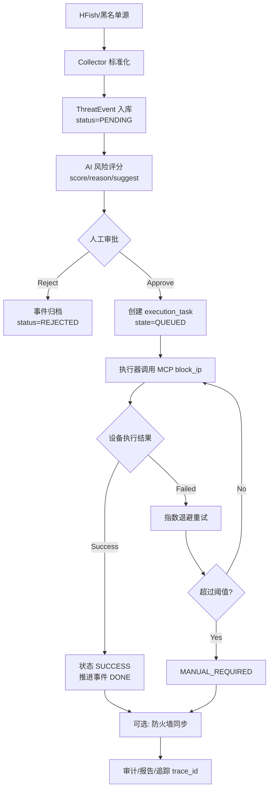
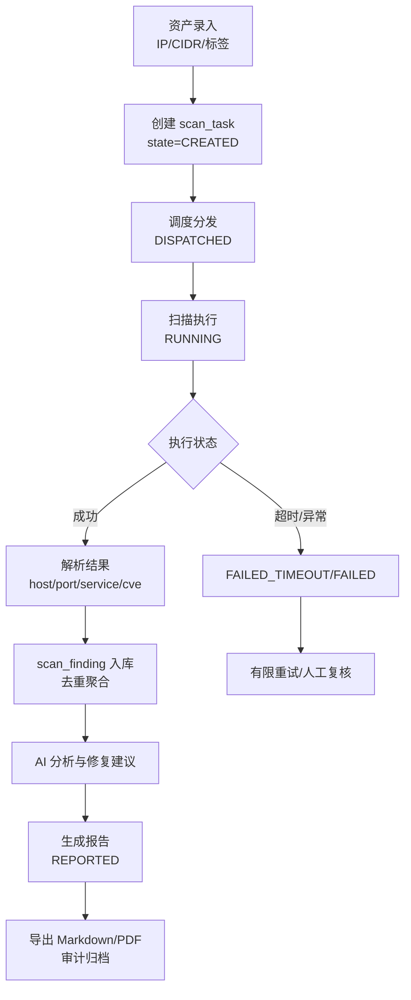
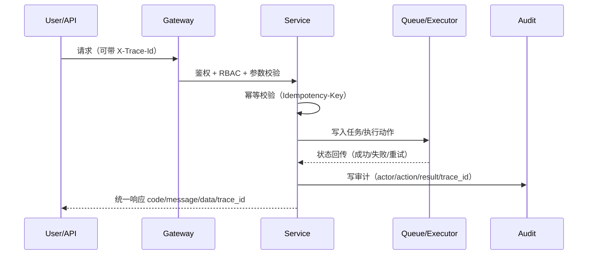

# Aimiguan

> 本文档是项目唯一主文档（Single Source of Truth）。
> 架构、流程、数据模型、实施计划、验证与里程碑均以本 README 为准。

## 文档导航
- 产品定位与目标
- 架构约束、接口规范、用户确认事项
- 拟定变更（后端/前端/服务/测试）
- 主流程、模块拆分、AI 强化、模型策略
- 数据模型、验证计划、里程碑与实施建议
- 运维手册、风险边界、后续演进

## 当前仓库状态
- 当前仓库已从纯方案阶段进入“可运行 + 持续迭代”阶段。
- 已完成：Step 1 基础底座、Step 2 后端核心能力、Step 3 防御链路主干（含 AI 评分降级标记与 block 重试到 `MANUAL_REQUIRED`）、**Step 4 探测扫描链路（含真实 Nmap 扫描、XML 解析、AI 分析、完整状态机）**、**P-1 MCP 客户端真实实现**。
- 当前重点：补齐 Step 2 剩余项（2.5/2.6/2.17）并推进 Step 4 探测扫描链路。
- 最新验证基线：`python -m pytest -q` 通过（16 passed），前端 `npm run build` 通过。

## 产品定位
`Aimiguan` 是一个 AI 驱动的自动化安全运营产品，分为两大板块：`防御监控` 与 `探测扫描`。

核心价值：
- 防御监控：对威胁事件进行实时处置（封禁、观察、回滚）
- 探测扫描：主动调用 Kali/MCP/漏洞工具扫描目标资产并输出风险清单
- AI 中枢：统一做设备管理、自然对话、风险评分、策略建议、分析报告生成
- 异常推送：支持多通道异常通知与机器人联动
- 插件扩展：支持 MCP 第三方插件接入（如 bot）
- 全流程可审计、可追溯、可复盘

## 项目目标
本项目当前目标是实现一个基于 `agent` 的安全联动系统：
- 从黑名单数据 API、蜜罐、扫描器获取威胁与漏洞数据
- 使用 `SQLite` 作为临时数据中间缓存（事件、任务、扫描结果）
- 由 Python 从 `SQLite` 读取任务并执行封禁/扫描编排
- 通过自研 MCP tools 控制多台交换机，在 `tele` 端口按逻辑顺序封禁指定 IP
- 主动调用 Kali/MCP/漏洞工具对目标主机进行探测扫描
- 在 Web 端展示 AI 对话、AI 分析、AI 报告与执行总结
- 预留外部防火墙 API 对接能力，将高风险 IP 同步下发到外部防火墙封堵

## 技术架构约束（固定）
- 后端：`Python`
- 数据中间缓存：`SQLite`
- 前端：`Vue`
- 前后端分离：采用前后端完全分离部署，前端通过统一 `/api/` 前缀访问后端
- 前端路由模式：`Hash` 模式（`#/`），避免服务端路由回退配置复杂度
- 组件库（统一使用）：
  - `https://www.ai-elements-vue.com/`
  - `https://www.shadcn-vue.com/`
- UI/UX 规范：
  - **暗色模式优先**：默认使用暗色主题，提供专业安全运营平台视觉体验
  - **流畅动画**：所有交互采用 150-300ms 过渡动画，仅动画 `transform` 和 `opacity` 属性
  - **响应式设计**：支持 375px/768px/1024px/1440px 断点，移动端优先
  - **无障碍访问**：所有交互元素支持键盘导航，焦点状态可见，色彩对比度 ≥ 4.5:1
  - **图标规范**：统一使用 SVG 图标（Heroicons/Lucide），禁止使用 emoji 作为 UI 图标
  - **加载状态**：异步操作显示加载指示器，超过 300ms 使用骨架屏
- 约束说明：后续前端组件优先复用以上两套组件库，不再引入新的主组件库，确保界面风格统一与开发效率。

## 范围与边界
### 本期范围（In Scope）
- 防御监控闭环：威胁采集 -> AI 评分 -> 人工审批 -> 交换机执行 -> 审计留痕。
- 探测扫描闭环：资产管理 -> 扫描调度 -> 结果解析 -> AI 报告 -> 导出归档。
- AI 中枢能力：对话、分析、报告、TTS（本地优先模型策略）。
- 外部联动能力：MCP 插件接入、异常推送、外部防火墙同步封堵。

### 非目标（Out of Scope, 当前阶段）
- 大规模分布式集群调度与跨地域多活。
- 全量 SIEM 替代能力（仅保留本项目范围内可观测与审计）。
- 全厂商零适配（先以有限设备类型打通闭环）。

## 交付标准（Definition of Done）
- 链路可跑通：防御链路与扫描链路都可完成一次端到端闭环。
- 操作可审计：关键动作均有 `trace_id`、操作者、时间、结果、证据。
- AI 可解释：评分、建议、报告能给出证据与理由。
- 风险可控：高风险动作具备审批、幂等、重试与回滚标记。
- 结果可复盘：报告、日志、任务状态可回查。

## 接口与路由规范
- API 统一前缀：`/api/`
- 接口版本建议：`/api/v1/...`
- 网关/反向代理统一转发 `/api/*` 到 Python 服务
- 统一响应结构：`code`, `message`, `data`, `trace_id`
- 统一鉴权与白名单策略：
  - 默认接口需鉴权（JWT/RBAC）
  - API 白名单仅保留必要公共接口（如登录、健康检查）
  - 白名单接口单独记录审计，避免被滥用

### 推荐接口分层
- `api/auth.py`: 登录、刷新、鉴权。
- `api/defense.py`: 告警接入、待办、审批执行。
- `api/scan.py`: 资产、任务、结果查询。
- `api/report.py`: AI 报告生成与导出。
- `api/ai_chat.py`: 多轮对话与上下文问答。
- `api/tts.py`: 语音任务提交、状态跟踪。
- `api/firewall.py`: 外部防火墙同步下发与回执。

### HFish 数据源最小字段协议（Collector 层）
- 适用范围：仅作为 `collector` 的数据来源适配，不扩展独立功能页。
- 入站响应兼容：
  - 外层兼容：`response_code`, `verbose_msg`, `data.page_no`, `data.page_size`, `data.total_num`, `data.sort`, `data.order`。
  - 列表兼容：`data.list_infos[]`（攻击来源聚合视图）。
  - 详情兼容：`data.attack_infos[]`（攻击明细视图）。
  - 趋势兼容：`data.attack_trend[]`（时间序列）。
- 统一采集字段（Canonical Event）：
  - `source_vendor`: 固定 `hfish`。
  - `source_type`: `attack_source | attack_detail | attack_credential`。
  - `source_event_id`: 优先 `info_id`，否则 `client_id + attack_ip + attack_time/last_attack_time` 组合生成。
  - `attack_ip`: 映射 `attack_ip`（必填）。
  - `attack_time`: 优先 `attack_time`，否则 `last_attack_time`（秒级时间戳统一转 UTC）。
  - `attack_count`: 优先 `attack_count`，详情无该字段时默认 `1`。
  - `threat_label`: 映射 `labels`，为空则回退 `labels_cn`，再回退 `unknown`。
  - `asset_ip`: 优先 `victim_ip`，否则 `client_ip`。
  - `service_name`: 映射 `service_name`。
  - `service_type`: 映射 `service_type`。
  - `is_white`: 映射 `is_white`，缺失默认 `false`。
  - `country/region/city`: 原样保留（为空允许）。
  - `raw_payload`: 保存完整原始 JSON。
  - `extra_json`: 保存未映射字段与前端临时字段。

#### HFish 列表数据映射（`data.list_infos[]`）
- 字段映射：
  - `client_id -> source_client_id`
  - `client_name -> source_client_name`
  - `client_ip -> asset_ip`
  - `service_class/service_type/service_name -> service_*`
  - `attack_ip -> attack_ip`
  - `attack_count -> attack_count`
  - `last_attack_time -> attack_time`
  - `labels/labels_cn -> threat_label/threat_label_cn`
  - `country_code/country/region/city -> geo_*`
  - `intranet/marked/service_status/is_white -> flags.*`

#### HFish 详情数据映射（`data.attack_infos[]`）
- 字段映射：
  - `info_id -> source_event_id`
  - `attack_ip/attack_port/attack_time -> attack_ip/attack_port/attack_time`
  - `victim_ip -> asset_ip`
  - `attack_rule[] -> rule_hits[]`
  - `credentials/commands/un_commands/files -> artifacts.*`
  - `session/login_result/duration/collected -> session_meta.*`
  - `info.method/info.url/info.status_code/info.user_agent -> http_meta.*`
  - `info.header/info.body/content_type -> http_raw.*`
  - `info_len -> payload_size`

#### HFish 趋势数据映射（`data.attack_trend[]`）
- 字段映射：
  - `attack_time (yyyy-mm-dd HH:MM:SS) -> trend_time`（按配置时区转 UTC）
  - `attack_count -> trend_count`
- 用途：仅用于看板统计，不直接写入 `threat_event` 明细表。

#### 与前端临时预览数据的兼容约定
- 前端预览字段可能先于后端 API 稳定；解析器按“已知字段映射 + 其余字段入 `extra_json`”处理。
- 任何新增字段默认不丢弃，保留在 `raw_payload`，避免后续二次回采。
- `response_code != 0` 视为源端失败，按 `502xx` 记录并重试。
- 仅 `attack_ip` 缺失判定为无效记录，其余缺失使用默认值并保留原始字段。

### 建议通用错误码
- `0`: 成功。
- `400xx`: 参数与校验错误。
- `401xx`: 鉴权失败。
- `403xx`: 权限不足。
- `404xx`: 资源不存在。
- `409xx`: 状态冲突（重复执行、幂等冲突）。
- `500xx`: 系统异常。
- `502xx`: 外部依赖异常（MCP / 防火墙 API / 扫描器）。

## 需要用户确认的事项（User Review Required）
> [!IMPORTANT]
> - **外部依赖**:
>   - `python-nmap`: 需要宿主机安装 `Nmap` 工具。
>   - 交换机控制: 需要通过 Telnet/SSH 访问交换机的网络权限。
>   - 本地 LLM/TTS: 需要运行推理服务（如 `Ollama` / `LocalAI`）或可访问的 API。
> - **人工确认机制**: 防御动作需经 AI 分析后，由管理员在 Web 端确认执行（Human-in-the-loop）。
> - **外部联动前置确认**: 若启用外部防火墙 API，需确认签名方式、幂等策略、失败重试与回执字段。

## 拟定变更（Proposed Changes）
### 后端（Python / FastAPI）
目录结构：`/backend`

#### [新建] `backend/main.py`
- 程序入口，生命周期事件（数据库初始化、任务调度器初始化），CORS 配置与健康检查。

#### [新建] `backend/core/database.py`
- SQLite 连接字符串与会话管理。
- 模型定义：
  - `ThreatEvent`: 威胁事件（包含 `risk_score`、`ai_suggestion`、`status`：`PENDING` / `APPROVED` / `REJECTED`）。
  - `ScanTask`, `Asset`, `BlockLog`。
  - 扩展表：`ai_tts_task`、`plugin_registry`、`push_channel`、`firewall_sync_task`、`model_profile`。

#### [新建] `backend/api/`
- `auth.py`: JWT 登录接口、Token 刷新、RBAC 权限控制。
- `defense.py`:
  - 接收 HFish 告警。
  - 获取待处置事件列表（Pending Events）。
  - 执行处置动作（Approve/Reject）并触发交换机封禁。
- `scan.py`: 资产管理、扫描任务触发与结果查询。
- `report.py`: AI 分析生成、报告导出接口。
- `ai_chat.py`: AI 多轮对话接口（事件/任务/资产上下文）。
- `tts.py`: 本地 TTS 任务提交、状态查询、音频索引。
- `firewall.py`: 外部防火墙同步封堵（签名、幂等、重试、回执追踪）。

#### [新建] `backend/services/ai_engine.py`（核心 AI 逻辑）
- **Prompt 设计**:
  1. **风险评估 Prompt**:
     - 输入：攻击者 IP、攻击类型、攻击频率、历史行为。
     - 输出：`{"score": 85, "reason": "...", "action_suggest": "BLOCK"}`。
  2. **扫描分析 Prompt**:
     - 输入：Nmap 扫描结果（XML/JSON）。
     - 输出：Markdown 格式的风险分析与修复建议。
- **模型适配**: 封装 `LocalLLMClient`（支持 `Ollama` / `LocalAI` API）。
- **决策逻辑**:
  - `Risk Score >= 80` -> 建议 `BLOCK`（自动推送待办）。
  - `Risk Score < 80` -> 建议 `MONITOR`（持续观察）。

#### [新建] `backend/services/mcp_client.py`（MCP 客户端集成）
- **功能**: 调用现有 MCP 工具执行交换机操作。
- **通信方式**: `stdio`（子进程）或 `SSE`（HTTP）。
- **指令调用**:
  - `use_mcp_tool(server_name, tool_name="block_ip", arguments={"ip": "1.2.3.4"})`
- **执行流程**:
  1. 接收封禁任务（IP）。
  2. 构造 MCP 工具调用请求。
  3. 发送至 MCP Server。
  4. 解析 MCP 返回结果。
  5. 记录操作日志到 Database。

#### [新建] `backend/services/scanner.py`（扫描任务队列）
- **调度机制**: 通过 `asyncio.create_task` 或轻量任务队列管理长耗时扫描。
- **扫描参数**: 仅开放常用参数组合（如 `-sS -sV -p 1-65535`），避免命令注入。
- **漏洞扫描支持（NSE）**:
  - 通过 `--script` 调用 Nmap 脚本引擎。
  - 示例：`--script smb-vuln-ms17-010`、`--script vuln`。
- **结果处理**:
  1. 解析 Nmap XML 输出（`python-nmap`）。
  2. 提取 `<host>`、`<port>`、`<service>`、`<script>`（漏洞信息）。
  3. 结构化写入 `ScanResult`。
  4. 触发 AI 分析并生成修复建议。

### 前端（Vue 3 + Vite）
目录结构：`/frontend`

#### [新建] `frontend/src/router/index.ts`
- Hash 模式路由：`createWebHashHistory()`。

#### [新建] `frontend/src/views/`
1. **DefenseDashboard.vue（防御监控）**
   - **UI 组件**: `StatsCard`（今日攻击数、封禁数）、`DataTable`（实时威胁列表）、`Dialog`（封禁确认弹窗）。
   - **功能**:
     - 实时刷新 HFish 告警。
     - **待办区**: 高亮显示 `Pending Review` 事件，由 AI 给出处置建议，管理员执行 `Approve/Reject`。

2. **ScanManager.vue（资产与扫描）**
   - **UI 组件**: `AssetTable`（资产列表）、`ScanConfigModal`（扫描配置弹窗）、`VulnReportCard`（漏洞详情卡片）。
   - **可视化（Visualization）**:
     - **网络拓扑图（Topology）**: 使用 `Cytoscape.js` 或 `ECharts` 展示主机关联关系与开放端口。
     - **端口矩阵（Port Matrix）**: 使用热力图展示端口开放情况（红=高危，绿=安全）。
     - **漏洞分布（Vuln Pie Chart）**: 饼图展示高/中/低危漏洞占比。
   - **功能**: 新增扫描任务（支持勾选 Script），查看 Nmap 原始输出与 AI 解读。

3. **AICenter.vue（AI 中枢）**
   - **UI 组件**: `ChatInterface`（对话框）、`ReportGenerator`（报告配置）。
   - **AI 对话（Chat）**:
     - **上下文感知**: 自动带入当前选中的 IP 或扫描任务作为 context。
     - **示例问答**: “IP 1.2.3.4 为什么被报高危？”，“这个 Samba 漏洞怎么修？”。
     - **追问机制**: 支持多轮对话，深入分析问题。
   - **AI 报告（Report）**:
     - **日报/周报**: 自动汇总当日拦截数、高危资产数。
     - **格式**: 生成 Markdown/PDF 下载。
   - **功能**: 与 AI 对话（如“分析 IP 1.2.3.4”），生成并下载 PDF/Markdown 报告。

#### [新建] `frontend/src/components/`
- 统一集成 `shadcn-vue` 与 `ai-elements-vue` 组件体系。

### 基础设施与依赖
#### [新建] `requirements.txt`
- `fastapi`, `uvicorn`, `python-nmap`, `sqlalchemy`, `pydantic`
- 建议补充：`python-jose`, `passlib`, `httpx`, `pytest`

## 后端目录约定
- 新增统一目录：`/api/`
- 约定：后端 API 的 Python 文件统一放在 `api/` 目录下（按模块分文件）
- 示例：`api/auth.py`, `api/defense.py`, `api/scan.py`, `api/report.py`


## 简单 Mind 思维导图
```text
AimiGuard（AI安全运营平台）
├─ 一、防御监控（被动响应）
│  ├─ 威胁输入
│  │  ├─ hifi 蜜罐告警推送
│  │  ├─ 黑名单 API 轮询
│  │  └─ 第三方威胁情报对接
│  ├─ 数据处理
│  │  ├─ 字段标准化与去重
│  │  ├─ SQLite 临时缓存
│  │  └─ trace_id 全链路追踪
│  ├─ AI 决策
│  │  ├─ 风险评分（0-100）
│  │  ├─ 动作建议（封禁/观察/放行）
│  │  ├─ 理由生成与置信度
│  │  └─ 模型路由（本地/云端切换）
│  ├─ 自动执行
│  │  ├─ MCP tools 调用交换机
│  │  ├─ tele 端口多设备控制
│  │  ├─ 失败重试与回滚标记
│  │  └─ 执行状态实时同步
│  └─ 审计与回传
│     ├─ 处置结果写入 audit_log
│     ├─ 防火墙同步状态跟踪
│     └─ 异常推送（钉钉/企微/邮件）
│
├─ 二、探测扫描（主动发现）
│  ├─ 资产管理
│  │  ├─ 单 IP / 网段 / 资产组
│  │  ├─ 资产标签与分组
│  │  └─ 扫描任务调度
│  ├─ 扫描引擎
│  │  ├─ Kali 工具集成（nmap/masscan）
│  │  ├─ MCP 漏洞工具调用
│  │  ├─ 端口与服务识别
│  │  ├─ 漏洞检测与弱口令爆破
│  │  └─ 扫描进度与状态机
│  ├─ 结果处理
│  │  ├─ 扫描结果写入 SQLite
│  │  ├─ AI 风险分级与关联
│  │  └─ 漏洞去重与聚合
│  └─ 报告生成
│     ├─ 摘要版（高管视角）
│     ├─ 详细版（技术视角）
│     ├─ 修复建议与优先级
│     └─ 导出与审计存档
│
├─ 三、AI 智能中枢
│  ├─ AI 对话
│  │  ├─ 自然语言问答
│  │  ├─ 上下文追问
│  │  ├─ 事件解释与溯源
│  │  └─ 语音 TTS（本地模型）
│  ├─ AI 分析
│  │  ├─ 威胁关联与聚类
│  │  ├─ 异常检测与趋势预测
│  │  ├─ 攻击链还原
│  │  └─ 风险优先级排序
│  └─ AI 报告
│     ├─ 日报/周报/月报
│     ├─ 专项报告（应急响应/合规）
│     ├─ 可视化图表生成
│     └─ 自动摘要与建议
│
├─ 四、系统能力（P0 成品化）
│  ├─ 版本与发布（R0）
│  │  ├─ 版本查询与追踪
│  │  ├─ 发布历史记录
│  │  └─ 一键回滚与健康检查
│  ├─ 配置治理（R1）
│  │  ├─ 多环境配置隔离
│  │  ├─ 启动前配置校验
│  │  └─ 配置完整性检查
│  ├─ 权限控制（R2）
│  │  ├─ RBAC 三层校验
│  │  ├─ 高风险动作权限点
│  │  └─ 未授权审计记录
│  ├─ 备份恢复（R3）
│  │  ├─ 全量/增量备份
│  │  ├─ 一致性检查
│  │  └─ 热/冷数据分层
│  ├─ 安全门禁（R4）
│  │  ├─ 依赖漏洞扫描
│  │  ├─ 镜像安全扫描
│  │  ├─ SBOM 生成
│  │  └─ 高危阈值阻断
│  ├─ 告警闭环（R5）
│  │  ├─ 告警统一入表
│  │  ├─ 状态机流转
│  │  ├─ 确认/关闭/复盘
│  │  └─ 关键失败自动触发
│  ├─ 指标采集（R6）
│  │  ├─ 延迟/成功率/队列深度
│  │  ├─ 阈值告警规则
│  │  ├─ 时序数据聚合
│  │  └─ 仪表盘实时展示
│  └─ 数据保护（R7）
│     ├─ 敏感字段脱敏
│     ├─ 导出二次确认
│     ├─ 审计日志 append-only
│     └─ 导出内容哈希校验
│
├─ 五、技术架构
│  ├─ 前端
│  │  ├─ Vue 3 + TypeScript
│  │  ├─ Hash 路由模式（#/）
│  │  ├─ Tailwind CSS
│  │  ├─ Shadcn Vue 组件库
│  │  ├─ AI Elements Vue 组件库
│  │  ├─ Pinia 状态管理
│  │  └─ ECharts 可视化
│  ├─ 后端
│  │  ├─ Python FastAPI / Flask
│  │  ├─ SQLite 数据缓存
│  │  └─ Alembic 数据库迁移
│  ├─ AI 能力
│  │  ├─ 本地模型优先（Ollama/LM Studio）
│  │  ├─ 云端模型备用（OpenAI/Claude）
│  │  ├─ 模型路由与降级
│  │  └─ TTS 本地化（Coqui/Piper）
│  ├─ 集成能力
│  │  ├─ MCP 插件体系
│  │  ├─ 防火墙 API 对接
│  │  ├─ 蜜罐数据接入
│  │  └─ 第三方工具调用（Kali/nmap）
│  └─ 部署运维
│     ├─ 前后端分离部署
│     ├─ 统一 /api/ 前缀
│     ├─ 日志聚合与监控
│     └─ 备份与灾备策略
│
└─ 六、数据流转
   ├─ 入站数据
   │  ├─ 蜜罐告警 → threat_event
   │  ├─ 扫描结果 → scan_finding
   │  └─ 用户操作 → audit_log
   ├─ 处理流程
   │  ├─ AI 评分 → ai_decision
   │  ├─ 任务队列 → execution_task
   │  └─ 防火墙同步 → firewall_sync_task
   ├─ 出站数据
   │  ├─ 封禁指令 → 交换机/防火墙
   │  ├─ 告警推送 → 钉钉/企微/邮件
   │  └─ 报告导出 → PDF/CSV/JSON
   └─ 审计链路
      ├─ 全链路 trace_id 透传
      ├─ 关键动作 audit_log 记录
      └─ 敏感操作二次确认
```

## 核心原理（基础版）
1. 防御监控与探测扫描的数据统一进入 `SQLite` 临时缓存。
2. AI 中枢对事件与扫描结果进行风险评分、关联分析与优先级排序。
3. 防御链路通过策略引擎决策后，调用 MCP tools 执行封禁与回滚。
4. 探测链路通过任务编排调用 Kali/MCP/漏洞工具主动扫描目标。
5. Web 面板提供 AI 对话、AI 分析看板、AI 报告中心和全链路审计。

## 主流程（如图）
### A. 防御监控流程（概览）
1. `hifi 蜜罐` 与 `黑名单数据 API` 产生可疑 IP。
2. 数据标准化后写入 `SQLite` 临时缓存。
3. AI 输出风险评分、动作建议与理由。
4. Python 执行器从 `SQLite` 拉取处置队列。
5. 调用自研 `MCP tools` 经 `tele` 端口控制多个交换机。
6. 按逻辑顺序执行封禁（支持失败重试与回滚标记）。
7. Web 展示执行状态、AI 分析与处置报告。

### B. 探测扫描流程（主动，概览）
1. 配置扫描目标（单 IP、网段、资产组）。
2. 任务编排器调用 Kali/MCP/漏洞工具执行扫描。
3. 采集端口、服务、漏洞、弱口令等结果并写入 `SQLite`。
4. AI 对扫描结果做风险分级、漏洞关联与修复建议。
5. 输出扫描报告（摘要版 + 详细版），支持导出与审计存档。

### C. 工作流图（Workflow）
#### C1. 防御监控工作流（Defense Workflow）


#### C2. 探测扫描工作流（Scan Workflow）


#### C3. 跨链路控制点工作流（Control Points）

    S-->>U: 统一响应 code/message/data/trace_id
```

#### C4. 工作流图例说明（Legend）
| 图形元素 | 含义 | 颜色/样式建议 |
|---------|------|---------------|
| 圆角矩形 | 状态/节点 | 蓝色=正常, 橙色=警告, 红色=失败, 绿色=成功 |
| 菱形 | 判断/分支点 | 黄色高亮 |
| 粗箭头 | 主链路（正常流程） | 黑色实线 |
| 虚线箭头 | 备选/可选链路 | 灰色虚线 |
| 双竖线矩形 | 外部系统/服务 | 灰色边框 |

#### C5. 状态机映射表（Step 3/4 对应）

**threat_event 状态流转**
| 当前状态 | 下一状态 | 触发条件 | 对应 Step |
|---------|---------|----------|----------|
| `PENDING` | `APPROVED` / `REJECTED` | 人工审批 | Step 3.17 |
| `APPROVED` | `EXECUTING` | 执行器拉取任务 | Step 3.19 |
| `EXECUTING` | `DONE` | 所有设备执行成功 | Step 3.19 |
| `EXECUTING` | `FAILED` | 设备执行全部失败且超阈值 | Step 3.19 |
| `REJECTED` | - | 归档终态 | Step 3.17 |
| `DONE` | - | 归档终态 | Step 3.19 |

**execution_task 状态流转**
| 当前状态 | 下一状态 | 触发条件 | 对应 Step |
|---------|---------|----------|----------|
| `QUEUED` | `RUNNING` | 执行器拉取并开始 | Step 3.19 |
| `RUNNING` | `SUCCESS` | 设备返回成功 | Step 3.19 |
| `RUNNING` | `FAILED` | 设备返回失败 | Step 3.19 |
| `FAILED` | `RETRYING` | 仍在重试阈值内 | Step 3.19 |
| `RETRYING` | `RUNNING` | 重试调度 | Step 3.19 |
| `RETRYING` | `MANUAL_REQUIRED` | 超过重试阈值 | Step 3.19 |
| `MANUAL_REQUIRED` | - | 人工介入终态 | Step 3.19 |

**scan_task 状态流转（Step 4）**
| 当前状态 | 下一状态 | 触发条件 | 对应 Step |
|---------|---------|----------|----------|
| `CREATED` | `DISPATCHED` | 调度器分发任务 | Step 4.6 |
| `DISPATCHED` | `RUNNING` | 扫描工具启动 | Step 4.7 |
| `RUNNING` | `PARSED` | 解析完成 | Step 4.9 |
| `PARSED` | `REPORTED` | 报告生成 | Step 4.13 |
| `RUNNING` | `FAILED` | 超时或异常 | Step 4.7 |
| `FAILED` | `RETRYING` | 有限重试 | Step 4.7 |
| `RETRYING` | `MANUAL_REQUIRED` | 超过重试阈值 | Step 4.7 |

**firewall_sync_task 状态流转**
| 当前状态 | 下一状态 | 触发条件 |
|---------|---------|----------|
| `PENDING` | `RUNNING` | 同步任务调度 |
| `RUNNING` | `SUCCESS` | 防火墙返回成功 |
| `RUNNING` | `FAILED` | 防火墙返回错误 |
| `FAILED` | `RETRYING` | 指数退避重试 |
| `RETRYING` | `MANUAL_REQUIRED` | 超过阈值 |

#### C6. 失败分支与重试策略

| 场景 | 处理策略 | 重试参数 | 终态 |
|------|----------|----------|------|
| MCP 设备不可达 | 指数退避，阈值 3 次 | 间隔 1s/2s/4s | `MANUAL_REQUIRED` |
| 设备权限错误 | 立即终止，标记不可恢复 | - | `MANUAL_REQUIRED` |
| 扫描任务超时 | 超时中断，标记失败 | 重试 2 次，间隔 30s | `FAILED` |
| AI 评分失败 | 规则引擎兜底，强制人工审批 | - | `PENDING`（需人工） |
| 幂等冲突 | 返回首次执行结果 | - | - |
| 防火墙同步失败 | 记录回执，不阻塞主链路 | 重试 3 次 | `MANUAL_REQUIRED` |

#### C7. 关键 trace_id 贯穿点

| 阶段 | trace_id 生成时机 | 贯穿链路 |
|------|-------------------|----------|
| 事件接入 | `collector` 接收时（无则生成） | threat_event → ai_decision → execution_task → audit_log |
| 任务创建 | `scan_task` 创建时 | scan_task → scan_finding → ai_report |
| 审批操作 | `API` 入栈时 | execution_task → firewall_sync_task → audit_log |
| 外部调用 | `MCP/Firewall` 请求时 | 请求 Header + 响应回执 |

## 主流程（可执行展开版）
### A1. 防御监控 E2E（Runbook）
## 主流程（可执行展开版）
### A1. 防御监控 E2E（Runbook）
- 阶段 0（事件接入）
  - 触发：蜜罐告警推送或黑名单轮询命中。
  - 输入：`ip/source/attack_type/timestamp/raw_payload`。
  - 处理：字段校验、去重（同 `ip + source + time_bucket`）、生成 `trace_id`。
  - 入库：写入 `threat_event`，初始状态 `PENDING`。
  - 失败：解析失败进入 `FAILED_NORMALIZE`（可落在错误事件表或审计日志）。
  - 说明：`HFish` 在本项目中仅作为“蜜罐事件来源”之一，由 `collector` 统一接入与标准化。
- 阶段 1（AI 评估）
  - 触发：`threat_event.status=PENDING`。
  - 处理：调用 `ai_engine` 输出 `ai_score/ai_reason/action_suggest/confidence`。
  - 规则：`ai_score >= 80` 建议 `BLOCK`，否则建议 `MONITOR`。
  - 入库：写入 `ai_decision_log`，回写 `threat_event.ai_score/ai_reason`。
  - 失败：AI 不可用时进入降级策略（规则引擎兜底 + 人工必审）。
- 阶段 2（人工审批）
  - 触发：控制台待办区出现事件。
  - API：`GET /api/v1/defense/pending` 查询、`POST /api/v1/defense/{id}/approve|reject` 审批。
  - 权限：仅 `operator/admin` 可审批。
  - 结果：
    - `approve` -> 创建 `execution_task(state=QUEUED)`。
    - `reject` -> `threat_event.status=REJECTED` 并写审计。
- 阶段 3（设备执行）
  - 触发：执行器轮询 `execution_task.state=QUEUED`。
  - 处理：按设备顺序调用 `mcp_client.block_ip`，每台设备独立记录结果。
  - 幂等：同一 `event_id + device_id + action` 仅允许一个活动任务。
  - 成功：任务置 `SUCCESS`，事件可推进 `DONE`。
  - 失败：任务置 `FAILED` 并进入 `RETRYING`（指数退避）。
- 阶段 4（外部防火墙联动，可选）
  - 触发：封禁成功且策略允许外部同步。
  - API：`POST /api/v1/firewall/sync`（或内部服务调用）。
  - 幂等：要求 `Idempotency-Key`，并落 `firewall_sync_task.request_hash`。
  - 回执：记录 `vendor/status_code/response_digest/trace_id`。
  - 失败：达到阈值后转 `MANUAL_REQUIRED`，不阻塞主链路闭环。
- 阶段 5（结果展示与复盘）
  - 控制台：展示事件状态时间线、AI 解释、设备执行明细、防火墙回执。
  - 报告：写入 `ai_report`，支持导出与归档。
  - 审计：关键动作写 `audit_log`（操作者、动作、目标、结果、trace_id）。

### A2. 防御链路异常分支
- MCP 不可达：标记设备执行失败，触发重试；超过阈值后转人工。
- 设备权限错误：立即停止该设备后续命令，记录不可恢复错误并告警。
- 重复审批：返回 `409xx`，直接回放首次审批结果（幂等返回）。
- 高危批量动作：必须二次确认，且强制写审计与通知。

### B1. 探测扫描 E2E（Runbook）
- 阶段 0（资产准备）
  - API：`POST /api/v1/scan/assets` 新增资产，`GET /api/v1/scan/assets` 查询。
  - 校验：目标格式、CIDR 合法性、扫描窗口与标签策略。
  - 入库：`asset` 写入，状态 `enabled=true`。
- 阶段 1（任务创建）
  - API：`POST /api/v1/scan/tasks`，参数包含 `target/tool_name/profile/script_set`。
  - 入库：创建 `scan_task(state=CREATED)`，生成 `trace_id`。
  - 安全：仅允许白名单扫描参数组合，禁止原始命令直传。
- 阶段 2（任务调度与执行）
  - 调度：`scan-orchestrator` 按优先级与并发阈值分发任务。
  - 执行：调用 Kali/MCP/漏洞工具，写入原始输出索引（路径或对象存储引用）。
  - 状态：`CREATED -> DISPATCHED -> RUNNING`。
  - 超时：达到阈值后置 `FAILED_TIMEOUT` 并允许有限重试。
- 阶段 3（结果解析与归一）
  - 解析：抽取 `host/port/service/script/cve/severity/evidence`。
  - 入库：写 `scan_finding`，任务状态推进 `PARSED`。
  - 去重：同资产同端口同漏洞在时间窗口内合并，保留最强证据。
- 阶段 4（AI 分析与建议）
  - 调用：`ai_engine` 生成风险摘要、修复优先级、复测建议。
  - 输出：写 `ai_report`，任务状态置 `REPORTED`。
  - 对话：支持在 `AICenter` 以任务上下文追问。
- 阶段 5（导出与闭环）
  - 导出：Markdown/PDF，关联 `trace_id` 与证据引用。
  - 闭环：对高危项创建修复待办并记录 SLA。

### B2. 扫描链路异常分支
- 目标不可达：记录 `UNREACHABLE`，不进入漏洞统计但保留审计。
- 工具执行异常：记录 `502xx` 依赖错误，按工具类型重试。
- 解析失败：保存原始输出，状态置 `FAILED_PARSE`，进入人工复核。
- 任务拥塞：触发限流与排队，必要时拒绝低优先级任务。

### C. 跨链路公共控制点
- 鉴权：除登录与健康检查外默认鉴权；白名单接口单独审计。
- 追踪：请求进入系统即生成或继承 `trace_id`，贯穿 API/任务/日志/报告。
- 幂等：高风险写操作必须携带 `Idempotency-Key`，重复请求返回首个结果。
- 审计：审批、封禁、回滚、凭据修改、插件启停、防火墙下发必须记录审计。
- 可观测：核心节点打点（排队时长、执行时长、失败原因、重试次数）。

### D. 前后端页面与后端流程映射（后台控制台完整规范）
#### D1. 控制台整体布局（App Shell）
- 页面结构：`左侧 Sidebar + 顶部 Topbar + 主内容区 RouterView + 右侧抽屉(告警/消息)`。
- 交互规则：
  - Sidebar 负责一级导航切换与权限可见性。
  - Topbar 负责全局搜索、系统状态提示与快捷操作。
  - 右上角负责账户与系统操作（通知、个人中心、设置、退出）。
- 响应式行为：
  - 桌面端固定侧边栏。
  - 移动端侧边栏折叠为抽屉，Topbar 提供菜单按钮展开。

#### D2. 左侧 Sidebar（页面切换）
- 菜单建议（按业务分组）
  - `总览`：`#/overview`（系统态势、核心指标、待办统计）。
  - `防御监控`：`#/defense`（告警、审批、执行状态）。
  - `探测扫描`：`#/scan`（资产、任务、漏洞结果）。
  - `AI 中枢`：`#/ai-center`（对话、报告、TTS）。
  - `插件与联动`：`#/integrations`（插件、推送通道、防火墙同步）。
  - `审计中心`：`#/audit`（操作日志、追踪检索、导出）。
  - `系统设置`：`#/settings`（账户、角色、策略、密钥、系统参数）。
- 切换行为
  - 点击菜单即路由切换并高亮当前菜单。
  - 切换前检测未保存表单，提示“保存后离开/放弃修改”。
  - 每次切换记录 `audit_log(module='navigation', action='switch_page')`。
- 权限可见性
  - `viewer`：总览、防御查看、扫描查看、AI 查看、审计查看。
  - `operator`：增加审批、执行、任务触发权限。
  - `admin`：增加系统设置、插件管理、密钥管理权限。

#### D3. 顶栏 Topbar（防御/探测视图切换）
- 视图定义
  - `防御坚守`：展示防御监控链路与威胁处置面板。
  - `主动探测`：展示探测扫描链路与任务结果面板。
- 切换控件
  - Topbar 显示双视图切换：`防御坚守 | 主动探测`。
  - 该切换仅影响前端展示面板，不切换后端运行模式。
- 运行说明
  - 审计日志、告警流、任务执行等后端链路持续实时运行，不因前端视图切换而停止。
  - 主动探测任务为手动/主动触发，不依赖“系统模式切换”。

#### D4. 右上角系统功能（完整后台）
- 功能清单
  - `通知中心`：未读告警、任务失败、外部联动异常。
  - `全局搜索`：按 IP/任务 ID/trace_id 快速跳转详情。
  - `个人中心`：头像、昵称、邮箱、最近登录信息。
  - `安全设置`：修改密码、2FA、会话管理。
  - `系统设置入口`：仅 `admin` 可见。
  - `退出登录`：清理 Token、清理本地缓存、回到登录页。
- 退出登录流程（必须）
  1. 点击右上角头像菜单 -> `退出登录`。
  2. 弹出二次确认（防误触）。
  3. 调用 `POST /api/v1/auth/logout` 注销当前会话。
  4. 前端清除 `access_token/refresh_token/user_profile`。
  5. 跳转 `#/login`，并展示“已安全退出”。

#### D5. 后端接口映射（系统功能）
- `GET /api/v1/system/profile`：获取当前用户资料与权限。
- `PUT /api/v1/system/profile`：更新个人资料。
- `POST /api/v1/system/password/change`：修改密码。
- `GET /api/v1/system/notifications`：通知列表（支持分页、未读筛选）。
- `POST /api/v1/system/notifications/read`：批量已读。
- `GET /api/v1/system/search`：全局搜索（按关键字类型路由）。
- `POST /api/v1/scan/tasks`：手动触发探测扫描任务（需权限与审计）。
- `POST /api/v1/auth/logout`：退出当前会话。

#### D6. 数据与状态建议（系统层）
- 建议新增表
  - `system_setting`: `key`, `value`, `updated_by`, `updated_at`。
  - `scan_task`: `id`, `target`, `tool_name`, `state`, `operator`, `trace_id`, `created_at`。
  - `user_session`: `id`, `user_id`, `token_id`, `ip`, `ua`, `expired_at`, `revoked_at`。
  - `user_notification`: `id`, `user_id`, `type`, `title`, `content`, `read_at`, `created_at`。
- 前端全局状态
  - `app.activePanel`, `app.user`, `app.permissions`, `app.unreadCount`, `app.systemHealth`。

#### D7. 页面级最小交互要求
- 所有可点击元素显示 `cursor-pointer`，并有 `transition-colors duration-200`。
- 高风险操作（批量处置、退出）均需确认弹窗。
- 失败提示需可追踪（展示 `trace_id`）。
- 表格列表支持：分页、筛选、排序、列显隐、导出。

#### D8. 验收标准（后台壳）
- Sidebar 所有菜单可按权限正确显示并可切换。
- Topbar 视图切换后界面状态即时一致，且不影响后端实时链路。
- 右上角退出流程无残留会话（刷新后仍在登录页）。
- 任一系统动作均可在审计中心按 `trace_id` 回放。

#### D9. 页面级详细规划（可直接开发）
##### D9.1 `#/overview`（总览）
- 页面目标
  - 展示系统全局健康度、链路状态、待处理事项与高风险事件趋势。
- 组件结构
  - 顶部状态条：当前视图（防御/探测）、系统健康灯、最近同步时间。
  - KPI 卡片：今日告警数、待审批数、封禁成功率、扫描成功率。
  - 趋势图：24h 告警趋势、7d 漏洞趋势、失败原因分布。
  - 待办面板：待审批事件 TopN、失败任务 TopN。
- 数据接口
  - `GET /api/v1/overview/metrics`
  - `GET /api/v1/overview/trends`
  - `GET /api/v1/overview/todos`
- 交互规则
  - 卡片支持点击跳转到对应页面并携带筛选条件。
  - 趋势图支持时间范围切换（24h/7d/30d）。

##### D9.2 `#/defense`（防御监控）
- 页面目标
  - 完成“查看 -> 审批 -> 执行 -> 回滚/复核”闭环。
- 组件结构
  - 筛选栏：时间、来源、风险等级、状态。
  - 事件表：IP、来源、AI评分、建议动作、状态、trace_id。
  - 详情抽屉：证据、时间线、执行日志、关联会话。
  - 操作区：Approve/Reject/Manual Rollback。
- 数据接口
  - `GET /api/v1/defense/events`
  - `GET /api/v1/defense/events/{id}`
  - `POST /api/v1/defense/{id}/approve`
  - `POST /api/v1/defense/{id}/reject`
  - `POST /api/v1/defense/{id}/rollback`
- 交互规则
  - 审批必须填写理由（可选模板）。
  - 执行失败时展示失败设备清单与重试入口。

##### D9.3 `#/scan`（探测扫描）
- 页面目标
  - 完成“资产 -> 任务 -> 结果 -> 修复建议”闭环。
- 组件结构
  - 资产列表区：资产增删改查、标签、优先级。
  - 任务队列区：任务状态、进度、耗时、失败原因。
  - 结果区：端口矩阵、漏洞列表、证据明细。
- 数据接口
  - `GET/POST /api/v1/scan/assets`
  - `GET/POST /api/v1/scan/tasks`
  - `GET /api/v1/scan/tasks/{id}`
  - `GET /api/v1/scan/tasks/{id}/findings`
- 交互规则
  - 创建任务时只允许参数模板选择，不允许自由输入危险参数。
  - 结果页支持按严重级别、CVE、端口筛选。

##### D9.4 `#/ai-center`（AI 中枢）
- 页面目标
  - 提供上下文问答、报告生成、TTS 播报。
- 组件结构
  - 会话面板：消息流、证据引用、上下文标签。
  - 报告面板：模板选择、时间范围、导出格式。
  - TTS 面板：语音模型、任务状态、音频回放。
- 数据接口
  - `POST /api/v1/ai/chat/session`
  - `POST /api/v1/ai/chat/message`
  - `POST /api/v1/report/generate`
  - `POST /api/v1/tts/task`
- 交互规则
  - 回答必须可展开查看证据来源。
  - 报告导出完成后产生通知并可追溯生成参数。

##### D9.5 `#/integrations`（插件与联动）
- 页面目标
  - 管理插件、推送通道、防火墙同步策略。
- 组件结构
  - 插件表：名称、类型、状态、最近心跳、权限范围。
  - 推送通道：通道类型、目标地址、状态、测试按钮。
  - 防火墙策略：厂商、策略ID、同步状态、失败重试阈值。
- 数据接口
  - `GET/POST /api/v1/plugins`
  - `GET/POST /api/v1/push/channels`
  - `GET/POST /api/v1/firewall/policies`
- 交互规则
  - 启停插件需二次确认并强制审计。
  - 通道配置支持“发送测试消息”。

##### D9.6 `#/audit`（审计中心）
- 页面目标
  - 提供可检索、可导出、可复盘的审计能力。
- 组件结构
  - 检索栏：按 `trace_id/operator/module/action/time` 查询。
  - 审计表：动作摘要、结果、来源 IP、创建时间。
  - 详情抽屉：请求摘要、响应摘要、前后状态 diff。
- 数据接口
  - `GET /api/v1/audit/logs`
  - `GET /api/v1/audit/logs/{id}`
  - `GET /api/v1/audit/export`
- 交互规则
  - 审计导出仅 `admin` 可用。
  - 高频查询自动缓存，避免影响线上性能。

##### D9.7 `#/settings`（系统设置）
- 页面目标
  - 管理用户、角色、策略、系统参数与密钥版本。
- 组件结构
  - 用户与角色：账号、角色分配、会话回收。
  - 策略设置：防御与探测策略参数、阈值参数。
  - 系统参数：任务并发、重试上限、超时阈值。
  - 安全配置：密钥版本、轮换计划、2FA 开关。
- 数据接口
  - `GET/PUT /api/v1/system/settings`
  - `GET/PUT /api/v1/system/roles`
  - `GET/PUT /api/v1/system/security`
- 交互规则
  - 参数修改需校验范围并展示“影响说明”。
  - 高风险配置变更需二次确认 + 审批流（可选）。

#### D10. 顶栏与右上角详细交互时序
- `视图切换时序`
  1. 用户点击 Topbar 视图切换。
  2. 前端立即切换展示面板（防御/探测）。
  3. 不触发后端运行模式变更。
  4. 后端审计与任务链路持续实时运行。
- `退出登录时序`
  1. 用户点击右上角头像菜单 `退出登录`。
  2. 弹窗确认。
  3. 调用 `POST /api/v1/auth/logout`。
  4. 失效当前会话 Token，写审计。
  5. 前端清理状态并跳转登录页。

#### D11. 后台功能实现顺序（前后端协同）
- 前置阶段
  - 完成 `auth + RBAC + trace_id`。
  - 完成全局状态管理（用户、权限、面板视图、通知）。
- UI 壳阶段
  - 先实现 App Shell 与路由骨架。
  - 再实现 Sidebar 权限菜单与 Topbar 视图切换。
  - 再实现右上角菜单与退出登录。
- 页面阶段
  - 优先：`overview -> defense -> scan`。
  - 次级：`ai-center -> integrations -> audit -> settings`。
- 联调阶段
  - 每页面按“列表 -> 详情 -> 动作 -> 失败分支”顺序联调。
- 验收阶段
  - 跑通关键 E2E：菜单切换、视图切换、退出登录、审计回放。

#### D12. 页面开发任务分解（前端）
- 公共组件
  - `AppSidebar`、`AppTopbar`、`UserMenu`、`ModeSwitch`、`NotifyDrawer`、`GlobalSearch`。
- 页面容器
  - `OverviewPage`、`DefensePage`、`ScanPage`、`AiCenterPage`、`IntegrationsPage`、`AuditPage`、`SettingsPage`。
- 组合组件
  - `MetricCard`、`EventTable`、`TaskQueueTable`、`AuditTable`、`ConfirmDialog`、`TraceBadge`。
- 状态模块
  - `useAuthStore`、`useAppStore`、`useDefenseStore`、`useScanStore`、`useAuditStore`。

#### D13. 页面开发任务分解（后端）
- 系统与账户
  - `api/system.py`: profile/settings/mode/notifications/search。
  - `api/auth.py`: logout/session revoke。
- 审计与模式
  - `services/audit_service.py`：统一写审计与查询。
  - `services/mode_service.py`：模式读写、广播、风控阈值。
- 查询聚合
  - `api/overview.py`：metrics/trends/todos 聚合接口。
- 安全边界
  - 中间件：权限校验、参数校验、限流、审计注入。

#### D14. 后台功能验收用例（建议直接用于测试）
- 用例 1：`viewer` 登录后仅可见允许菜单，无法访问设置页。
- 用例 2：`operator` 手动触发探测任务成功，且审计可检索。
- 用例 3：`admin` 在设置页修改阈值，保存后生效并可回滚。
- 用例 4：退出登录后 Token 失效，刷新页面保持未登录态。
- 用例 5：通过 `trace_id` 可从总览跳转到审计详情并回放全链路。

### E. 端到端验收口径（流程视角）
- 防御闭环：从告警接入到设备封禁成功，全链路 `trace_id` 可回放。
- 扫描闭环：从任务创建到报告导出，关键状态全部可见且可审计。
- 异常闭环：重试、人工接管、失败原因分类可查且可统计。
- 合规闭环：高风险动作均有审批、权限校验与不可篡改审计记录。

## 模块拆分（子内容）
### 1) 防御监控模块
- `collector`
  - 对接黑名单 API、蜜罐数据
  - 字段校验、去重、重复来源合并
  - 说明：`HFish API` 按统一采集协议接入 `collector`，不单独扩展专用页面。
  - 统一字段输出：`source_vendor`, `source_type`, `source_event_id`, `attack_ip`, `attack_time`, `threat_label`, `raw_payload`, `extra_json`。
- `normalizer`
  - 统一数据结构与风险等级
  - 写入 `SQLite` 临时缓存并维护状态字段
- `policy-engine`
  - 规则决策（封禁/观察/忽略）
  - AI 风险评分、策略建议、白名单保护、阈值控制、审批条件
- `executor`
  - 任务编排、队列执行、重试机制
  - 幂等处理（同一 IP 避免重复封禁）
- `mcp-tools`
  - 多交换机驱动适配
  - 命令模板与厂商差异屏蔽

### 2) 探测扫描模块（主动）
- `asset-manager`
  - 管理扫描目标（IP/网段/资产组）
  - 目标标签、优先级、扫描窗口控制
- `scan-orchestrator`
  - 编排 Kali/MCP/漏洞工具扫描任务
  - 控制并发、超时、重试与任务隔离
- `vuln-adapter`
  - 统一不同扫描工具输出格式
  - 漏洞去重、CVE 映射、严重级别归一
- `scan-result-center`
  - 扫描结果写入 `SQLite`
  - 形成资产维度风险画像与历史趋势

### 3) AI 与前端模块
- `web-console`
  - 基于 `Vue` 开发（前后端分离 + Hash 路由）
  - 组件统一使用 `ai-elements-vue` 与 `shadcn-vue`
  - 实时状态、任务详情、执行日志
  - 审批入口、手动回滚、报表导出
- `ai-copilot`
  - AI 对话：问答、追问、上下文解释
  - AI 分析：关联分析、告警聚类、异常检测
  - AI 报告：摘要版/详细版报告、日报/周报/专项报告
  - 语音 TTS：本地模型语音播报告警与摘要
- `plugin-hub`
  - MCP 第三方插件接入（如 bot）
  - 异常推送通道管理（Webhook/机器人/IM）
- `firewall-connector`
  - 对接外部防火墙 API
  - 将封禁 IP 同步下发到防火墙（支持回执与失败重试）

## AI 强化重点（本期）
- `AI-risk`：对每条威胁事件与扫描发现输出风险分（0-100）与处置优先级。
- `AI-decision`：给出动作建议（封禁/观察/忽略/立即修复）并提供可读理由。
- `AI-explain`：对执行结果给出解释（成功原因、失败根因、修复建议）。
- `AI-cluster`：对相似告警和漏洞结果聚类，降低告警噪音与重复处置。
- `AI-chat`：支持基于当前任务上下文的多轮对话（问原因、问影响、问下一步）。
- `AI-report`：自动生成班次总结、日报、周报、专项漏洞分析报告，支持导出。
- `AI-tts`：支持本地大模型 TTS 语音播报（告警、结论、摘要）。
- `AI-model-router`：主模型默认本地部署，支持按策略切换不同模型。

## 模型与推理策略（本地优先）
- 主语言模型：本地大模型（默认）
- 模型切换：支持按任务类型切换（对话/分析/报告/语音）
- 路由策略：可按延迟、成本、准确率、可用性自动选择模型
- TTS 策略：语音播报默认本地 TTS 模型，支持替换语音引擎
- 合规策略：敏感数据默认本地处理，外发需显式开关与审计

## 外部防火墙 API 对接（未来能力）
- 目标：将高风险 IP 在处置后同步到外部防火墙 API 做二次封堵
- 下发流程：策略确认 -> 生成防火墙动作 -> API 下发 -> 回执记录 -> 失败重试
- 对接方式：标准 REST API / 厂商 SDK 适配层
- 安全要求：接口签名、TLS、IP 白名单、请求幂等键、重放保护
- 审计要求：记录目标防火墙、策略ID、请求体摘要、回执码、trace_id
## AI 对话与 AI 分析报告（详细）
- AI 对话内容
  - 可按事件/任务/资产发起对话：例如“这个 IP 为什么被封禁？”
  - 支持追问：例如“如果不封禁，影响范围是什么？”
  - 支持语音播报结果（本地 TTS）
  - 对话内容与引用证据（日志/告警/扫描结果）关联存档
- AI 分析内容
  - 防御监控：攻击来源画像、重复攻击路径、封禁效果评估
  - 探测扫描：高危漏洞链路、横向风险扩散路径、修复优先级建议
  - 统一输出：风险等级、置信度、证据列表、建议动作
- AI 报告内容
  - 摘要版：关键风险、处置动作、未闭环项
  - 详细版：资产维度、漏洞维度、事件维度、时间线
  - 管理版：趋势统计、处置 SLA、误报率、修复进度
- 报告导出
  - 支持按时间范围/资产组导出
  - 支持归档并关联审计记录

## 报告模板建议（可直接落地）
- 防御监控报告
  - 概览：事件总数、高危占比、处置成功率、平均响应时间
  - 详情：Top 攻击源 IP、封禁动作明细、失败原因与回滚记录
  - 建议：白名单调整、策略阈值优化、设备侧加固项
- 探测扫描报告
  - 概览：扫描资产数、发现漏洞数、高危漏洞数、未修复项
  - 详情：资产-端口-服务-漏洞清单、证据截图/日志引用
  - 建议：修复优先级（P0/P1/P2）、复测计划、责任人建议

## AI 对话示例（面板内）
- 问：`这个 IP 为什么被封禁？`
- 答：`AI 根据近 30 分钟攻击频次、命中规则、历史行为相似度给出高风险结论，建议封禁 24 小时。`
- 问：`这个漏洞需要立即修复吗？`
- 答：`该漏洞 CVSS 高，且服务暴露在公网，建议 24 小时内修复并进行复测。`
- 问：`本周风险变化趋势如何？`
- 答：`高危事件环比下降 12%，但弱口令相关告警上升 18%，建议强化口令策略。`

## 交换机密码等保存（详细）
建议实现 `credential-vault` 子模块，要求如下：
- 存储内容
  - 设备地址、端口、用户名、密码/密钥、设备类型、标签
- 安全策略
  - 密码在库中必须加密保存（如 AES-GCM）
  - 加密主密钥来自环境变量或外部密钥服务，不写入代码仓库
  - 展示层不返回明文密码，仅返回掩码和更新时间
- 使用策略
  - 执行时临时解密到内存，用后立即释放
  - 记录谁在什么时间使用了哪台设备凭据
- 权限策略
  - 凭据读取与编辑分离权限（最小权限原则）
  - 关键修改需二次确认

## 面板保护（详细）
`web-console` 需要最小安全基线：
- 身份认证
  - 登录态管理（JWT + 过期时间 + 刷新机制）
  - 支持 2FA（MVP 可先预留接口）
- 访问控制
  - RBAC 角色：`viewer`、`operator`、`admin`
  - 高风险动作（批量封禁/回滚）仅 `operator/admin`
- 安全防护
  - 全站 HTTPS
  - CSRF 防护、接口限流、防暴力登录
  - 登录失败告警和 IP 限制策略
- 审计与告警
  - 审计日志不可篡改（追加写）
  - 风险操作（批量封禁、凭据更新）触发通知

## 数据模型建议（MVP）
- `threat_event`: `id`, `ip`, `source`, `risk_level`, `ai_score`, `ai_reason`, `timestamp`, `status`
- `execution_task`: `id`, `event_id`, `device_id`, `action`, `state`, `retry_count`, `started_at`, `ended_at`
- `scan_task`: `id`, `target`, `target_type`, `tool_name`, `state`, `started_at`, `ended_at`
- `scan_finding`: `id`, `scan_task_id`, `asset`, `port`, `service`, `vuln_id`, `severity`, `evidence`, `status`
- `device`: `id`, `name`, `ip`, `port`, `vendor`, `enabled`
- `credential`: `id`, `device_id`, `username`, `secret_ciphertext`, `key_version`, `updated_at`
- `ai_decision_log`: `id`, `event_id`, `model_name`, `decision`, `confidence`, `reason`, `created_at`
- `ai_chat_session`: `id`, `context_type`, `context_id`, `operator`, `started_at`
- `ai_chat_message`: `id`, `session_id`, `role`, `content`, `evidence_refs`, `created_at`
- `ai_report`: `id`, `report_type`, `scope`, `summary`, `detail_path`, `created_at`
- `ai_tts_task`: `id`, `source_type`, `source_id`, `voice_model`, `audio_path`, `state`, `created_at`
- `plugin_registry`: `id`, `plugin_name`, `plugin_type`, `endpoint`, `enabled`, `updated_at`
- `push_channel`: `id`, `channel_type`, `target`, `enabled`, `updated_at`
- `firewall_sync_task`: `id`, `ip`, `firewall_vendor`, `policy_id`, `request_hash`, `state`, `retry_count`, `created_at`
- `model_profile`: `id`, `model_name`, `model_type`, `is_local`, `priority`, `enabled`
- `audit_log`: `id`, `operator`, `module`, `action`, `result`, `created_at`, `trace_id`

## 验证计划（Verification Plan）
### 自动化测试
- **后端测试**: 使用 `pytest` 测试 API 端点和业务逻辑（Mock Nmap 和交换机连接）。
- **前端测试**: 组件渲染测试、路由跳转测试、关键交互状态测试（审批按钮与任务状态联动）。

### 人工验证
1. **防御流程（Human-in-the-loop）**:
   - 模拟 HFish 告警 -> 写入 SQLite。
   - 触发 AI 分析 -> 生成评分和建议 -> 状态置为 `PENDING`。
   - **Web 端显示待办事项** -> 用户点击“封禁/驳回” -> API 更新状态 -> 触发交换机封禁命令或归档驳回。
2. **扫描流程**:
   - 添加 localhost 资产 -> 触发扫描 -> 检查 Nmap 解析结果 -> 验证 AI 报告生成。
   - 勾选 NSE Script 扫描 -> 验证漏洞脚本输出可解析并进入漏洞视图。
3. **UI 验证**:
   - 检查 Hash 路由导航和组件样式是否统一。
   - 检查 DefenseDashboard / ScanManager / AICenter 页面数据刷新与交互反馈是否符合预期。
4. **联动验证**:
   - 验证 MCP 调用日志、失败重试、幂等去重与最终状态一致性。
   - 验证外部防火墙 API 回执记录、失败重试、审计字段完整性。

## 第一版里程碑
- [ ] 打通防御监控链路：API/蜜罐 -> SQLite -> Python 执行 -> 交换机封禁
- [ ] 打通探测扫描链路：资产配置 -> Kali/MCP/漏洞工具 -> SQLite 入库
- [ ] 完成 1 台交换机封禁闭环 + 1 套扫描工具闭环
- [ ] 完成统一 `/api/` 路由规范与 `/api/v1` 版本化
- [ ] 完成前后端分离部署与前端 Hash 路由
- [ ] 完成 API 白名单与鉴权策略落地
- [ ] 完成 `api/` 目录改造（后端 API Python 文件归一）
- [ ] 扩展到多台交换机并按顺序执行
- [ ] 增加凭据加密存储与读取审计
- [ ] 增加面板登录、RBAC、高风险操作确认
- [ ] 上线 AI 对话（基于任务上下文）
- [ ] 上线 AI 分析（聚类、解释、修复建议）
- [ ] 上线 AI 报告中心（日报/周报/专项报告）
- [ ] 上线本地模型 TTS 语音播报（告警与报告摘要）
- [ ] 接入 MCP 第三方插件（如 bot）与异常推送通道
- [ ] 增加外部防火墙 API 同步封堵（含回执、重试、审计）
- [ ] 实现本地模型默认 + 可切换模型路由

## 实施建议
- 先做 MVP：`Python + SQLite + Vue` 固定架构，完成防御监控闭环 + 探测扫描闭环 + 最小审批流程
- 再做增强：多厂商设备适配、更多扫描插件、规则可视化配置、联动告警
- AI 持续优化：决策可解释性、报告质量、误报率、修复建议命中率
- 模型策略：本地模型优先，外部模型按策略切换并保留审计
- 持续优化：执行耗时、告警噪音、审计完整性与可追溯性

## 成品化补充清单（按优先级）
### P0（必须先补齐）
- [ ] 可运行工程骨架：`backend/`、`frontend/`、`requirements.txt`、初始化脚本、样例配置可直接启动。
- [ ] 数据库可执行规范：建表 SQL、索引、唯一约束、状态枚举、初始化数据、迁移策略（建议 Alembic）。
- [ ] API 契约冻结：OpenAPI 文档、错误码映射、幂等规则、分页与排序标准统一。
- [ ] 关键任务状态机：`threat_event`、`execution_task`、`scan_task`、`firewall_sync_task` 的状态流转、超时与人工接管规则明确。
- [ ] 安全最小闭环：凭据加密、密钥管理、RBAC 接口权限矩阵、审计日志追加写规则可执行。

### P1（上线前补齐）
- [ ] 可观测性：结构化日志、`trace_id` 全链路透传、指标与告警阈值落地。
- [ ] 测试与质量门禁：单测/集成/E2E 覆盖目标、CI 流水线（lint + test + build）与阻断规则。
- [ ] 部署分层：`dev/test/prod` 环境配置分离、反向代理与密钥注入方案、备份恢复流程。

### P2（稳定运营优化）
- [ ] 验收 KPI 量化：误报率、处置 SLA、封禁成功率、报告生成时延按周期复盘。
- [ ] 外部联动治理：MCP 插件准入清单、风险分级、熔断与降级策略、第三方故障隔离。

### P0 成品化补丁（仅功能清单）
- [ ] R0 版本与发布能力（功能化）
  - 实现 `/api/system/version`：返回 `app_version/git_commit/build_time/schema_version`。
  - 实现数据库 `release_history`：记录 `version/commit/deploy_env/deploy_at/status`。
  - 实现回滚接口 `/api/system/rollback`（仅允许回滚到最近 N 个可用版本）。
  - 回滚后自动执行：配置回切 + 数据库迁移版本校验 + 服务健康检查。

- [ ] R1 环境配置能力（功能化）
  - 实现配置加载优先级：`ENV > .env > default`。
  - 实现启动前配置校验：缺失关键项（JWT、DB、加密密钥）直接阻止启动。
  - 实现 `/api/system/config-check`：返回配置完整性与风险项（不返回明文密钥）。
  - 配置项支持 `dev/staging/prod` 隔离，禁止跨环境复用敏感值。

- [ ] R2 权限控制能力（功能化）
  - 实现 RBAC 三层校验：页面权限、接口权限、动作权限。
  - 为高风险动作增加权限点：`approve_event/reject_event/block_ip/update_system`。
  - 未授权请求统一返回 `40301`，并写入 `audit_log`（含 `user_id/action/resource/trace_id`）。
  - 前端路由守卫与按钮可见性统一使用权限点，避免“前端隐藏但后端可调”。

- [ ] R3 数据备份与恢复能力（功能化）
  - 实现数据库备份任务：全量每日 + 增量每小时（可配置）。
  - 实现 `/api/system/backup/list` 与 `/api/system/backup/restore`。
  - 恢复后自动执行一致性检查：核心表行数、关键索引、最新事件可读性。
  - 为 `threat_event/scan_finding/audit_log` 实现归档任务与查询透明化（热/冷分层）。

- [ ] R4 安全扫描门禁能力（功能化）
  - CI 增加依赖漏洞扫描与镜像扫描步骤，输出结构化报告 JSON。
  - 高危漏洞阈值触发发布阻断（可在配置中定义 `critical/high` 阈值）。
  - 生成并保存 `SBOM`（组件名、版本、许可证、漏洞状态）。
  - 提供 `/api/system/security-report/latest` 用于后台查看最近一次扫描结果。

- [ ] R5 运行告警与事故闭环（功能化）
  - 告警统一入表 `alert_event`：`level/type/source/summary/payload/status`。
  - 实现告警状态机：`NEW -> ACKED -> RESOLVED -> POSTMORTEM`。
  - 实现 `/api/alerts` 列表、确认、关闭、复盘记录接口。
  - 关键失败（执行器连续失败、防火墙同步失败、AI 服务降级）必须自动触发告警。

- [ ] R6 非功能指标采集（功能化）
  - 实现指标采集：`api_latency_p95/p99`、`queue_depth`、`task_success_rate`、`audit_write_rate`。
  - 实现 `/api/system/metrics/overview` 聚合接口用于仪表盘展示。
  - 实现阈值告警：延迟、失败率、队列积压超过阈值自动触发 `alert_event`。
  - 所有关键链路（入站->审批->执行）必须有 `trace_id` 全链路透传。

- [ ] R7 数据保护与审计能力（功能化）
  - 敏感字段默认脱敏返回：IP、账号标识、会话标识（按规则局部掩码）。
  - 实现导出接口的二次确认与导出审计：`who/when/what/why/trace_id`。
  - 审计日志不可更新不可删除（append-only），仅允许按条件查询。
  - 实现 `/api/audit/export`，导出结果包含校验哈希，保证导出内容可追溯。

#### P0 详细实施卡（接口 + 数据 + 最小测试）
- R0 版本与回滚
  - 接口：`GET /api/system/version`、`POST /api/system/rollback`。
  - 数据：`release_history(version, commit, schema_version, env, status, created_at)`。
  - 最小测试：查询版本成功；回滚到合法版本成功；回滚到不存在版本返回 `404xx`。

- R1 配置治理
  - 接口：`GET /api/system/config-check`（仅返回完整性，不返回密文/明文值）。
  - 数据：`system_config_snapshot(key, source, is_sensitive, loaded_at)`。
  - 最小测试：缺失 `JWT_SECRET` 启动失败；`dev/staging/prod` 配置隔离有效。

- R2 RBAC 权限
  - 接口：`GET /api/auth/me/permissions`、`POST /api/auth/role/bind`。
  - 数据：`role`、`permission`、`role_permission`、`user_role`、`access_audit`。
  - 最小测试：无权限调用审批/封禁接口返回 `40301`；授权后可调用并记录审计。

- R3 备份恢复
  - 接口：`GET /api/system/backup/list`、`POST /api/system/backup/create`、`POST /api/system/backup/restore`。
  - 数据：`backup_job(type, started_at, finished_at, status, artifact_uri, checksum)`。
  - 最小测试：可创建全量备份；可恢复最近可用备份；恢复后核心表可读且索引存在。

- R4 安全门禁
  - 接口：`GET /api/system/security-report/latest`。
  - 数据：`security_scan_report(scan_type, tool, summary_json, critical_count, high_count, created_at)`。
  - 最小测试：高危漏洞超过阈值时流水线失败；低于阈值时流水线通过并存档报告。

- R5 告警闭环
  - 接口：`GET /api/alerts`、`POST /api/alerts/{id}/ack`、`POST /api/alerts/{id}/resolve`、`POST /api/alerts/{id}/postmortem`。
  - 数据：`alert_event(level, type, source, summary, payload_json, status, trace_id, created_at)`。
  - 最小测试：关键失败自动生成告警；告警可完成 `NEW->ACKED->RESOLVED->POSTMORTEM`。

- R6 指标与阈值
  - 接口：`GET /api/system/metrics/overview`、`GET /api/system/metrics/timeseries`。
  - 数据：`metric_point(metric, value, labels_json, ts)`、`metric_rule(metric, operator, threshold, window)`。
  - 最小测试：P95 超阈值触发告警；队列堆积触发告警；恢复后自动关闭告警。

- R7 脱敏与审计导出
  - 接口：`POST /api/audit/export`、`GET /api/audit/export/{job_id}`。
  - 数据：`audit_log(actor, action, target, reason, trace_id, created_at)`、`audit_export_job(filters_json, status, file_uri, file_hash)`。
  - 最小测试：导出文件包含哈希；脱敏字段不泄露原值；审计日志不可更新不可删除。

#### P0 一次性联调顺序（单人开发建议）
- 先打通 R1（配置）+ R0（版本）保证服务稳定可启动、可识别版本。
- 再实现 R2（权限）+ R7（审计）保证所有关键动作先有权限和留痕。
- 然后实现 R5（告警）+ R6（指标）保证系统故障可见。
- 最后实现 R3（备份）+ R4（安全门禁）完成上线前兜底能力。

#### P0 API 规范（请求/响应/错误码）

##### R0 版本与回滚
```json
// GET /api/system/version
// 响应 200
{
  "app_version": "1.2.3",
  "git_commit": "a3f5c2d",
  "build_time": "2026-02-22T10:30:00Z",
  "schema_version": "20260222_001",
  "env": "production"
}

// POST /api/system/rollback
// 请求
{
  "target_version": "1.2.2",
  "reason": "回滚原因描述",
  "trace_id": "req_abc123"
}
// 响应 200（回滚成功）
{
  "status": "success",
  "rolled_back_to": "1.2.2",
  "actions_taken": ["config_reverted", "schema_checked", "health_verified"],
  "trace_id": "req_abc123"
}
// 响应 40404（版本不存在）
{
  "error": "version_not_found",
  "message": "目标版本 1.2.2 不在可回滚列表中",
  "available_versions": ["1.2.3", "1.2.1", "1.2.0"]
}
// 响应 50001（回滚失败）
{
  "error": "rollback_failed",
  "message": "数据库迁移版本校验失败",
  "detail": "schema version mismatch",
  "trace_id": "req_abc123"
}
```

##### R1 环境配置
```json
// GET /api/system/config-check
// 响应 200（配置完整）
{
  "status": "healthy",
  "missing_keys": [],
  "risk_items": [],
  "env": "production",
  "loaded_at": "2026-02-22T10:00:00Z"
}
// 响应 50002（配置缺失）
{
  "status": "unhealthy",
  "missing_keys": ["JWT_SECRET", "DB_ENCRYPTION_KEY"],
  "risk_items": [
    {"key": "AI_API_KEY", "issue": "使用默认值，生产环境不安全"}
  ],
  "env": "production"
}
```

##### R2 RBAC 权限
```json
// GET /api/auth/me/permissions
// 响应 200
{
  "user_id": "user_001",
  "roles": ["operator", "viewer"],
  "permissions": [
    "view_events",
    "approve_event",
    "reject_event",
    "view_audit"
  ],
  "denied_permissions": ["block_ip", "update_system"]
}

// POST /api/auth/role/bind
// 请求
{
  "user_id": "user_002",
  "role": "admin",
  "reason": "升级为管理员",
  "trace_id": "req_def456"
}
// 响应 200
{
  "status": "success",
  "user_id": "user_002",
  "new_roles": ["admin", "operator"],
  "trace_id": "req_def456"
}

// 未授权调用示例（任意需要权限的接口）
// 响应 40301
{
  "error": "permission_denied",
  "message": "缺少权限: approve_event",
  "required_permission": "approve_event",
  "user_roles": ["viewer"],
  "trace_id": "req_xyz789",
  "audit_logged": true
}
```

##### R3 备份恢复
```json
// GET /api/system/backup/list
// 响应 200
{
  "backups": [
    {
      "id": "backup_001",
      "type": "full",
      "started_at": "2026-02-22T02:00:00Z",
      "finished_at": "2026-02-22T02:15:00Z",
      "status": "success",
      "artifact_uri": "s3://backups/full_20260222.tar.gz",
      "checksum": "sha256:abc123...",
      "size_bytes": 1048576000
    },
    {
      "id": "backup_002",
      "type": "incremental",
      "started_at": "2026-02-22T03:00:00Z",
      "finished_at": "2026-02-22T03:05:00Z",
      "status": "success",
      "artifact_uri": "s3://backups/incr_20260222_03.tar.gz",
      "checksum": "sha256:def456...",
      "size_bytes": 52428800
    }
  ]
}

// POST /api/system/backup/create
// 请求
{
  "type": "full",
  "reason": "手动全量备份",
  "trace_id": "req_backup_001"
}
// 响应 202（异步任务已创建）
{
  "job_id": "backup_003",
  "status": "pending",
  "estimated_duration_seconds": 900,
  "trace_id": "req_backup_001"
}

// POST /api/system/backup/restore
// 请求
{
  "backup_id": "backup_001",
  "reason": "恢复到昨日状态",
  "trace_id": "req_restore_001"
}
// 响应 200（恢复成功）
{
  "status": "success",
  "restored_from": "backup_001",
  "consistency_checks": {
    "threat_event_count": 12345,
    "indexes_verified": true,
    "latest_event_readable": true
  },
  "trace_id": "req_restore_001"
}
// 响应 50003（恢复失败）
{
  "error": "restore_failed",
  "message": "一致性检查失败",
  "detail": "threat_event 表行数不匹配",
  "trace_id": "req_restore_001"
}
```

##### R4 安全门禁
```json
// GET /api/system/security-report/latest
// 响应 200
{
  "scan_id": "scan_20260222_001",
  "scan_type": "dependency_vulnerability",
  "tool": "trivy",
  "scanned_at": "2026-02-22T09:00:00Z",
  "summary": {
    "critical": 0,
    "high": 2,
    "medium": 5,
    "low": 12
  },
  "vulnerabilities": [
    {
      "cve": "CVE-2024-12345",
      "severity": "high",
      "package": "requests",
      "installed_version": "2.28.0",
      "fixed_version": "2.31.0",
      "description": "SSRF vulnerability in requests library"
    }
  ],
  "sbom_uri": "s3://security/sbom_20260222.json",
  "passed_gate": false,
  "gate_rule": "critical=0 AND high<=1"
}
```

##### R5 告警闭环
```json
// GET /api/alerts?status=NEW&page=1&size=20
// 响应 200
{
  "alerts": [
    {
      "id": "alert_001",
      "level": "critical",
      "type": "executor_failure",
      "source": "firewall_executor",
      "summary": "防火墙同步连续失败 5 次",
      "payload": {
        "firewall_vendor": "paloalto",
        "failed_ips": ["1.2.3.4", "5.6.7.8"],
        "error": "connection timeout"
      },
      "status": "NEW",
      "trace_id": "alert_trace_001",
      "created_at": "2026-02-22T10:30:00Z"
    }
  ],
  "total": 3,
  "page": 1,
  "size": 20
}

// POST /api/alerts/alert_001/ack
// 请求
{
  "ack_by": "user_001",
  "note": "已确认，正在排查",
  "trace_id": "req_ack_001"
}
// 响应 200
{
  "status": "success",
  "alert_id": "alert_001",
  "new_status": "ACKED",
  "acked_at": "2026-02-22T10:35:00Z"
}

// POST /api/alerts/alert_001/resolve
// 请求
{
  "resolved_by": "user_001",
  "resolution": "已修复防火墙连接配置",
  "trace_id": "req_resolve_001"
}
// 响应 200
{
  "status": "success",
  "alert_id": "alert_001",
  "new_status": "RESOLVED",
  "resolved_at": "2026-02-22T11:00:00Z"
}

// POST /api/alerts/alert_001/postmortem
// 请求
{
  "author": "user_001",
  "root_cause": "防火墙 API 密钥过期",
  "action_items": ["更新密钥轮换流程", "增加密钥过期告警"],
  "trace_id": "req_postmortem_001"
}
// 响应 200
{
  "status": "success",
  "alert_id": "alert_001",
  "new_status": "POSTMORTEM",
  "postmortem_at": "2026-02-22T12:00:00Z"
}
```

##### R6 指标与阈值
```json
// GET /api/system/metrics/overview
// 响应 200
{
  "metrics": {
    "api_latency_p95_ms": 120,
    "api_latency_p99_ms": 350,
    "queue_depth": 45,
    "task_success_rate": 0.98,
    "audit_write_rate_per_sec": 12.5
  },
  "thresholds": {
    "api_latency_p95_ms": {"threshold": 200, "status": "healthy"},
    "api_latency_p99_ms": {"threshold": 500, "status": "healthy"},
    "queue_depth": {"threshold": 100, "status": "healthy"},
    "task_success_rate": {"threshold": 0.95, "status": "healthy"}
  },
  "collected_at": "2026-02-22T10:40:00Z"
}

// GET /api/system/metrics/timeseries?metric=api_latency_p95_ms&from=2026-02-22T09:00:00Z&to=2026-02-22T10:00:00Z
// 响应 200
{
  "metric": "api_latency_p95_ms",
  "unit": "milliseconds",
  "data_points": [
    {"ts": "2026-02-22T09:00:00Z", "value": 110},
    {"ts": "2026-02-22T09:05:00Z", "value": 115},
    {"ts": "2026-02-22T09:10:00Z", "value": 120}
  ]
}

// 阈值告警自动触发示例（系统内部行为，无需手动调用）
// 当 api_latency_p95_ms > 200 时，自动创建 alert_event：
{
  "level": "warning",
  "type": "metric_threshold_exceeded",
  "source": "metrics_monitor",
  "summary": "API P95 延迟超过阈值",
  "payload": {
    "metric": "api_latency_p95_ms",
    "current_value": 250,
    "threshold": 200,
    "window": "5m"
  },
  "status": "NEW"
}
```

##### R7 脱敏与审计导出
```json
// POST /api/audit/export
// 请求
{
  "filters": {
    "actor": "user_001",
    "action": "approve_event",
    "start_time": "2026-02-20T00:00:00Z",
    "end_time": "2026-02-22T23:59:59Z"
  },
  "reason": "月度审计报告",
  "trace_id": "req_export_001"
}
// 响应 202（异步任务已创建）
{
  "job_id": "export_001",
  "status": "pending",
  "estimated_duration_seconds": 60,
  "trace_id": "req_export_001"
}

// GET /api/audit/export/export_001
// 响应 200（导出完成）
{
  "job_id": "export_001",
  "status": "completed",
  "file_uri": "s3://audit-exports/export_001.csv",
  "file_hash": "sha256:xyz789...",
  "row_count": 1234,
  "created_at": "2026-02-22T10:50:00Z",
  "completed_at": "2026-02-22T10:51:00Z"
}
// 响应 202（导出进行中）
{
  "job_id": "export_001",
  "status": "running",
  "progress": 0.65
}

// 审计日志查询示例（脱敏字段）
// GET /api/audit?page=1&size=20
// 响应 200
{
  "logs": [
    {
      "id": "audit_001",
      "actor": "user_001",
      "action": "approve_event",
      "target": "event_12345",
      "target_ip": "1.2.***.**",  // 脱敏
      "reason": "正常流量",
      "trace_id": "req_abc123",
      "created_at": "2026-02-22T10:30:00Z"
    }
  ],
  "total": 5678,
  "page": 1,
  "size": 20
}
```

#### P0 错误码统一规范
| 错误码 | 含义 | 示例场景 |
|--------|------|----------|
| `40301` | 权限不足 | 无权限调用审批/封禁接口 |
| `40404` | 资源不存在 | 回滚到不存在的版本 |
| `50001` | 回滚失败 | 数据库迁移版本校验失败 |
| `50002` | 配置异常 | 缺失关键配置项 |
| `50003` | 恢复失败 | 备份恢复后一致性检查失败 |
| `50004` | 告警操作失败 | 告警状态机转换非法 |
| `50005` | 导出失败 | 审计日志导出任务异常 |

## 工程化落地模板（建议直接纳入迭代）
### 1) 可运行骨架与启动约定
- 后端启动：提供 `backend/main.py` + `backend/.env.example` + `backend/scripts/init_db.py`。
- 前端启动：提供 `frontend/package.json` + `frontend/.env.example`，默认代理 `/api`。
- 一键启动建议：提供根目录脚本（如 `scripts/dev.ps1`）完成依赖安装、数据库初始化、前后端启动。

### 2) 数据库建表与迁移规范（MVP）
- 必备约束：
  - 所有核心表包含 `id`、`created_at`、`updated_at`。
  - 关键链路表包含 `trace_id`。
  - 幂等相关表包含唯一键（如 `request_hash`）。
- 迁移策略：
  - 使用版本化迁移（推荐 Alembic），禁止手工改线上表结构。
  - 每次迁移附带回滚脚本与验证 SQL。

```sql
-- sql/mvp_schema.sql (skeleton)
CREATE TABLE IF NOT EXISTS threat_event (
  id INTEGER PRIMARY KEY,
  ip TEXT NOT NULL,
  source TEXT NOT NULL,
  ai_score INTEGER,
  ai_reason TEXT,
  status TEXT NOT NULL CHECK(status IN ('PENDING','APPROVED','REJECTED','EXECUTING','DONE','FAILED')),
  trace_id TEXT NOT NULL,
  created_at TEXT NOT NULL,
  updated_at TEXT NOT NULL
);
CREATE INDEX IF NOT EXISTS idx_threat_event_status ON threat_event(status);
CREATE INDEX IF NOT EXISTS idx_threat_event_trace_id ON threat_event(trace_id);

CREATE TABLE IF NOT EXISTS firewall_sync_task (
  id INTEGER PRIMARY KEY,
  ip TEXT NOT NULL,
  firewall_vendor TEXT NOT NULL,
  policy_id TEXT,
  request_hash TEXT NOT NULL UNIQUE,
  state TEXT NOT NULL CHECK(state IN ('PENDING','RUNNING','SUCCESS','FAILED','RETRYING','MANUAL_REQUIRED')),
  retry_count INTEGER NOT NULL DEFAULT 0,
  trace_id TEXT NOT NULL,
  created_at TEXT NOT NULL,
  updated_at TEXT NOT NULL
);

-- R0: 版本与发布历史
CREATE TABLE IF NOT EXISTS release_history (
  id INTEGER PRIMARY KEY,
  version TEXT NOT NULL,
  git_commit TEXT NOT NULL,
  schema_version TEXT NOT NULL,
  deploy_env TEXT NOT NULL CHECK(deploy_env IN ('dev','staging','production')),
  status TEXT NOT NULL CHECK(status IN ('deployed','active','rolled_back','failed')),
  deployed_by TEXT,
  rollback_reason TEXT,
  trace_id TEXT,
  created_at TEXT NOT NULL,
  updated_at TEXT NOT NULL
);
CREATE INDEX IF NOT EXISTS idx_release_history_env_status ON release_history(deploy_env, status);
CREATE INDEX IF NOT EXISTS idx_release_history_version ON release_history(version);

-- R1: 配置快照（用于审计和回滚）
CREATE TABLE IF NOT EXISTS system_config_snapshot (
  id INTEGER PRIMARY KEY,
  config_key TEXT NOT NULL,
  config_value TEXT,
  source TEXT NOT NULL CHECK(source IN ('env','dotenv','default')),
  is_sensitive INTEGER NOT NULL DEFAULT 0,
  env TEXT NOT NULL CHECK(env IN ('dev','staging','production')),
  loaded_at TEXT NOT NULL,
  created_at TEXT NOT NULL
);
CREATE INDEX IF NOT EXISTS idx_config_snapshot_key_env ON system_config_snapshot(config_key, env);
CREATE INDEX IF NOT EXISTS idx_config_snapshot_loaded_at ON system_config_snapshot(loaded_at);

-- R2: RBAC 权限体系
CREATE TABLE IF NOT EXISTS role (
  id INTEGER PRIMARY KEY,
  name TEXT NOT NULL UNIQUE,
  description TEXT,
  created_at TEXT NOT NULL,
  updated_at TEXT NOT NULL
);

CREATE TABLE IF NOT EXISTS permission (
  id INTEGER PRIMARY KEY,
  name TEXT NOT NULL UNIQUE,
  resource TEXT NOT NULL,
  action TEXT NOT NULL,
  description TEXT,
  created_at TEXT NOT NULL,
  updated_at TEXT NOT NULL
);
CREATE UNIQUE INDEX IF NOT EXISTS idx_permission_resource_action ON permission(resource, action);

CREATE TABLE IF NOT EXISTS role_permission (
  id INTEGER PRIMARY KEY,
  role_id INTEGER NOT NULL,
  permission_id INTEGER NOT NULL,
  created_at TEXT NOT NULL,
  FOREIGN KEY (role_id) REFERENCES role(id) ON DELETE CASCADE,
  FOREIGN KEY (permission_id) REFERENCES permission(id) ON DELETE CASCADE
);
CREATE UNIQUE INDEX IF NOT EXISTS idx_role_permission_unique ON role_permission(role_id, permission_id);

CREATE TABLE IF NOT EXISTS user_role (
  id INTEGER PRIMARY KEY,
  user_id TEXT NOT NULL,
  role_id INTEGER NOT NULL,
  granted_by TEXT,
  reason TEXT,
  trace_id TEXT,
  created_at TEXT NOT NULL,
  updated_at TEXT NOT NULL,
  FOREIGN KEY (role_id) REFERENCES role(id) ON DELETE CASCADE
);
CREATE INDEX IF NOT EXISTS idx_user_role_user_id ON user_role(user_id);
CREATE UNIQUE INDEX IF NOT EXISTS idx_user_role_unique ON user_role(user_id, role_id);

CREATE TABLE IF NOT EXISTS access_audit (
  id INTEGER PRIMARY KEY,
  user_id TEXT NOT NULL,
  action TEXT NOT NULL,
  resource TEXT NOT NULL,
  permission_required TEXT,
  result TEXT NOT NULL CHECK(result IN ('granted','denied')),
  reason TEXT,
  trace_id TEXT NOT NULL,
  created_at TEXT NOT NULL
);
CREATE INDEX IF NOT EXISTS idx_access_audit_user_id ON access_audit(user_id);
CREATE INDEX IF NOT EXISTS idx_access_audit_result ON access_audit(result);
CREATE INDEX IF NOT EXISTS idx_access_audit_trace_id ON access_audit(trace_id);
CREATE INDEX IF NOT EXISTS idx_access_audit_created_at ON access_audit(created_at);

-- R3: 备份与恢复
CREATE TABLE IF NOT EXISTS backup_job (
  id INTEGER PRIMARY KEY,
  job_type TEXT NOT NULL CHECK(job_type IN ('full','incremental')),
  started_at TEXT NOT NULL,
  finished_at TEXT,
  status TEXT NOT NULL CHECK(status IN ('pending','running','success','failed')),
  artifact_uri TEXT,
  checksum TEXT,
  size_bytes INTEGER,
  error_message TEXT,
  triggered_by TEXT,
  trace_id TEXT,
  created_at TEXT NOT NULL,
  updated_at TEXT NOT NULL
);
CREATE INDEX IF NOT EXISTS idx_backup_job_status ON backup_job(status);
CREATE INDEX IF NOT EXISTS idx_backup_job_started_at ON backup_job(started_at);

CREATE TABLE IF NOT EXISTS restore_job (
  id INTEGER PRIMARY KEY,
  backup_id INTEGER NOT NULL,
  started_at TEXT NOT NULL,
  finished_at TEXT,
  status TEXT NOT NULL CHECK(status IN ('pending','running','success','failed')),
  consistency_check_result TEXT,
  error_message TEXT,
  triggered_by TEXT,
  reason TEXT,
  trace_id TEXT,
  created_at TEXT NOT NULL,
  updated_at TEXT NOT NULL,
  FOREIGN KEY (backup_id) REFERENCES backup_job(id)
);
CREATE INDEX IF NOT EXISTS idx_restore_job_status ON restore_job(status);
CREATE INDEX IF NOT EXISTS idx_restore_job_backup_id ON restore_job(backup_id);

-- R4: 安全扫描报告
CREATE TABLE IF NOT EXISTS security_scan_report (
  id INTEGER PRIMARY KEY,
  scan_type TEXT NOT NULL CHECK(scan_type IN ('dependency_vulnerability','container_image','code_analysis')),
  tool TEXT NOT NULL,
  summary_json TEXT NOT NULL,
  critical_count INTEGER NOT NULL DEFAULT 0,
  high_count INTEGER NOT NULL DEFAULT 0,
  medium_count INTEGER NOT NULL DEFAULT 0,
  low_count INTEGER NOT NULL DEFAULT 0,
  sbom_uri TEXT,
  passed_gate INTEGER NOT NULL DEFAULT 0,
  gate_rule TEXT,
  scanned_at TEXT NOT NULL,
  created_at TEXT NOT NULL
);
CREATE INDEX IF NOT EXISTS idx_security_scan_type ON security_scan_report(scan_type);
CREATE INDEX IF NOT EXISTS idx_security_scan_scanned_at ON security_scan_report(scanned_at);
CREATE INDEX IF NOT EXISTS idx_security_scan_passed_gate ON security_scan_report(passed_gate);

-- R5: 告警与事故闭环
CREATE TABLE IF NOT EXISTS alert_event (
  id INTEGER PRIMARY KEY,
  level TEXT NOT NULL CHECK(level IN ('info','warning','critical')),
  type TEXT NOT NULL,
  source TEXT NOT NULL,
  summary TEXT NOT NULL,
  payload_json TEXT,
  status TEXT NOT NULL CHECK(status IN ('NEW','ACKED','RESOLVED','POSTMORTEM')),
  acked_by TEXT,
  acked_at TEXT,
  resolved_by TEXT,
  resolved_at TEXT,
  resolution TEXT,
  postmortem_author TEXT,
  postmortem_at TEXT,
  postmortem_content TEXT,
  trace_id TEXT NOT NULL,
  created_at TEXT NOT NULL,
  updated_at TEXT NOT NULL
);
CREATE INDEX IF NOT EXISTS idx_alert_event_status ON alert_event(status);
CREATE INDEX IF NOT EXISTS idx_alert_event_level ON alert_event(level);
CREATE INDEX IF NOT EXISTS idx_alert_event_type ON alert_event(type);
CREATE INDEX IF NOT EXISTS idx_alert_event_trace_id ON alert_event(trace_id);
CREATE INDEX IF NOT EXISTS idx_alert_event_created_at ON alert_event(created_at);

-- R6: 指标采集与阈值告警
CREATE TABLE IF NOT EXISTS metric_point (
  id INTEGER PRIMARY KEY,
  metric TEXT NOT NULL,
  value REAL NOT NULL,
  labels_json TEXT,
  ts TEXT NOT NULL,
  created_at TEXT NOT NULL
);
CREATE INDEX IF NOT EXISTS idx_metric_point_metric_ts ON metric_point(metric, ts);
CREATE INDEX IF NOT EXISTS idx_metric_point_ts ON metric_point(ts);

CREATE TABLE IF NOT EXISTS metric_rule (
  id INTEGER PRIMARY KEY,
  metric TEXT NOT NULL UNIQUE,
  operator TEXT NOT NULL CHECK(operator IN ('gt','lt','gte','lte','eq')),
  threshold REAL NOT NULL,
  window_seconds INTEGER NOT NULL DEFAULT 300,
  enabled INTEGER NOT NULL DEFAULT 1,
  alert_level TEXT NOT NULL CHECK(alert_level IN ('info','warning','critical')),
  created_at TEXT NOT NULL,
  updated_at TEXT NOT NULL
);
CREATE INDEX IF NOT EXISTS idx_metric_rule_enabled ON metric_rule(enabled);

-- R7: 审计日志与导出
CREATE TABLE IF NOT EXISTS audit_log (
  id INTEGER PRIMARY KEY,
  actor TEXT NOT NULL,
  action TEXT NOT NULL,
  target TEXT NOT NULL,
  target_type TEXT,
  target_ip TEXT,
  reason TEXT,
  result TEXT NOT NULL CHECK(result IN ('success','failed')),
  error_message TEXT,
  trace_id TEXT NOT NULL,
  created_at TEXT NOT NULL
);
CREATE INDEX IF NOT EXISTS idx_audit_log_actor ON audit_log(actor);
CREATE INDEX IF NOT EXISTS idx_audit_log_action ON audit_log(action);
CREATE INDEX IF NOT EXISTS idx_audit_log_trace_id ON audit_log(trace_id);
CREATE INDEX IF NOT EXISTS idx_audit_log_created_at ON audit_log(created_at);
CREATE INDEX IF NOT EXISTS idx_audit_log_result ON audit_log(result);

CREATE TABLE IF NOT EXISTS audit_export_job (
  id INTEGER PRIMARY KEY,
  filters_json TEXT NOT NULL,
  status TEXT NOT NULL CHECK(status IN ('pending','running','completed','failed')),
  file_uri TEXT,
  file_hash TEXT,
  row_count INTEGER,
  error_message TEXT,
  requested_by TEXT NOT NULL,
  reason TEXT,
  progress REAL DEFAULT 0,
  trace_id TEXT,
  created_at TEXT NOT NULL,
  updated_at TEXT NOT NULL
);
CREATE INDEX IF NOT EXISTS idx_audit_export_status ON audit_export_job(status);
CREATE INDEX IF NOT EXISTS idx_audit_export_requested_by ON audit_export_job(requested_by);
CREATE INDEX IF NOT EXISTS idx_audit_export_created_at ON audit_export_job(created_at);
```

### 3) API 契约与幂等规范
- API 文档：提供 `/api/v1/openapi.json` 与导出的静态文档页面。
- 统一约定：
  - 请求头支持 `X-Trace-Id`（可选，服务端兜底生成）。
  - 高风险写接口支持 `Idempotency-Key`（必填）。
  - 响应统一返回 `code/message/data/trace_id`。
- 幂等规则：同一 `Idempotency-Key + operator + action + target` 视为同一请求，返回首次执行结果。

### 4) 关键状态机（建议）
- `threat_event`：`PENDING -> APPROVED/REJECTED -> EXECUTING -> DONE/FAILED`。
- `execution_task`：`QUEUED -> RUNNING -> SUCCESS/FAILED -> RETRYING -> MANUAL_REQUIRED`。
- `scan_task`：`CREATED -> DISPATCHED -> RUNNING -> PARSED -> REPORTED/FAILED`。
- `firewall_sync_task`：`PENDING -> RUNNING -> SUCCESS/FAILED -> RETRYING -> MANUAL_REQUIRED`。

### 5) 安全执行细则
- 凭据安全：`credential.secret_ciphertext` 使用 AES-GCM；主密钥来自环境变量或 KMS；支持 `key_version` 轮换。
- RBAC 矩阵（最小集）：
  - `viewer`：只读仪表盘、报告。
  - `operator`：可审批、可执行封禁、可触发扫描。
  - `admin`：可管理凭据、插件、模型路由与系统策略。
- 审计规则：所有高风险动作（封禁、回滚、凭据修改、插件启停）必须写 `audit_log`，并带 `trace_id`。

### 6) 可观测性与 SLO
- 日志标准字段：`timestamp`, `level`, `trace_id`, `operator`, `module`, `action`, `target`, `result`, `latency_ms`, `error_code`。
- 最小指标集：
  - 防御链路：审批耗时、封禁成功率、重试率。
  - 扫描链路：任务吞吐、平均耗时、超时率。
  - 外部依赖：MCP 成功率、防火墙 API 成功率、AI 服务可用性。
- 建议 SLO（MVP）：
  - 封禁执行成功率 >= 99%。
  - 防火墙同步成功率 >= 98%。
  - P95 API 延迟 <= 500ms（不含长任务接口）。

### 7) 测试与 CI 门禁
- 测试分层：
  - 单元测试：策略引擎、状态机流转、解析器。
  - 集成测试：API + SQLite + Mock MCP/防火墙。
  - E2E：防御闭环与扫描闭环各至少 1 条主路径。
- CI 阻断条件：
  - lint 或测试失败禁止合并。
  - 覆盖率低于阈值（建议 70%）禁止合并。
  - OpenAPI 与实现不一致禁止合并。

### 8) 部署与环境分层
- 环境配置：`dev/test/prod` 分离，严禁生产密钥复用到开发环境。
- 反向代理：统一 `/api/*` 转发后端，前端静态资源独立托管。
- 运维保障：每日自动备份 SQLite + 每周归档 + 恢复演练（至少月度一次）。

### 9) 验收 KPI（建议）
- 误报率（按周）<= 20%。
- 人工审批平均时延 <= 5 分钟。
- 高危事件 24 小时内闭环率 >= 95%。
- 报告生成成功率 >= 99%，生成时延 P95 <= 60 秒。

### 10) 外部联动治理（MCP/防火墙/插件）
- 准入机制：插件注册需签名校验、权限声明、健康检查通过。
- 风险分级：高风险插件默认只读，需管理员二次授权后开放执行权限。
- 失效保护：第三方异常触发熔断，不阻塞主流程；任务自动转 `MANUAL_REQUIRED`。
- 回放能力：保留请求摘要与回执，支持按 `trace_id` 全链路复盘。

## 备注
- `SQLite` 作为临时中间缓存，建议字段覆盖事件、任务、扫描结果、AI 结论、对话与报告索引。
- 封禁与扫描动作必须保留审计日志：操作者、目标、命令/工具、结果、时间、追踪ID。
- API 统一使用 `/api/` 前缀，前端使用 Hash 路由，保持前后端分离架构一致性。
- API 白名单仅允许必要公共接口，其他接口默认鉴权。
- 后端 API Python 文件统一放在 `api/` 目录。
- 默认使用本地语言模型与本地 TTS，模型切换需可配置并记录审计。
- 支持 MCP 第三方插件与异常推送通道，插件调用需做权限控制。
- 外部防火墙 API 联动封堵需支持签名、幂等、重试和回执追踪。
- 组件规范：前端组件库统一使用 `https://www.ai-elements-vue.com/` 与 `https://www.shadcn-vue.com/`。

## 建议目录结构（目标）
```text
backend/
  main.py
  core/
    database.py
  api/
    auth.py
    defense.py
    scan.py
    report.py
    ai_chat.py
    tts.py
    firewall.py
  services/
    ai_engine.py
    mcp_client.py
    scanner.py
frontend/
  src/
    router/
      index.ts
    views/
      DefenseDashboard.vue
      ScanManager.vue
      AICenter.vue
    components/
requirements.txt
```

## 配置与环境变量建议
- `APP_ENV`: `dev` / `test` / `prod`。
- `DATABASE_URL`: 默认 `sqlite:///aimiguard.db`。
- `JWT_SECRET`: JWT 签名密钥。
- `JWT_EXPIRE_MINUTES`: Token 过期时长。
- `LLM_PROVIDER`: `ollama` / `localai` / `custom`。
- `LLM_BASE_URL`: 本地模型服务地址。
- `TTS_PROVIDER`: 本地 TTS 引擎类型。
- `MCP_MODE`: `stdio` / `sse`。
- `MCP_SERVER_NAME`: MCP 服务标识。
- `FIREWALL_API_URL`: 外部防火墙 API 地址。
- `FIREWALL_API_KEY`: 外部防火墙鉴权密钥。
- `AUDIT_ENABLED`: 审计开关。

## 运维与运行手册（Runbook）
### 日常巡检
- 检查待办队列堆积量（`PENDING` 数量与平均停留时长）。
- 检查扫描任务失败率、平均耗时、重试次数。
- 检查 MCP 调用失败原因分布（网络、认证、设备不可达）。
- 检查外部防火墙同步回执成功率。

### 故障处置
1. 封禁执行失败：
   - 先确认设备网络连通与凭据有效性。
   - 再检查 MCP 工具返回码与错误信息。
   - 按重试策略执行，必要时转人工处理并记录原因。
2. 扫描任务超时：
   - 检查目标可达性与扫描参数。
   - 降低并发、缩小端口范围重试。
3. AI 服务不可用：
   - 切换到备用模型配置。
   - 保留人工决策路径，避免阻断主流程。

## 安全与合规基线
- 全站 HTTPS、接口签名、最小权限、敏感配置不入库。
- 凭据加密保存（如 AES-GCM），主密钥来自环境变量或外部 KMS。
- 审计日志追加写，禁止篡改，关键动作需要二次确认。
- 高风险动作默认人工审批，支持回滚标记与复核。

## 性能与容量规划（建议）
- 数据生命周期：事件/任务按周期归档，避免 SQLite 长期膨胀。
- 队列控制：限制并发与队列深度，防止扫描风暴。
- 指标监控：任务吞吐、失败率、平均响应、外部依赖可用性。
- 告警策略：按严重级别分层通知，降低噪声。

## 后续演进路线
- 多厂商交换机适配层扩展。
- 漏洞工具适配器扩展（统一结果协议）。
- 策略引擎可视化配置。
- 报告模板中心化与分角色输出。
- 审计看板与合规报表自动化。

## 详细规划文档（执行版）
### 规划目标
- 将当前 README 从“方案说明”推进为“可按周执行、可按里程碑验收、可按指标复盘”的项目主计划。
- 覆盖范围：需求冻结、架构落地、研发实施、联调验证、灰度上线、稳定运营。
- 输出要求：每阶段都包含输入、动作、交付物、验收口径、风险与回退策略。

### 阶段划分与周期建议（12 周）
- `Phase 0（第 1 周）`：范围冻结与工程基线。
- `Phase 1（第 2-4 周）`：MVP 双链路打通（防御 + 扫描）。
- `Phase 2（第 5-8 周）`：增强能力（AI、插件、防火墙联动、安全加固）。
- `Phase 3（第 9-10 周）`：预发布（压测、故障演练、回归、文档补齐）。
- `Phase 4（第 11-12 周）`：上线与运营优化（SLO 观测、误报治理、成本优化）。

### Phase 0：范围冻结与工程基线（第 1 周）
- 输入
  - 当前 README、接口规范、数据模型草案、外部依赖清单。
- 关键动作
  - 冻结 MVP 范围（必须项 / 延后项）。
  - 建立仓库结构：`backend/`、`frontend/`、`scripts/`、`sql/`、`tests/`。
  - 提供 `.env.example`、本地启动脚本、数据库初始化脚本。
  - 约定代码规范、分支策略、提交规范、CI 基线。
- 交付物
  - 可运行空骨架、首版建表 SQL、OpenAPI 空壳、CI 初版。
- 验收
  - 本地可一键启动；`/health` 可用；核心表可创建；前端可访问并连通 `/api`。

### Phase 1：MVP 双链路打通（第 2-4 周）
- 第 2 周（防御链路主路径）
  - 完成 `collector/normalizer/policy-engine`。
  - 完成待办审批接口与前端待办列表。
  - 完成单设备封禁闭环（含审计）。
- 第 3 周（扫描链路主路径）
  - 完成资产管理、任务创建、调度执行、结果解析。
  - 完成扫描结果列表与基础报告生成。
- 第 4 周（双链路集成）
  - 完成统一状态机、统一错误码、统一 `trace_id`。
  - 完成最小权限 RBAC（viewer/operator/admin）。
  - 完成 E2E 主路径测试（防御 1 条 + 扫描 1 条）。
- 阶段交付物
  - 可演示系统：告警到封禁、资产到报告两条路径均可跑通。
- 阶段验收
  - 防御链路成功率 >= 95%，扫描任务成功率 >= 90%。

### Phase 2：增强能力与安全加固（第 5-8 周）
- 第 5 周（AI 中枢增强）
  - 多轮对话上下文、解释增强、报告模板增强。
  - TTS 任务提交、状态查询、音频索引落库。
- 第 6 周（插件与推送）
  - `plugin_registry` 与 `push_channel` 接入。
  - 异常推送支持至少 1 种通道（Webhook 或 IM 机器人）。
- 第 7 周（外部防火墙联动）
  - `firewall_sync_task` 流程落地，签名、幂等、重试、回执追踪。
  - 联动失败转人工接管，不阻断主业务链路。
- 第 8 周（安全与合规）
  - 凭据加密（AES-GCM）、密钥轮换、操作二次确认。
  - 审计日志增强：高风险操作全量覆盖。
- 阶段交付物
  - AI 中枢、插件联动、防火墙联动、安全基线均可演示。
- 阶段验收
  - 高风险动作审计覆盖率 100%，防火墙同步成功率 >= 98%。

### Phase 3：预发布与稳定性验证（第 9-10 周）
- 关键动作
  - 回归测试、接口兼容检查、数据迁移演练。
  - 压测（API、任务队列、扫描并发）、故障演练（MCP/AI/防火墙不可用）。
  - 完成 Runbook、值班手册、应急预案、回滚预案。
- 交付物
  - 发布候选版本（RC）、压测报告、故障演练报告、上线检查单。
- 验收
  - 达到 SLO 门槛；演练项通过；上线阻断项为 0。

### Phase 4：上线与运营优化（第 11-12 周）
- 关键动作
  - 小流量灰度发布，监控指标逐步放量。
  - 周度复盘误报率、处置时延、任务失败 Top 原因。
  - 优化模型路由、重试策略、扫描参数模板。
- 交付物
  - 正式上线版本、首月运营报告、优化 backlog。
- 验收
  - 关键指标稳定在目标区间，未出现 P0/P1 级重大故障。

## 模块级实施清单（WBS）
### 后端
- `api/auth.py`：登录、刷新、鉴权中间件、RBAC 校验装饰器。
- `api/defense.py`：告警接入、待办查询、审批执行、执行明细查询。
- `api/scan.py`：资产 CRUD、任务创建、任务查询、结果查询。
- `api/report.py`：报告生成、导出、归档索引查询。
- `api/ai_chat.py`：会话管理、消息上下文拼装、证据引用。
- `api/tts.py`：任务提交、进度查询、音频路径索引。
- `api/firewall.py`：同步下发、回执处理、失败重试、人工接管。
- `services/*`：AI 引擎、MCP 客户端、扫描调度、策略引擎、审计服务。

### 前端
- 路由：`#/defense`、`#/scan`、`#/ai-center`。
- 页面：待办审批、扫描任务、报告中心、AI 对话、系统设置。
- 交互：高风险动作确认、执行进度可视化、失败原因可追踪。
- 状态管理：按模块拆分（defense/scan/ai/system），统一错误处理。

### 数据与运维
- 数据库：建表、索引、迁移脚本、归档策略、备份恢复脚本。
- 观测：日志规范、指标采集、告警规则、看板模板。
- 安全：密钥管理、凭据加密、访问控制、审计保留策略。

## 依赖关系与并行策略
- 串行依赖
  - 数据模型冻结 -> API 契约冻结 -> 前后端联调。
  - RBAC 模型冻结 -> 高风险操作上线。
  - 幂等策略冻结 -> 防火墙联动上线。
- 可并行项
  - 扫描链路开发 与 防御链路开发可并行。
  - AI 报告模板 与 前端可视化可并行。
  - 日志指标接入 与 业务接口开发可并行。

## 里程碑与闸门（Go/No-Go）
- `M1（第 4 周）`：MVP 双链路打通
  - 闸门：E2E 用例通过、核心接口稳定、无阻断级安全问题。
- `M2（第 8 周）`：增强能力完成
  - 闸门：插件/推送/防火墙联动可用，审计覆盖达标。
- `M3（第 10 周）`：预发布通过
  - 闸门：压测与故障演练通过，回滚预案可执行。
- `M4（第 12 周）`：正式上线
  - 闸门：灰度指标稳定、P0/P1 缺陷清零、值班机制就绪。

## 发布准备清单（Release Checklist）
- [ ] OpenAPI 与实现一致，变更日志齐全。
- [ ] 数据迁移脚本在测试环境演练通过。
- [ ] CI 全绿（lint/test/build/e2e）。
- [ ] SLO 仪表盘与告警规则已启用。
- [ ] 回滚脚本、应急联系人、值班手册已就绪。
- [ ] 关键高风险动作已验证二次确认与审计留痕。

## 研发协作与节奏建议
- 每日：站会跟踪阻塞项（外部依赖、接口变更、环境问题）。
- 每周：周计划与周复盘（目标达成、风险变化、下周动作）。
- 每阶段结束：里程碑评审（Demo + 指标 + 风险 + Go/No-Go 决策）。
- 变更控制：涉及鉴权、审计、幂等、状态机的改动必须走评审。

## 风险登记（建议维护为活文档）
- `R1` 外部依赖不稳定（MCP/防火墙/AI 服务）
  - 应对：熔断、重试、降级、人工接管。
- `R2` 误报率偏高导致人工负担上升
  - 应对：规则与模型联合调优、白名单治理、聚类去噪。
- `R3` 扫描任务拥塞影响主流程
  - 应对：并发上限、优先级队列、扫描窗口控制。
- `R4` 审计数据不完整影响合规
  - 应对：强制审计中间件、发布前审计覆盖检查。
- `R5` 凭据与密钥管理不当
  - 应对：密钥轮换、最小权限、敏感操作双人复核。

## 分步 TODO 清单（可直接执行）
> 使用方式：按顺序逐项勾选，不建议跳步。每完成一项需附最小验证结果（命令输出或页面截图说明）。

### Step 0：项目初始化（先做）
- [ ] 0.1 创建目录：`backend/`、`frontend/`、`scripts/`、`sql/`、`tests/`。
- [ ] 0.2 创建环境模板：`backend/.env.example`、`frontend/.env.example`。
- [ ] 0.3 创建后端入口：`backend/main.py`，包含 `/health`。
- [ ] 0.4 创建前端壳：`frontend` 初始化并配置 Hash 路由。
- [ ] 0.5 创建一键启动脚本：`scripts/dev.ps1`（初始化 DB + 启动前后端）。
- [ ] 0.6 验证：本地可访问前端页面且 `/api/health` 返回成功。

### Step 1：数据库与迁移（基础底座）✅
- [x] 1.1 落地首版建表 SQL：`sql/mvp_schema.sql`。
- [x] 1.2 创建关键索引（状态、时间、trace_id、request_hash）。
- [x] 1.3 定义状态枚举与约束（CHECK/唯一键）。
- [ ] 1.4 引入迁移工具（建议 Alembic）并创建初始迁移。（注：当前采用直接SQL方式，暂不引入Alembic）
- [x] 1.5 编写初始化脚本：创建表 + 样例数据（`backend/init_db.py`，支持 `--force` 参数）。
- [x] 1.6 验证：空库可初始化，重复执行不报错（幂等初始化）。

### Step 2：鉴权与通用中间件（先于业务接口）
- [x] 2.1 设计并确认认证模型：用户、角色、权限点（viewer/operator/admin）。
- [x] 2.2 实现登录接口（账号密码校验、签发 access token）。
- [x] 2.3 实现刷新接口（refresh token 换新 access token）。
- [x] 2.4 实现 JWT 验签中间件（过期、签名、格式错误统一处理）。
- [x] 2.5 实现 RBAC 权限装饰器（接口级权限点绑定）。
- [x] 2.6 完成前端路由守卫（未登录跳登录、无权限跳 403 页面）。
- [x] 2.7 实现 `trace_id` 中间件（优先读取请求头，缺失自动生成）。
- [x] 2.8 实现统一响应封装：`code/message/data/trace_id`。
- [x] 2.9 实现统一异常处理器（400xx/401xx/403xx/409xx/500xx/502xx）。
- [x] 2.10 新建 `api/system.py` 路由骨架（profile/settings/mode/notifications/search）。
- [x] 2.11 实现 `GET /api/v1/system/profile`（返回用户资料+权限）。
- [x] 2.12 实现系统状态读取与前端视图切换基础能力（防御/探测）。
- [x] 2.13 实现 `services/audit_service.py` 统一写审计入口并保持链路持续运行。
- [x] 2.14 实现 `services/audit_service.py`（统一写审计入口）。
- [x] 2.15 搭建后台 App Shell：`Sidebar + Topbar + RouterView + 右侧通知抽屉`。
- [x] 2.16 完成 Sidebar 菜单与路由元信息：`overview/defense/scan/ai-center/integrations/audit/settings`。
- [x] 2.17 完成 Topbar 防御/探测视图切换（仅前端展示切换，无后端模式开关）。
- [x] 2.18 完成右上角系统菜单（通知、个人中心、安全设置、系统设置、退出登录）。
- [x] 2.19 实现 `POST /api/v1/auth/logout`（会话失效/可选 token 黑名单）。
- [x] 2.20 实现前端退出清理（token/user/缓存）并跳转 `#/login`。
- [x] 2.21 验证：未授权拒绝、授权放行、`trace_id` 可追踪、视图切换不影响后端实时链路、退出后刷新仍需登录。

### Step 3：防御链路（MVP 主路径）
- [x] 3.1 定义 HFish 入站 DTO（`list_infos/attack_infos/attack_trend` 三结构）。
- [x] 3.2 实现源端响应校验（`response_code==0` 才进入解析，失败映射 `502xx`）。
- [x] 3.3 实现 `list_infos[]` 解析与字段映射（攻击来源聚合数据）。
- [x] 3.4 实现 `attack_infos[]` 解析与字段映射（攻击详情数据）。
- [x] 3.5 实现 `attack_trend[]` 解析（仅用于统计，不入 `threat_event` 明细）。
- [x] 3.6 统一时间处理：`attack_time/last_attack_time` 转 UTC 时间戳。
- [x] 3.7 实现标签标准化：`labels -> labels_cn -> unknown` 回退链。
- [x] 3.8 实现来源统一字段构建：`source_vendor/source_type/source_event_id`。
- [x] 3.9 实现字段容错：缺失字段落 `extra_json`，保留 `raw_payload`。
- [x] 3.10 实现去重键：`source_vendor + source_event_id`（无 id 时组合键兜底）。
- [x] 3.11 实现白名单/内网标记处理（`is_white/intranet` 参与策略判断）。
- [x] 3.12 落库 `threat_event`（基础字段 + 规范状态 + trace_id）。
- [x] 3.13 写接入审计日志（接入来源、条数、成功/失败、trace_id）。
- [x] 3.14 接入 AI 风险评分（失败时规则引擎兜底并标记降级来源）。
- [x] 3.15 回写 `ai_score/ai_reason/action_suggest` 到事件记录。
- [x] 3.16 实现待审批列表 API（状态、时间、风险等级筛选）。
- [x] 3.17 实现审批接口（Approve/Reject + 操作理由）。
- [x] 3.18 审批通过后创建 `execution_task(QUEUED)`（幂等防重）。
- [x] 3.19 实现执行器调用 `block_ip`、失败重试（指数退避）与 `MANUAL_REQUIRED`。
- [x] 3.20 验证：从 HFish 入站到封禁闭环跑通，且字段缺失时可回退到 `extra_json`。

### 当前问题与未来规划（TODO）
- [x] P-1 将 `backend/services/mcp_client.py` 从占位实现替换为真实 `stdio/sse` MCP 通信，~~补充失败分类（可重试/不可重试）~~✅。
- [x] P-2 将当前审批接口内同步执行的重试流程，重构为后台执行器（避免长请求阻塞），并保留 `QUEUED/RUNNING/RETRYING/SUCCESS/MANUAL_REQUIRED` 状态机。
- [x] P-3 补齐 Step 3.16：新增待审批列表接口（时间范围、风险分、来源、状态组合筛选）及分页排序。
- [x] P-4 收敛时间实现：清理 `datetime.utcnow()` 相关告警，统一为时区感知 UTC 时间。
- [x] P-5 收敛 Step 2 剩余项：完善 RBAC 权限点绑定（2.5）、前端路由守卫（2.6）、防御/探测面板视图切换体验（2.17）。
- [x] P-6 进入 Step 4 探测扫描链路开发（4.1-4.16 全部完成），资产 -> 任务 -> 结果最小闭环已打通并验证通过。

### 全链路可视化自定义编辑（详细规划）

> 目标：**保留现有功能接口与全链路能力不破坏**，在其上新增“可视化工作流 + 全量可配置 + 在线编辑发布”。

#### 0. 基础原则（必须满足）
- 接口兼容：现有 API 路径、请求/响应结构默认保持不变（向后兼容）。
- 链路完整：HFish 入站 → AI 评分 → 审批 → 执行器 → MCP/防火墙同步 → 审计，不允许断链。
- 可回滚：所有流程配置变更可版本化、可审计、可一键回滚。
- 渐进上线：先“旁路可视化”，再“灰度接管执行”，最后“全量替换”。

#### 1. 能力边界定义（你要的“全部自定义”）
- 节点可自定义：触发器、条件判断、AI 节点、执行动作、通知节点、人工审批节点。
- 参数可自定义：重试次数、退避策略、超时、幂等键规则、阈值、风险分段、路由条件。
- 数据映射可自定义：输入字段映射、默认值策略、缺失字段降级、输出字段模板。
- 运行策略可自定义：同步/异步、并发上限、队列优先级、失败分流（自动重试/人工介入）。
- 展示可自定义：画布布局、节点分组、泳道、状态颜色、告警阈值、看板视图。

#### 2. 架构设计（保持接口不变的实现方式）
- `workflow_definition`：存流程 JSON DSL（节点、边、条件、变量、版本号）。
- `workflow_version`：发布版管理（draft/published/archived），支持灰度与回滚。
- `workflow_runtime`：运行时编排器（解析 DSL，驱动现有 `defense/scan` 服务）。
- `workflow_run` / `workflow_step_run`：记录每次执行与每个节点状态（QUEUED/RUNNING/SUCCESS/FAILED/MANUAL_REQUIRED）。
- 适配层（Adapter）：将 DSL 节点映射到现有服务调用：`ai_engine`、`mcp_client`、`audit_service`、`scan`。

#### 3. 可视化编辑器（前端）
- 画布：节点拖拽连线、分支配置、条件表达式编辑、变量面板。
- 配置面板：节点参数 schema 驱动（表单自动渲染），支持 JSON 高级模式。
- 校验器：发布前静态校验（环路检测、必填参数、不可达节点、危险参数拦截）。
- 预演器：Dry-Run 输入样本，输出每个节点预计行为与风险提示。
- 差异查看：版本 Diff（节点/边/参数变更），支持审批后发布。

#### 4. API 规划（新增，不破坏现有）
- `GET /api/v1/workflows`：流程列表（名称、版本、状态、最近发布人）。
- `POST /api/v1/workflows`：创建流程草稿。
- `GET /api/v1/workflows/{id}`：获取流程定义（含节点图）。
- `PUT /api/v1/workflows/{id}`：更新草稿。
- `POST /api/v1/workflows/{id}/validate`：校验草稿。
- `POST /api/v1/workflows/{id}/publish`：发布版本（可灰度百分比）。
- `POST /api/v1/workflows/{id}/rollback`：回滚到指定版本。
- `POST /api/v1/workflows/{id}/runs`：手动触发一次运行（调试/回放）。
- `GET /api/v1/workflow-runs/{run_id}`：运行详情与节点轨迹。

#### 5. 安全与治理（必须内建）
- RBAC：`workflow_view/workflow_edit/workflow_publish/workflow_rollback` 四类权限点。
- 审批门禁：发布与回滚必须二次审批（操作理由 + trace_id + 审计日志）。
- 参数沙箱：禁止危险命令注入；MCP 参数白名单；超时与重试上限硬限制。
- 兼容策略：未命中新流程时自动回落旧链路；异常时强制进入 `MANUAL_REQUIRED`。

#### 6. 里程碑（分阶段落地）
- M1（1 周）：数据模型 + 流程 DSL + 基础 CRUD + 只读可视化。
- M2（1 周）：可视化编辑 + 校验器 + 版本发布/回滚 + 审计闭环。
- M3（1 周）：运行时编排器接入 `defense` 链路（灰度 10%→50%→100%）。
- M4（1 周）：接入 `scan` 链路 + 统一运行监控看板 + 回放调试工具。

#### 7. 验收标准（Done Definition）
- 兼容性：旧接口回归测试全部通过；旧前端无需改动即可继续使用。
- 可用性：编辑器可完成“从新建到发布到回滚”的完整闭环。
- 可观测性：任意 `trace_id` 可追踪到流程版本、运行实例、节点执行细节。
- 安全性：权限、审批、审计、参数白名单全部生效，拒绝未授权发布。
- 稳定性：任一节点失败不导致系统失控，按策略进入重试或人工介入终态。

#### 8. 与现有 TODO 对齐（执行顺序建议）
- 先完成 `P-1`（真实 MCP 通信）作为动作节点基础。
- 并行推进 Step 4 扫描链路，沉淀可复用节点能力。
- 再启动“全链路可视化自定义编辑”M1-M4，最后统一纳入发布门禁。

#### 9. 可执行 TODO 拆分（详细步骤）

> 说明：以下按 `WBS`（Work Breakdown Structure）拆分，所有任务要求“代码 + 测试 + 文档 + 回归结果”四项齐全才算完成。

##### M1：流程 DSL + 数据模型 + 基础 CRUD + 只读可视化（第 1 周）

- [ ] `M1-01` 定义流程 DSL v1（后端主责，前端参与）
  - [ ] 定义 `node` 结构：`id/type/name/config/timeout/retry_policy`。
  - [ ] 定义 `edge` 结构：`from/to/condition/priority`。
  - [ ] 定义全局变量与上下文：`context/inputs/outputs/trace_id`。
  - [ ] 定义状态机枚举：`DRAFT/VALIDATED/PUBLISHED/ARCHIVED` 与运行态。
  - [ ] 输出 `dsl.schema.json` + 示例 `defense_default_v1.json`。
  - 验收证据：Schema 校验测试 + 示例可通过校验。

- [ ] `M1-02` 新增工作流数据表（后端）
  - [ ] 建表：`workflow_definition`（逻辑流主表）。
  - [ ] 建表：`workflow_version`（版本快照 + 发布状态）。
  - [ ] 建表：`workflow_run`、`workflow_step_run`（运行与节点轨迹）。
  - [ ] 索引：`workflow_id/version/status/created_at/trace_id`。
  - [ ] 提供迁移脚本与回滚脚本。
  - 验收证据：迁移脚本可重复执行，回滚可恢复。

- [ ] `M1-03` 提供基础 API（后端）
  - [ ] `GET /api/v1/workflows` 列表（分页、关键字段过滤）。
  - [ ] `POST /api/v1/workflows` 创建草稿。
  - [ ] `GET /api/v1/workflows/{id}` 获取详情（含图结构）。
  - [ ] `PUT /api/v1/workflows/{id}` 更新草稿（乐观锁 version_tag）。
  - [ ] `POST /api/v1/workflows/{id}/validate` 校验草稿。
  - 验收证据：API 单测 + 契约测试 + 鉴权测试通过。

- [ ] `M1-04` 只读可视化页面（前端）
  - [ ] 新增 `WorkflowCatalogPage`（流程列表）。
  - [ ] 新增 `WorkflowReadonlyGraphPage`（只读画布）。
  - [ ] 显示节点状态、边条件、版本信息、发布时间。
  - [ ] 对接详情 API，支持 trace_id 跳转入口。
  - 验收证据：页面截图 + 端到端冒烟测试。

##### M2：可视化编辑 + 校验器 + 版本发布/回滚 + 审计闭环（第 2 周）

- [ ] `M2-01` 可视化编辑器基础能力（前端）
  - [ ] 节点拖拽、连线、删除、复制、分组。
  - [ ] 条件分支编辑器（布尔表达式 + 优先级）。
  - [ ] 节点参数表单（schema 驱动）与 JSON 高级模式。
  - [ ] 未保存状态提示、离开确认、自动草稿保存。
  - 验收证据：编辑器交互测试 + 数据回填测试。

- [ ] `M2-02` 发布前校验器（后端）
  - [ ] 结构校验：缺节点、孤立边、循环依赖。
  - [ ] 规则校验：不可达节点、无终止节点、条件冲突。
  - [ ] 安全校验：危险参数、超时上限、重试上限。
  - [ ] 兼容校验：关键动作节点必须可映射现有服务适配器。
  - 验收证据：错误码矩阵 + 负例测试集。

- [ ] `M2-03` 发布、灰度、回滚 API（后端）
  - [ ] `POST /publish`：支持灰度比例、生效时间、审批理由。
  - [ ] `POST /rollback`：按版本回滚并写审计。
  - [ ] 发布冲突控制：同一流程同一时刻仅一个发布事务。
  - [ ] 落审计：`actor/action/reason/result/trace_id`。
  - 验收证据：并发发布冲突测试 + 回滚回放测试。

- [ ] `M2-04` RBAC 与审批门禁（后端+前端）
  - [ ] 新增权限点：`workflow_view/edit/publish/rollback`。
  - [ ] 高风险操作二次确认（理由 + 二次口令/确认弹窗）。
  - [ ] 审批通过后才能发布，拒绝时保留草稿。
  - [ ] 前端按钮按权限自动显隐。
  - 验收证据：权限矩阵测试（viewer/operator/admin）。

##### M3：运行时编排器接入 defense 链路（第 3 周）

- [ ] `M3-01` 运行时编排器核心（后端）
  - [ ] DSL 解析器：把节点图编译为可执行计划。
  - [ ] 执行引擎：队列调度、节点超时、重试策略、分支跳转。
  - [ ] 幂等层：同一请求键防重执行。
  - [ ] 状态推进：`QUEUED->RUNNING->RETRYING->SUCCESS/FAILED/MANUAL_REQUIRED`。
  - 验收证据：运行状态机测试 + 幂等测试。

- [ ] `M3-02` defense 适配器（后端）
  - [ ] 适配 AI 节点：复用 `ai_engine.assess_threat`。
  - [ ] 适配动作节点：复用 `mcp_client.block_ip`。
  - [ ] 适配审计节点：复用 `audit_service`。
  - [ ] 失败分类：可重试/不可重试/人工介入。
  - 验收证据：从 HFish 入站到执行完成全链路集成测试。

- [ ] `M3-03` 灰度接管（后端）
  - [ ] 引入流量分流开关：`legacy_only/workflow_gray/workflow_full`。
  - [ ] 支持按百分比灰度（10%→50%→100%）。
  - [ ] 灰度期间双写关键审计指标（可选）。
  - [ ] 一键回退到 legacy 链路。
  - 验收证据：灰度回归报告 + 回退演练记录。

##### M4：scan 链路接入 + 运行监控 + 回放调试（第 4 周）

- [ ] `M4-01` scan 节点模型与适配器（后端）
  - [ ] 资产选择节点、任务创建节点、结果解析节点。
  - [ ] 复用 Step 4 资产/任务/结果接口与状态机。
  - [ ] 漏洞聚合与报告节点对接。
  - 验收证据：扫描任务从创建到报告完成端到端测试。

- [ ] `M4-02` 运行监控看板（前端）
  - [ ] 流程运行列表（状态、耗时、失败率、版本）。
  - [ ] 节点级时间线（每步输入摘要/输出摘要/错误信息）。
  - [ ] 支持 `trace_id` 全链路跳转。
  - 验收证据：监控页面冒烟测试 + 性能采样。

- [ ] `M4-03` 回放与调试工具（前后端）
  - [ ] 选择历史 `run_id` 回放。
  - [ ] 支持“从失败节点继续执行”（可选手工修复参数）。
  - [ ] 生成调试报告（失败原因、建议修复项）。
  - 验收证据：回放成功率与调试闭环验证。

##### 横向任务（跨 M1-M4）

- [ ] `X-01` 测试体系
  - [ ] 单元测试：DSL 解析、校验器、状态机。
  - [ ] 集成测试：API + DB + adapter。
  - [ ] E2E：可视化编辑到发布到运行到回滚。
  - [ ] 回归基线：旧接口行为不可回归。

- [ ] `X-02` 性能与稳定性
  - [ ] 压测：并发发布、并发运行、长链路重试。
  - [ ] 指标：P95 延迟、任务积压、失败重试率。
  - [ ] 保护：熔断、限流、隔离队列。

- [ ] `X-03` 运维与发布
  - [ ] Feature Flag：分阶段开关。
  - [ ] 灰度/回滚预案文档。
  - [ ] 运行手册：告警、排障、应急处置。

##### 周计划（执行节奏建议）

- [ ] Week 1：完成 M1（Schema/表/API/只读图）+ 单测。
- [ ] Week 2：完成 M2（编辑/校验/发布回滚/RBAC）+ 集成测试。
- [ ] Week 3：完成 M3（编排器 + defense 灰度）+ 回退演练。
- [ ] Week 4：完成 M4（scan 接入 + 监控 + 回放）+ 全量回归。

##### 每个任务统一完成标准（模板）

- [ ] 代码已合入并通过 `lsp_diagnostics`。
- [ ] 对应测试新增并通过（单元/集成/E2E 至少其一，关键链路需全覆盖）。
- [ ] README/API 文档已更新。
- [ ] 审计日志可追踪（含 `trace_id`）。
- [ ] 提供回滚方案并验证可执行。

### Step 4：探测扫描链路（进行中）

- [x] 4.1 设计资产模型字段（IP/CIDR、标签、优先级、启停状态）。
- [x] 4.2 实现资产新增接口（格式校验、重复校验、默认标签）。
- [x] 4.3 实现资产列表/筛选/启停接口（分页、关键字搜索、PATCH /toggle 快捷启停）。
- [x] 4.4 定义扫描参数模板（白名单 `SCAN_PROFILES`，GET /scan/profiles，禁止前端自由拼接参数，profile 校验在 API 层强制）。
- [x] 4.5 实现任务创建接口（关联资产、模板白名单校验、超时 timeout_seconds）。
- [x] 4.6 实现任务队列与并发控制（全局 max_concurrent=3 上限，超限返回 429 queued）。
- [x] 4.7 实现任务超时策略（`asyncio.wait_for` 包裹执行，超时写 FAILED + 审计）。
- [x] 4.8 调用 Nmap 执行并保存原始 XML 输出到 `scan_outputs/` 目录。
- [x] 4.9 解析扫描输出（NmapParser 解析 host/port/service/script，evidence 字段完整）。
- [x] 4.10 统一漏洞等级（HIGH/MEDIUM/LOW/INFO 映射，高危端口列表规则）。
- [x] 4.11 落库 `scan_finding` 并做去重（同任务内 asset+port+service 去重，跳过重复）。
- [x] 4.12 实现状态机推进：`CREATED->DISPATCHED->RUNNING->PARSED->REPORTED/FAILED`。
- [x] 4.13 实现任务结果查询 API（列表分页/筛选、详情含发现列表、发现列表分页/多维筛选）。
- [x] 4.14 实现前端扫描管理三标签页（资产管理/扫描任务/漏洞发现，含状态/进度/耗时/失败提示）。
- [x] 4.15 实现前端结果详情（任务详情弹窗含发现列表、发现项详情查看、证据展示）。
- [ ] 4.16 验证：从创建任务到报告可跑通，超时与失败分支可复现并可追踪。

#### Step 3 字段级执行卡（HFish）
- 3.A `list_infos` 入站 -> Canonical
  - 输入字段：`client_id/client_ip/service_name/service_type/attack_ip/attack_count/last_attack_time/labels/labels_cn/is_white/intranet`。
  - 输出字段：`source_vendor=hfish`, `source_type=attack_source`, `source_event_id`, `attack_ip`, `attack_time`, `attack_count`, `asset_ip`, `service_name`, `service_type`, `threat_label`, `is_white`, `raw_payload`, `extra_json`。
  - 验收：同一 `source_event_id` 重复入站不产生重复活跃事件。
- 3.B `attack_infos` 入站 -> Canonical
  - 输入字段：`info_id/attack_ip/attack_port/attack_time/victim_ip/attack_rule/info.url/info.method/info.status_code/info.user_agent/session`。
  - 输出字段：`source_type=attack_detail`, `source_event_id=info_id`, `attack_ip`, `attack_time`, `asset_ip`, `extra_json.http_meta`, `extra_json.rule_hits`。
  - 验收：详情数据可追溯到同源来源事件（按 `attack_ip + client_id + time_window` 关联）。
- 3.C `attack_trend` 入站 -> 统计
  - 输入字段：`attack_time(yyyy-mm-dd HH:MM:SS)`, `attack_count`。
  - 输出字段：`trend_time_utc`, `trend_count`（仅用于看板聚合，不入 `threat_event`）。
  - 验收：趋势图与源端总数偏差不超过约定阈值（建议 <= 1%）。
- 3.D 回退与兼容
  - 缺失关键字段 `attack_ip`：标记无效并写错误审计。
  - 其他字段缺失：默认值 + 保留到 `extra_json`。
  - `response_code != 0`：按 `502xx` 记录，进入重试队列。

#### Step 2-4 工时与角色估算（建议）
- Step 2（鉴权与通用中间件）
  - 预估：`40~56h`。
  - 角色：后端 `24~32h`，前端 `12~16h`，测试 `4~8h`。
  - 依赖：数据库用户表、JWT 密钥、路由守卫基础框架。
- Step 3（防御链路 + HFish 兼容）
  - 预估：`56~80h`。
  - 角色：后端 `36~52h`，前端 `12~16h`，测试 `8~12h`。
  - 依赖：Step 2 已完成、`threat_event/execution_task` 表可用、审计服务可用。
- Step 4（扫描链路）
  - 预估：`48~72h`。
  - 角色：后端 `30~44h`，前端 `12~18h`，测试 `6~10h`。
  - 依赖：资产模型、任务队列、扫描工具执行环境。
- 执行节奏建议
  - 第 1 天：后端实现与单测。
  - 第 2 天：前后端联调与错误分支补齐。
  - 第 3 天：E2E 与回归验证，更新审计与运行文档。

#### Step 3 任务单（负责人/工时/依赖/完成证据）
- T3-01 HFish 入站 DTO 定义
  - 负责人：后端；工时：`2h`；依赖：无。
  - 完成证据：DTO/Schema 代码 + 校验用例。
- T3-02 源端响应校验与错误码映射
  - 负责人：后端；工时：`2h`；依赖：T3-01。
  - 完成证据：`response_code!=0` 返回 `502xx` 的测试。
- T3-03 `list_infos` 解析器
  - 负责人：后端；工时：`4h`；依赖：T3-01。
  - 完成证据：样例数据解析断言通过。
- T3-04 `attack_infos` 解析器
  - 负责人：后端；工时：`6h`；依赖：T3-01。
  - 完成证据：`info_id/attack_rule/http_meta` 映射测试通过。
- T3-05 `attack_trend` 解析器
  - 负责人：后端；工时：`2h`；依赖：T3-01。
  - 完成证据：趋势时间转换与聚合输出正确。
- T3-06 时间与标签标准化
  - 负责人：后端；工时：`3h`；依赖：T3-03,T3-04。
  - 完成证据：`attack_time` UTC 化、标签回退链测试。
- T3-07 容错与扩展字段保留
  - 负责人：后端；工时：`3h`；依赖：T3-03,T3-04。
  - 完成证据：缺字段回退至 `extra_json/raw_payload`。
- T3-08 去重与幂等键实现
  - 负责人：后端；工时：`3h`；依赖：T3-03,T3-04。
  - 完成证据：重复入站不重复写活跃事件。
- T3-09 `threat_event` 落库与状态初始化
  - 负责人：后端；工时：`4h`；依赖：T3-06,T3-08。
  - 完成证据：入库记录字段齐全，状态为 `PENDING`。
- T3-10 接入审计日志
  - 负责人：后端；工时：`2h`；依赖：T3-09。
  - 完成证据：审计中心可检索接入动作。
- T3-11 AI 评分接入与降级兜底
  - 负责人：后端；工时：`4h`；依赖：T3-09。
  - 完成证据：AI 可用与不可用两分支均可运行。
- T3-12 待审批列表 API
  - 负责人：后端；工时：`3h`；依赖：T3-09。
  - 完成证据：筛选/分页/排序接口测试通过。
- T3-13 审批接口（Approve/Reject）
  - 负责人：后端；工时：`3h`；依赖：T3-12。
  - 完成证据：状态流转与审计写入正确。
- T3-14 前端待办列表联调
  - 负责人：前端；工时：`5h`；依赖：T3-12。
  - 完成证据：列表展示、筛选、详情可用。
- T3-15 审批交互联调
  - 负责人：前端；工时：`4h`；依赖：T3-13。
  - 完成证据：Approve/Reject 操作及反馈链路通畅。
- T3-16 执行器触发与重试策略
  - 负责人：后端；工时：`5h`；依赖：T3-13。
  - 完成证据：失败重试与 `MANUAL_REQUIRED` 可复现。
- T3-17 防御链路集成测试
  - 负责人：测试；工时：`6h`；依赖：T3-16。
  - 完成证据：E2E（入站->审批->执行）通过。
- T3-18 防御链路验收与复盘
  - 负责人：后端+前端+测试；工时：`3h`；依赖：T3-17。
  - 完成证据：验收记录、问题清单、修复计划。

### Step 5：AI 中枢（对话/报告/TTS）
- [ ] 5.1 实现 `ai_chat`：会话创建、上下文拼装、消息入库。
- [ ] 5.2 实现 `report`：摘要版/详细版报告生成与导出。
- [ ] 5.3 实现 `tts`：任务提交、状态查询、音频索引记录。
- [ ] 5.4 在 `AICenter` 打通对话、报告、TTS 三个入口。
- [ ] 5.5 验证：可对同一事件/任务发起问答并导出报告。

### Step 6：外部联动（插件/推送/防火墙）
- [ ] 6.1 实现 `plugin_registry` 管理与启停接口。
- [ ] 6.2 实现 `push_channel`（至少 1 种通道）。
- [ ] 6.3 实现防火墙同步接口与签名校验。
- [ ] 6.4 实现防火墙幂等键（`Idempotency-Key` -> `request_hash`）。
- [ ] 6.5 实现回执处理、失败重试、`MANUAL_REQUIRED` 转人工。
- [ ] 6.6 验证：封禁后可触发防火墙同步并正确记录回执。

### Step 7：安全加固（上线前必须完成）
- [ ] 7.1 实现凭据加密存储（AES-GCM）与 `key_version`。
- [ ] 7.2 实现密钥轮换流程（旧密钥可解，新密钥重加密）。
- [ ] 7.3 高风险动作添加二次确认与操作原因必填。
- [ ] 7.4 增加接口限流、防暴力登录、白名单策略。
- [ ] 7.5 完善审计日志不可篡改策略（追加写 + 校验）。
- [ ] 7.6 验证：随机抽检高风险动作，审计字段齐全且可追溯。

### Step 8：可观测性与告警
- [ ] 8.1 统一结构化日志字段（含 `trace_id`）。
- [ ] 8.2 接入核心指标：成功率、延迟、重试率、失败类型分布。
- [ ] 8.3 配置告警阈值（MCP 失败率、防火墙回执失败率、扫描超时率）。
- [ ] 8.4 搭建基础看板（防御、扫描、外部依赖、AI 可用性）。
- [ ] 8.5 验证：人为制造失败场景，告警能在阈值内触发。

### Step 9：测试与 CI 门禁
- [ ] 9.1 单元测试：策略引擎、状态机、解析器。
- [ ] 9.2 集成测试：API + SQLite + Mock MCP/防火墙。
- [ ] 9.3 E2E：防御闭环 1 条、扫描闭环 1 条。
- [ ] 9.4 前端关键交互测试：审批、状态刷新、错误提示。
- [ ] 9.5 新增后台壳 E2E：Sidebar 路由切换、Topbar 视图切换、右上角退出登录。
- [ ] 9.6 新增权限 E2E：viewer/operator/admin 菜单可见性与接口访问控制。
- [ ] 9.7 新增系统功能 E2E：通知已读、全局搜索跳转、探测任务触发审计写入。
- [ ] 9.8 CI 接入：lint + test + build + e2e。
- [ ] 9.9 阻断规则：任一关键流程失败禁止合并。
- [ ] 9.10 验证：主分支流水线连续 3 次通过。

### Step 10：预发布与上线
- [ ] 10.1 完成数据迁移演练与回滚演练。
- [ ] 10.2 完成压测（API、队列、扫描并发）并输出报告。
- [ ] 10.3 完成故障演练（MCP/AI/防火墙不可用）。
- [ ] 10.4 完成值班手册、应急预案、联系人清单。
- [ ] 10.5 小流量灰度发布并观察核心指标。
- [ ] 10.6 正式放量上线并冻结版本。
- [ ] 10.7 验证：上线后一周无 P0/P1 故障，SLO 达标。

## 每步完成定义（DoD 模板）
- [ ] 代码已合并且 CI 通过。
- [ ] 关键日志与审计字段完整。
- [ ] 文档已同步更新（接口、状态机、配置项）。
- [ ] 失败分支已验证（至少 1 个异常场景）。
- [ ] 有可复现的验证记录（命令输出/截图/测试报告）。

## 后台功能专项排期（两周冲刺模板）
### Sprint A（第 1 周）：后台壳与系统能力
- Day 1
  - [ ] 建立 App Shell、路由骨架、权限路由守卫。
  - [ ] 接入 `useAuthStore/useAppStore`。
- Day 2
  - [ ] 完成 Sidebar 菜单、权限可见性、激活高亮。
  - [ ] 完成 Topbar 基础布局与系统状态显示。
- Day 3
  - [ ] 完成防御/探测视图切换 UI（仅展示层）。
  - [ ] 打通手动探测任务触发入口与回执展示。
- Day 4
  - [ ] 完成右上角菜单：通知、个人中心、安全设置、退出登录。
  - [ ] 打通 `POST /auth/logout` 并验证会话清理。
- Day 5
  - [ ] 完成 `overview` 页面卡片、趋势、待办模块。
  - [ ] 执行 Sprint A 回归（菜单切换/视图切换/退出登录/审计）。

### Sprint B（第 2 周）：页面联调与系统闭环
- Day 1
  - [ ] 完成 `defense` 页面联调（列表、详情、审批、失败重试入口）。
- Day 2
  - [ ] 完成 `scan` 页面联调（资产、任务、结果、筛选）。
- Day 3
  - [ ] 完成 `ai-center` 页面联调（会话、报告、TTS）。
- Day 4
  - [ ] 完成 `integrations/audit/settings` 页面联调。
- Day 5
  - [ ] 跑通专项 E2E：权限矩阵、视图切换、通知已读、全局搜索、退出登录。
  - [ ] 输出问题清单与下轮修复计划。


## 开发指南（快速上手）

### 环境准备
**必需软件**
- Python 3.9+
- Node.js 16+
- SQLite 3
- Git

**可选软件（按需）**
- Ollama / LM Studio（本地 AI 模型）
- Nmap（扫描功能）
- Telnet/SSH 客户端（交换机控制）

### 快速启动（本地开发）

#### 1. 克隆仓库
```powershell
git clone <repository-url>
cd aimiguan
```

#### 2. 后端初始化
```powershell
# 进入后端目录
cd backend

# 创建虚拟环境
python -m venv venv
.\venv\Scripts\Activate.ps1

# 安装依赖
pip install -r requirements.txt

# 复制环境配置
Copy-Item .env.example .env

# 编辑 .env 配置必要参数
# JWT_SECRET=<生成随机密钥>
# DATABASE_URL=sqlite:///aimiguard.db

# 初始化数据库
python scripts/init_db.py

# 启动后端服务（开发模式）
python main.py --dev
```

后端默认运行在 `http://localhost:8000`

**启动参数说明**：
```powershell
# 开发模式（热重载 + 详细日志）
python main.py --dev

# 指定端口
python main.py --port 8080

# 指定主机（允许外部访问）
python main.py --host 0.0.0.0 --port 8000

# 生产模式（多进程）
python main.py --workers 4
```

#### 3. 前端初始化
```powershell
# 新开终端，进入前端目录
cd frontend

# 安装依赖
npm install

# 复制环境配置
Copy-Item .env.example .env

# 启动开发服务器
npm run dev
```

前端默认运行在 `http://localhost:5173`

#### 4. 验证安装
- 访问前端：`http://localhost:5173`
- 检查后端健康：`http://localhost:8000/api/health`
- 默认登录账号：`admin` / `admin123`（首次启动自动创建）

### 启动配置详解

#### main.py 启动入口
```python
# backend/main.py
import uvicorn
import argparse
from pathlib import Path

def main():
    parser = argparse.ArgumentParser(description='AimiGuard 安全运营平台')
    parser.add_argument('--host', default='127.0.0.1', help='监听地址')
    parser.add_argument('--port', type=int, default=8000, help='监听端口')
    parser.add_argument('--workers', type=int, default=1, help='工作进程数')
    parser.add_argument('--dev', action='store_true', help='开发模式（热重载）')
    args = parser.parse_args()
    
    # 检查前端构建产物
    dist_path = Path(__file__).parent / "dist"
    if not dist_path.exists() and not args.dev:
        print("警告：未找到前端构建产物 (dist/)，请先运行 npm run build")
    
    uvicorn.run(
        "app:app",
        host=args.host,
        port=args.port,
        workers=args.workers,
        reload=args.dev,
        log_level="debug" if args.dev else "info"
    )

if __name__ == "__main__":
    main()
```

#### app.py 应用配置
```python
# backend/app.py
from fastapi import FastAPI
from fastapi.staticfiles import StaticFiles
from fastapi.responses import FileResponse
from fastapi.middleware.cors import CORSMiddleware
from pathlib import Path

app = FastAPI(
    title="AimiGuard API",
    version="1.0.0",
    docs_url="/api/docs" if DEBUG else None,  # 生产环境禁用文档
    redoc_url=None,
    openapi_url="/api/openapi.json" if DEBUG else None
)

# CORS 配置（开发环境）
if DEBUG:
    app.add_middleware(
        CORSMiddleware,
        allow_origins=["http://localhost:5173"],
        allow_credentials=True,
        allow_methods=["*"],
        allow_headers=["*"],
    )

# 注册 API 路由
from api import auth, defense, scan, ai_chat
app.include_router(auth.router, prefix="/api/v1", tags=["auth"])
app.include_router(defense.router, prefix="/api/v1", tags=["defense"])
app.include_router(scan.router, prefix="/api/v1", tags=["scan"])
app.include_router(ai_chat.router, prefix="/api/v1", tags=["ai"])

# 静态文件托管（生产模式）
dist_path = Path(__file__).parent / "dist"
if dist_path.exists():
    # 托管静态资源
    app.mount("/assets", StaticFiles(directory=str(dist_path / "assets")), name="assets")
    
    # SPA 路由支持（所有非 API 请求返回 index.html）
    @app.get("/{full_path:path}")
    async def serve_spa(full_path: str):
        # API 请求返回 404
        if full_path.startswith("api/"):
            return {"detail": "Not Found"}, 404
        
        # 其他请求返回 index.html（Vue Router 处理）
        index_file = dist_path / "index.html"
        if index_file.exists():
            return FileResponse(index_file)
        return {"detail": "Frontend not built"}, 404

# 健康检查
@app.get("/api/health")
async def health_check():
    return {
        "status": "healthy",
        "version": "1.0.0",
        "mode": "development" if DEBUG else "production"
    }
```

### 开发工作流

#### 代码规范
**后端（Python）**
- 使用 Black 格式化：`black backend/`
- 使用 Flake8 检查：`flake8 backend/`
- 类型提示：使用 Pydantic 模型和类型注解

**前端（Vue 3 + TypeScript）**
- 使用 ESLint + Prettier
- 组件命名：PascalCase（`DefenseDashboard.vue`）
- 组合式 API（Composition API）优先

#### Git 分支策略
- `main`：生产分支，受保护
- `dev`：开发主分支
- `feature/*`：功能分支
- `bugfix/*`：修复分支
- `hotfix/*`：紧急修复

#### 提交规范（Conventional Commits）
```
feat: 新增防御监控待办列表
fix: 修复扫描任务状态机异常
docs: 更新 API 文档
refactor: 重构 AI 评分逻辑
test: 增加审批接口单元测试
chore: 更新依赖版本
```

### 数据库管理

#### 迁移管理（Alembic）
```powershell
# 生成迁移脚本
alembic revision --autogenerate -m "添加告警表"

# 执行迁移
alembic upgrade head

# 回滚迁移
alembic downgrade -1

# 查看迁移历史
alembic history
```

#### 数据库备份
```powershell
# 手动备份
python scripts/backup_db.py

# 恢复备份
python scripts/restore_db.py --backup-file backups/backup_20260222.db
```

### 测试指南

#### 后端测试
```powershell
# 运行所有测试
pytest

# 运行指定模块
pytest tests/api/test_defense.py

# 生成覆盖率报告
pytest --cov=backend --cov-report=html

# 查看覆盖率
Start-Process htmlcov/index.html
```

#### 前端测试
```powershell
# 单元测试
npm run test:unit

# E2E 测试
npm run test:e2e

# 组件测试
npm run test:component
```

#### 集成测试
```powershell
# 启动测试环境
docker-compose -f docker-compose.test.yml up -d

# 运行集成测试
pytest tests/integration/

# 清理测试环境
docker-compose -f docker-compose.test.yml down
```

### 调试技巧

#### 后端调试
```python
# 使用 pdb 断点
import pdb; pdb.set_trace()

# 使用日志
import logging
logger = logging.getLogger(__name__)
logger.debug(f"trace_id={trace_id}, event={event}")
```

#### 前端调试
- 使用 Vue DevTools 浏览器扩展
- 使用 `console.log` 和 `debugger` 语句
- 检查网络请求：浏览器开发者工具 Network 面板

#### 常见问题排查
1. **后端启动失败**
   - 检查端口占用：`netstat -ano | findstr :8000`
   - 检查数据库连接：确认 `DATABASE_URL` 配置正确
   - 检查依赖版本：`pip list`

2. **前端无法连接后端**
   - 检查代理配置：`vite.config.ts` 中的 `proxy` 设置
   - 检查 CORS 配置：后端 `main.py` 中的 CORS 中间件
   - 检查网络请求：浏览器控制台 Network 面板

3. **数据库迁移失败**
   - 检查迁移脚本：`alembic/versions/`
   - 手动回滚：`alembic downgrade -1`
   - 重置数据库：删除 `aimiguard.db` 并重新初始化

### API 开发规范

#### 接口定义
```python
# backend/api/defense.py
from fastapi import APIRouter, Depends
from pydantic import BaseModel

router = APIRouter(prefix="/api/v1/defense", tags=["defense"])

class ApproveRequest(BaseModel):
    event_id: str
    reason: str
    trace_id: str

@router.post("/{event_id}/approve")
async def approve_event(
    event_id: str,
    request: ApproveRequest,
    current_user: User = Depends(get_current_user)
):
    # 实现逻辑
    pass
```

#### 错误处理
```python
from fastapi import HTTPException

# 统一错误响应
raise HTTPException(
    status_code=403,
    detail={
        "code": 40301,
        "message": "权限不足",
        "trace_id": trace_id
    }
)
```

#### 审计记录
```python
from services.audit_service import write_audit

# 关键操作必须记录审计
await write_audit(
    actor=current_user.id,
    action="approve_event",
    target=event_id,
    result="success",
    trace_id=trace_id
)
```

### 前端开发规范

#### 组件结构
```vue
<!-- frontend/src/views/DefenseDashboard.vue -->
<script setup lang="ts">
import { ref, onMounted } from 'vue'
import { useDefenseStore } from '@/stores/defense'

const defenseStore = useDefenseStore()
const events = ref([])

onMounted(async () => {
  await defenseStore.fetchPendingEvents()
  events.value = defenseStore.pendingEvents
})
</script>

<template>
  <div class="defense-dashboard">
    <!-- 组件内容 -->
  </div>
</template>

<style scoped>
/* 组件样式 */
</style>
```

#### 状态管理（Pinia）
```typescript
// frontend/src/stores/defense.ts
import { defineStore } from 'pinia'
import { ref } from 'vue'
import type { ThreatEvent } from '@/types'

export const useDefenseStore = defineStore('defense', () => {
  const pendingEvents = ref<ThreatEvent[]>([])
  
  async function fetchPendingEvents() {
    const response = await fetch('/api/v1/defense/events?status=PENDING')
    pendingEvents.value = await response.json()
  }
  
  return { pendingEvents, fetchPendingEvents }
})
```

#### API 调用封装
```typescript
// frontend/src/api/defense.ts
import { apiClient } from './client'

export const defenseApi = {
  async getPendingEvents() {
    return apiClient.get('/defense/events', { params: { status: 'PENDING' } })
  },
  
  async approveEvent(eventId: string, reason: string) {
    return apiClient.post(`/defense/${eventId}/approve`, { reason })
  }
}
```

---

## 部署文档（生产环境）

### 部署架构

#### 单进程架构（推荐）
```
[用户浏览器]
    ↓
[Python FastAPI 服务 - 单端口]
    ├─ /          → 前端静态文件（Vue 构建产物）
    ├─ /api/*     → 后端 API 接口
    └─ SQLite 数据库
```

**特点**：
- 单进程启动，简化部署
- FastAPI 同时托管 API 和静态文件
- Hash 路由模式（#/）无需服务端路由配置
- 适合中小规模部署（< 1000 并发）

**可选架构（高并发场景）**：
如需支持更高并发，可在前面加 Nginx 反向代理：
```
[Nginx] → [FastAPI] → [SQLite]
  ↓
静态文件缓存 + Gzip 压缩
```

### 环境配置

#### 生产环境变量（backend/.env.prod）
```bash
# 应用配置
APP_ENV=production
APP_VERSION=1.0.0
DEBUG=false

# 数据库
DATABASE_URL=sqlite:////data/aimiguard.db

# 安全配置
JWT_SECRET=<生产环境强密钥-至少32字符>
JWT_EXPIRE_MINUTES=60
ENCRYPTION_KEY=<AES加密主密钥-32字节base64>

# AI 模型
LLM_PROVIDER=ollama
LLM_BASE_URL=http://localhost:11434
LLM_MODEL=qwen2.5:14b
TTS_PROVIDER=coqui
TTS_MODEL_PATH=/models/tts

# MCP 配置
MCP_MODE=stdio
MCP_SERVER_NAME=switch-controller

# 外部集成
FIREWALL_API_URL=https://firewall.example.com/api
FIREWALL_API_KEY=<防火墙API密钥>

# 审计与日志
AUDIT_ENABLED=true
LOG_LEVEL=INFO
LOG_FILE=/var/log/aimiguard/app.log

# 性能配置
MAX_WORKERS=4
TASK_QUEUE_SIZE=100
SCAN_CONCURRENCY=5
```

#### 前端环境变量（frontend/.env.production）
```bash
VITE_API_BASE_URL=/api
VITE_APP_TITLE=AimiGuard 安全运营平台
VITE_APP_VERSION=1.0.0
```

### 部署步骤

#### 1. 服务器准备
```powershell
# 系统要求
# - OS: Windows Server 2019+ / Ubuntu 20.04+
# - CPU: 4核+
# - RAM: 8GB+
# - Disk: 100GB+ SSD

# 安装依赖
# Python 3.9+
# Node.js 16+
# Nginx
# SQLite 3
```

#### 2. 后端部署
```powershell
# 创建部署目录
mkdir C:\aimiguard
cd C:\aimiguard

# 克隆代码
git clone <repository-url> .
git checkout main

# 后端构建
cd backend
python -m venv venv
.\venv\Scripts\Activate.ps1
pip install -r requirements.txt

# 配置生产环境
Copy-Item .env.prod .env
# 编辑 .env 填写生产配置

# 初始化数据库
python scripts/init_db.py --env production

# 创建 Windows 服务（使用 NSSM）
nssm install AimiGuardBackend "C:\aimiguard\backend\venv\Scripts\python.exe" "C:\aimiguard\backend\main.py"
nssm set AimiGuardBackend AppDirectory "C:\aimiguard\backend"
nssm set AimiGuardBackend AppEnvironmentExtra "APP_ENV=production"
nssm start AimiGuardBackend
```

#### 3. 前端构建与集成
```powershell
# 构建前端
cd ..\frontend
npm install
npm run build

# 将构建产物复制到后端目录
Copy-Item -Recurse dist\* ..\backend\dist\

# 验证文件结构
Get-ChildItem ..\backend\dist\
# 应包含：index.html, assets/, favicon.ico 等
```

#### 4. 启动服务
```powershell
cd ..\backend

# 方式一：直接启动（前台运行）
python main.py --host 0.0.0.0 --port 8000 --workers 4

# 方式二：Windows 服务（推荐）
# 使用 NSSM 创建服务
nssm install AimiGuard "C:\aimiguard\backend\venv\Scripts\python.exe" "C:\aimiguard\backend\main.py --host 0.0.0.0 --port 8000 --workers 4"
nssm set AimiGuard AppDirectory "C:\aimiguard\backend"
nssm set AimiGuard AppEnvironmentExtra "APP_ENV=production"
nssm set AimiGuard DisplayName "AimiGuard 安全运营平台"
nssm set AimiGuard Description "AI 驱动的安全运营与设备管理平台"
nssm set AimiGuard Start SERVICE_AUTO_START
nssm start AimiGuard

# 查看服务状态
nssm status AimiGuard
Get-Service AimiGuard

# 查看日志
Get-Content C:\aimiguard\logs\app.log -Tail 50 -Wait
```

#### 5. 验证部署
```powershell
# 检查服务运行
Invoke-WebRequest http://localhost:8000/api/health

# 访问前端（浏览器）
Start-Process http://localhost:8000

# 检查进程
Get-Process | Where-Object {$_.ProcessName -like "*python*"}

# 检查端口监听
netstat -ano | findstr :8000
```

#### 6. 可选：Nginx 反向代理（高并发场景）
如需支持更高并发或添加 SSL，可在前面加 Nginx：

```nginx
```nginx
# C:\nginx\conf\aimiguard.conf
server {
    listen 80;
    server_name aimiguard.example.com;
    
    # 强制 HTTPS
    return 301 https://$server_name$request_uri;
}

server {
    listen 443 ssl http2;
    server_name aimiguard.example.com;
    
    # SSL 证书
    ssl_certificate /path/to/cert.pem;
    ssl_certificate_key /path/to/key.pem;
    ssl_protocols TLSv1.2 TLSv1.3;
    ssl_ciphers HIGH:!aNULL:!MD5;
    
    # 前端静态文件
    location / {
        root C:/nginx/html/aimiguard;
        try_files $uri $uri/ /index.html;
        
        # 缓存策略
        location ~* \.(js|css|png|jpg|jpeg|gif|ico|svg|woff|woff2)$ {
            expires 1y;
            add_header Cache-Control "public, immutable";
        }
    }
    
    # 后端 API 代理
    location /api/ {
        proxy_pass http://127.0.0.1:8000;
        proxy_set_header Host $host;
        proxy_set_header X-Real-IP $remote_addr;
        proxy_set_header X-Forwarded-For $proxy_add_x_forwarded_for;
        proxy_set_header X-Forwarded-Proto $scheme;
        
        # 超时配置
        proxy_connect_timeout 60s;
        proxy_send_timeout 60s;
        proxy_read_timeout 60s;
        
        # WebSocket 支持（如需要）
        proxy_http_version 1.1;
        proxy_set_header Upgrade $http_upgrade;
        proxy_set_header Connection "upgrade";
    }
    
    # 安全头
    add_header X-Frame-Options "SAMEORIGIN" always;
    add_header X-Content-Type-Options "nosniff" always;
    add_header X-XSS-Protection "1; mode=block" always;
    add_header Referrer-Policy "strict-origin-when-cross-origin" always;
    
    # 日志
    access_log C:/nginx/logs/aimiguard_access.log;
    error_log C:/nginx/logs/aimiguard_error.log;
}
```

#### 5. 启动服务
```powershell
# 启动 Nginx
Start-Service nginx

# 验证后端服务
Invoke-WebRequest http://localhost:8000/api/health

# 验证前端访问
Start-Process https://aimiguard.example.com
```

### 数据库管理

#### 备份策略
```powershell
# 每日全量备份（计划任务）
# 任务名称：AimiGuard-DailyBackup
# 触发器：每天 02:00
# 操作：运行脚本
python C:\aimiguard\backend\scripts\backup_db.py --type full

# 每小时增量备份
# 任务名称：AimiGuard-HourlyBackup
# 触发器：每小时
# 操作：运行脚本
python C:\aimiguard\backend\scripts\backup_db.py --type incremental
```

#### 备份保留策略
- 全量备份：保留 30 天
- 增量备份：保留 7 天
- 归档备份：每月 1 日备份永久保留

#### 恢复流程
```powershell
# 1. 停止服务
Stop-Service AimiGuardBackend

# 2. 恢复数据库
python scripts/restore_db.py --backup-file backups/backup_20260222_full.db

# 3. 验证一致性
python scripts/verify_db.py

# 4. 启动服务
Start-Service AimiGuardBackend

# 5. 验证功能
Invoke-WebRequest http://localhost:8000/api/health
```

### 监控与告警

#### 日志管理
```powershell
# 日志位置
# 应用日志：C:\aimiguard\logs\app.log
# 审计日志：C:\aimiguard\logs\audit.log
# Nginx 日志：C:\nginx\logs\

# 日志轮转（使用 logrotate 或 Windows 计划任务）
# 每日轮转，保留 30 天
```

#### 健康检查
```powershell
# 后端健康检查
Invoke-WebRequest http://localhost:8000/api/health

# 数据库健康检查
python scripts/check_db_health.py

# 磁盘空间检查
Get-PSDrive C | Select-Object Used,Free
```

#### 告警配置
- 服务停止：立即告警
- 磁盘空间 < 10GB：警告
- 数据库备份失败：立即告警
- API 错误率 > 5%：警告
- 队列堆积 > 100：警告

### 性能优化

#### 数据库优化
```sql
-- 定期清理过期数据
DELETE FROM threat_event WHERE created_at < datetime('now', '-90 days');

-- 重建索引
REINDEX;

-- 分析查询性能
EXPLAIN QUERY PLAN SELECT * FROM threat_event WHERE status='PENDING';

-- 定期 VACUUM
VACUUM;
```

#### 应用优化
- 启用 Gzip 压缩（Nginx）
- 配置静态资源缓存
- 使用连接池（数据库）
- 限制并发任务数
- 启用 API 响应缓存

### 安全加固

#### 系统安全
- 最小权限原则：应用使用专用账户运行
- 防火墙规则：仅开放必要端口（80/443）
- 定期更新：系统补丁和依赖包
- 密钥管理：使用环境变量或密钥管理服务

#### 应用安全
- 强制 HTTPS
- JWT Token 过期时间：1 小时
- 密码策略：最少 8 位，包含大小写字母、数字、特殊字符
- 登录失败锁定：5 次失败后锁定 15 分钟
- 审计日志：所有高风险操作记录

#### 数据安全
- 数据库加密：敏感字段 AES-256 加密
- 备份加密：备份文件加密存储
- 传输加密：TLS 1.2+
- 访问控制：RBAC 权限体系

#### 访问控制与伪装（高级防护）

**1. IP 白名单机制**

多层防护策略：

```nginx
# Nginx 层白名单（第一道防线）
# C:\nginx\conf\aimiguard.conf

geo $whitelist {
    default 0;
    # 内网段
    10.0.0.0/8 1;
    172.16.0.0/12 1;
    192.168.0.0/16 1;
    # 办公网段
    203.0.113.0/24 1;
    # VPN 出口
    198.51.100.10 1;
}

server {
    listen 443 ssl http2;
    server_name aimiguard.example.com;
    
    # 白名单检查
    if ($whitelist = 0) {
        return 444;  # 直接断开连接，不返回任何响应
    }
    
    # 或返回伪装页面
    # if ($whitelist = 0) {
    #     return 302 https://www.example.com;
    # }
    
    # ... 其他配置
}
```

应用层白名单（第二道防线）：

```python
# backend/middleware/ip_whitelist.py
from fastapi import Request, HTTPException
from typing import List
import ipaddress

class IPWhitelistMiddleware:
    def __init__(self, app, whitelist: List[str]):
        self.app = app
        self.whitelist = [ipaddress.ip_network(ip) for ip in whitelist]
    
    async def __call__(self, request: Request, call_next):
        client_ip = request.client.host
        
        # 检查 X-Forwarded-For（如果使用代理）
        forwarded = request.headers.get("X-Forwarded-For")
        if forwarded:
            client_ip = forwarded.split(",")[0].strip()
        
        # 白名单检查
        if not self._is_whitelisted(client_ip):
            # 记录审计日志
            await log_blocked_access(client_ip, request.url.path)
            # 返回伪装响应或直接拒绝
            raise HTTPException(status_code=404, detail="Not Found")
        
        return await call_next(request)
    
    def _is_whitelisted(self, ip: str) -> bool:
        try:
            client = ipaddress.ip_address(ip)
            return any(client in network for network in self.whitelist)
        except ValueError:
            return False
```

数据库层白名单管理：

```sql
-- 白名单管理表
CREATE TABLE ip_whitelist (
    id INTEGER PRIMARY KEY AUTOINCREMENT,
    ip_range TEXT NOT NULL,              -- CIDR 格式：192.168.1.0/24
    description TEXT,                     -- 说明：办公网/VPN/临时授权
    whitelist_type TEXT DEFAULT 'permanent', -- permanent/temporary
    expires_at DATETIME,                  -- 临时白名单过期时间
    created_by TEXT NOT NULL,
    created_at DATETIME DEFAULT CURRENT_TIMESTAMP,
    updated_at DATETIME DEFAULT CURRENT_TIMESTAMP
);

CREATE INDEX idx_ip_whitelist_type ON ip_whitelist(whitelist_type);
CREATE INDEX idx_ip_whitelist_expires ON ip_whitelist(expires_at);

-- 访问审计表（记录所有被拒绝的访问）
CREATE TABLE access_audit (
    id INTEGER PRIMARY KEY AUTOINCREMENT,
    client_ip TEXT NOT NULL,
    request_path TEXT,
    request_method TEXT,
    user_agent TEXT,
    blocked_reason TEXT,                  -- not_in_whitelist/rate_limit/suspicious
    created_at DATETIME DEFAULT CURRENT_TIMESTAMP
);

CREATE INDEX idx_access_audit_ip ON access_audit(client_ip);
CREATE INDEX idx_access_audit_time ON access_audit(created_at);
```

动态白名单管理 API：

```python
# POST /api/v1/security/whitelist/add
{
    "ip_range": "203.0.113.0/24",
    "description": "新办公区网段",
    "whitelist_type": "permanent",
    "trace_id": "req_abc123"
}

# POST /api/v1/security/whitelist/temp
{
    "ip_range": "198.51.100.50",
    "description": "临时远程运维",
    "expires_in_hours": 4,
    "reason": "应急响应",
    "trace_id": "req_def456"
}

# DELETE /api/v1/security/whitelist/{id}
# 需要二次确认 + 审计记录
```

**2. 非入口阻断与隐蔽访问**

端口敲门（Port Knocking）：

```powershell
# 使用 Windows Firewall 规则实现端口敲门
# 默认关闭 443 端口，只有按顺序访问特定端口后才开放

# 1. 创建默认拒绝规则
New-NetFirewallRule -DisplayName "AimiGuard-Block-443" `
    -Direction Inbound -LocalPort 443 -Protocol TCP -Action Block

# 2. 使用脚本监听敲门序列
# knock_sequence.ps1
$knockSequence = @(7000, 8000, 9000)  # 敲门序列
$knockWindow = 10  # 10秒内完成敲门

# 监听敲门日志，匹配序列后临时开放 443
# 实现逻辑：监听防火墙日志 -> 验证序列 -> 动态添加允许规则
```

单包授权（SPA - Single Packet Authorization）：

```python
# 使用加密的单包授权，比端口敲门更安全
# 客户端发送加密的授权包，服务端验证后临时开放访问

# backend/services/spa_service.py
import hmac
import hashlib
import time

def generate_spa_token(client_ip: str, secret: str) -> str:
    """生成 SPA 授权令牌"""
    timestamp = int(time.time())
    message = f"{client_ip}:{timestamp}"
    signature = hmac.new(
        secret.encode(),
        message.encode(),
        hashlib.sha256
    ).hexdigest()
    return f"{message}:{signature}"

def verify_spa_token(token: str, client_ip: str, secret: str) -> bool:
    """验证 SPA 令牌并检查时效"""
    try:
        message, signature = token.rsplit(":", 1)
        ip, timestamp = message.split(":")
        
        # 验证 IP
        if ip != client_ip:
            return False
        
        # 验证时效（5分钟内有效）
        if time.time() - int(timestamp) > 300:
            return False
        
        # 验证签名
        expected = hmac.new(
            secret.encode(),
            message.encode(),
            hashlib.sha256
        ).hexdigest()
        
        return hmac.compare_digest(signature, expected)
    except:
        return False

# 客户端使用示例
# curl -H "X-SPA-Token: <token>" https://aimiguard.example.com/api/health
```

VPN/隧道强制入口：

```nginx
# 仅允许通过 VPN 访问
# 检查客户端证书或特定请求头

server {
    listen 443 ssl http2;
    server_name aimiguard.example.com;
    
    # 要求客户端证书
    ssl_client_certificate /path/to/ca.crt;
    ssl_verify_client on;
    
    # 或检查 VPN 网关添加的特定头
    if ($http_x_vpn_gateway != "internal-vpn-gateway") {
        return 444;
    }
    
    # ... 其他配置
}
```

**3. 伪装与反侦察措施**

隐藏技术栈信息：

```nginx
# Nginx 配置
server {
    # 隐藏 Nginx 版本
    server_tokens off;
    
    # 伪装 Server 头
    more_set_headers "Server: Apache/2.4.41";
    
    # 移除 X-Powered-By
    more_clear_headers "X-Powered-By";
    
    # 自定义错误页面（不暴露框架）
    error_page 404 /404.html;
    error_page 500 502 503 504 /50x.html;
    
    location = /404.html {
        root /usr/share/nginx/html;
        internal;
    }
}
```

```python
# FastAPI 配置
from fastapi import FastAPI

app = FastAPI(
    # 禁用自动文档（生产环境）
    docs_url=None,
    redoc_url=None,
    openapi_url=None,
    # 自定义响应头
    default_response_class=CustomResponse
)

class CustomResponse(JSONResponse):
    def __init__(self, *args, **kwargs):
        super().__init__(*args, **kwargs)
        # 移除框架特征
        self.headers.pop("X-FastAPI-Version", None)
        # 伪装为其他框架
        self.headers["X-Powered-By"] = "Express"
```

蜜罐端点（诱捕攻击者）：

```python
# 假的管理后台登录页面
@app.get("/admin/login")
async def fake_admin_login(request: Request):
    """伪装的管理后台，记录所有访问者"""
    client_ip = request.client.host
    
    # 记录可疑访问
    await log_suspicious_access(
        ip=client_ip,
        path="/admin/login",
        reason="访问不存在的管理后台"
    )
    
    # 返回逼真的假登录页面
    return HTMLResponse("""
    <!DOCTYPE html>
    <html>
    <head><title>Admin Login</title></head>
    <body>
        <form action="/admin/auth" method="post">
            <input type="text" name="username" placeholder="Username">
            <input type="password" name="password" placeholder="Password">
            <button type="submit">Login</button>
        </form>
    </body>
    </html>
    """)

@app.post("/admin/auth")
async def fake_admin_auth(request: Request):
    """记录攻击者尝试的凭据"""
    form = await request.form()
    client_ip = request.client.host
    
    # 记录尝试的凭据
    await log_attack_attempt(
        ip=client_ip,
        username=form.get("username"),
        password_hash=hashlib.sha256(form.get("password").encode()).hexdigest()
    )
    
    # 延迟响应（浪费攻击者时间）
    await asyncio.sleep(3)
    
    # 返回假的错误信息
    return {"error": "Invalid credentials"}

# 假的 API 端点
@app.get("/api/v1/users/list")
async def fake_api_endpoint(request: Request):
    """假的敏感 API，诱捕扫描器"""
    await log_suspicious_access(
        ip=request.client.host,
        path="/api/v1/users/list",
        reason="访问不存在的敏感 API"
    )
    
    # 返回假数据
    return {
        "users": [
            {"id": 1, "username": "admin", "role": "admin"},
            {"id": 2, "username": "test", "role": "user"}
        ]
    }
```

响应延迟与速率限制（防自动化扫描）：

```python
# 对可疑请求添加延迟
from slowapi import Limiter, _rate_limit_exceeded_handler
from slowapi.util import get_remote_address
from slowapi.errors import RateLimitExceeded

limiter = Limiter(key_func=get_remote_address)
app.state.limiter = limiter
app.add_exception_handler(RateLimitExceeded, _rate_limit_exceeded_handler)

# 登录接口严格限流
@app.post("/api/v1/auth/login")
@limiter.limit("5/minute")  # 每分钟最多 5 次
async def login(request: Request):
    # 登录逻辑
    pass

# 对频繁失败的 IP 增加延迟
async def adaptive_delay(client_ip: str):
    """根据失败次数动态增加延迟"""
    fail_count = await get_recent_fail_count(client_ip, minutes=10)
    
    if fail_count > 10:
        await asyncio.sleep(10)  # 10秒延迟
    elif fail_count > 5:
        await asyncio.sleep(5)   # 5秒延迟
    elif fail_count > 3:
        await asyncio.sleep(2)   # 2秒延迟
```

端口伪装（让扫描器误判）：

```nginx
# 在非标准端口运行服务
# 443 端口返回假的 Apache 欢迎页
# 实际服务运行在 8443 或其他端口

server {
    listen 443 ssl http2;
    server_name aimiguard.example.com;
    
    # 返回假的 Apache 默认页面
    location / {
        return 200 "<!DOCTYPE html><html><head><title>Apache2 Ubuntu Default Page</title></head><body><h1>It works!</h1></body></html>";
        add_header Content-Type text/html;
    }
}

server {
    listen 8443 ssl http2;
    server_name aimiguard.example.com;
    
    # 真实服务（需要知道端口才能访问）
    # ... 实际配置
}
```

**4. 综合防护策略建议**

生产环境推荐配置：

```yaml
# 安全配置清单
security:
  # 第一层：网络层
  - 仅开放 443 端口
  - 使用非标准端口（如 8443）
  - 配置 IP 白名单（Nginx geo 模块）
  
  # 第二层：应用层
  - IP 白名单中间件
  - JWT 短期 Token（1小时）
  - 登录失败锁定（5次/15分钟）
  - API 速率限制（100次/分钟）
  
  # 第三层：伪装层
  - 隐藏技术栈信息
  - 自定义错误页面
  - 部署蜜罐端点
  - 响应延迟（可疑请求）
  
  # 第四层：监控层
  - 记录所有被拒绝的访问
  - 异常 IP 自动加入黑名单
  - 攻击行为实时告警
  - 定期审查访问日志
```

实施优先级：

1. **P0（必须）**：IP 白名单 + HTTPS + JWT 认证
2. **P1（推荐）**：隐藏技术栈 + 速率限制 + 访问审计
3. **P2（增强）**：蜜罐端点 + 响应延迟 + 端口伪装
4. **P3（高级）**：端口敲门 / SPA + VPN 强制入口

**5. 配置示例（完整）**

```bash
# .env.prod 增加安全配置
# IP 白名单
IP_WHITELIST=10.0.0.0/8,172.16.0.0/12,192.168.0.0/16,203.0.113.0/24
IP_WHITELIST_ENABLED=true

# 伪装配置
HIDE_TECH_STACK=true
FAKE_SERVER_HEADER=Apache/2.4.41
HONEYPOT_ENABLED=true

# 速率限制
RATE_LIMIT_ENABLED=true
RATE_LIMIT_PER_MINUTE=100
LOGIN_RATE_LIMIT=5

# 访问控制
REQUIRE_CLIENT_CERT=false
VPN_ONLY_MODE=false
PORT_KNOCKING_ENABLED=false

# 审计
LOG_BLOCKED_ACCESS=true
AUTO_BLACKLIST_THRESHOLD=10  # 10次失败后自动加入黑名单
```

这些措施可以有效防止：
- 未授权访问
- 自动化扫描
- 暴力破解
- 信息泄露
- DDoS 攻击
- 0day 探测

### 故障恢复

#### 常见故障处理

**1. 后端服务无响应**
```powershell
# 检查服务状态
Get-Service AimiGuardBackend

# 查看日志
Get-Content C:\aimiguard\logs\app.log -Tail 100

# 重启服务
Restart-Service AimiGuardBackend
```

**2. 数据库损坏**
```powershell
# 检查数据库完整性
sqlite3 aimiguard.db "PRAGMA integrity_check;"

# 如果损坏，从备份恢复
python scripts/restore_db.py --backup-file backups/latest.db
```

**3. 磁盘空间不足**
```powershell
# 清理日志
Remove-Item C:\aimiguard\logs\*.log.old

# 清理过期备份
python scripts/cleanup_old_backups.py --days 30

# 归档历史数据
python scripts/archive_old_data.py --days 90
```

**4. 性能下降**
```powershell
# 检查数据库大小
Get-Item C:\aimiguard\data\aimiguard.db | Select-Object Length

# 优化数据库
python scripts/optimize_db.py

# 检查队列堆积
python scripts/check_queue_depth.py
```

### 升级流程

#### 版本升级步骤
```powershell
# 1. 备份当前版本
python scripts/backup_db.py --type full
git tag backup-$(Get-Date -Format "yyyyMMdd-HHmmss")

# 2. 拉取新版本
git fetch origin
git checkout v1.1.0

# 3. 更新后端
cd backend
.\venv\Scripts\Activate.ps1
pip install -r requirements.txt --upgrade

# 4. 执行数据库迁移
alembic upgrade head

# 5. 更新前端
cd ..\frontend
npm install
npm run build
Copy-Item -Recurse dist\* C:\nginx\html\aimiguard\ -Force

# 6. 重启服务
Restart-Service AimiGuardBackend
Restart-Service nginx

# 7. 验证升级
Invoke-WebRequest http://localhost:8000/api/system/version
```

#### 回滚流程
```powershell
# 1. 停止服务
Stop-Service AimiGuardBackend

# 2. 回滚代码
git checkout <previous-version-tag>

# 3. 回滚数据库
alembic downgrade <previous-revision>

# 4. 恢复备份（如需要）
python scripts/restore_db.py --backup-file backups/backup_before_upgrade.db

# 5. 重启服务
Start-Service AimiGuardBackend

# 6. 验证回滚
Invoke-WebRequest http://localhost:8000/api/health
```

### 运维检查清单

#### 每日检查
- [ ] 服务运行状态
- [ ] 磁盘空间使用率
- [ ] 备份任务执行状态
- [ ] 错误日志审查
- [ ] 待办队列堆积情况

#### 每周检查
- [ ] 数据库性能分析
- [ ] 安全日志审查
- [ ] 系统资源使用趋势
- [ ] 备份恢复演练
- [ ] 依赖包安全扫描

#### 每月检查
- [ ] 系统补丁更新
- [ ] 证书有效期检查
- [ ] 历史数据归档
- [ ] 容量规划评估
- [ ] 灾备演练

### 联系与支持

**技术支持**
- 文档：https://docs.aimiguard.com
- 问题反馈：https://github.com/aimiguard/issues
- 邮件支持：support@aimiguard.com

**紧急联系**
- 值班电话：<待补充>
- 应急响应：<待补充>
## 故障排查与应急手册（Troubleshooting）
### 网络连通性排查
| 检查项 | 命令/方法 | 预期结果 |
|--------|-----------|----------|
| 后端服务健康 | `curl http://localhost:8000/health` | `{"status":"healthy"}` |
| 数据库可访问 | `sqlite3 aimiguard.db ".tables"` | 列出所有表 |
| AI 服务可用 | `curl http://localhost:11434/api/tags` | 返回模型列表 |
| MCP 进程运行 | `ps aux | grep mcp` | 进程存在 |

### 常见故障处理
| 故障现象 | 可能原因 | 排查方法 | 解决方案 |
|----------|----------|----------|----------|
| 审批提交无响应 | 执行器未启动 | 检查 `execution_task` 队列 | 重启执行器服务 |
| AI 评分超时 | 模型服务不可达 | 检查 `LLM_BASE_URL` 配置 | 切换备用模型或启用规则兜底 |
| 封禁执行失败 | MCP 设备连接失败 | 检查设备网络与凭据 | 验证凭据有效期 |
| 扫描任务卡住 | 扫描工具进程挂起 | 检查任务超时设置 | 手动重置任务状态 |
| 前端无法登录 | JWT 配置不一致 | 检查 `JWT_SECRET` 环境变量 | 保持前后端配置一致 |

### 日志定位关键
```bash
# 查看最近 100 条错误日志
tail -n 100 backend/logs/error.log | grep ERROR

# 按 trace_id 检索完整链路
grep "trace_id=abc123" backend/logs/*.log

# 查看执行器重试日志
tail -f backend/logs/executor.log | grep RETRY

# 查看 AI 评分降级日志
grep "DEGRADED" backend/logs/ai.log
```

## 性能优化建议
### API 响应优化
- 列表接口默认分页 `page=1&size=20`，避免全量返回
- 复杂聚合查询使用异步任务，结果通过 WebSocket 推送
- 启用响应缓存（静态数据/配置类接口）

### 数据库优化
- 定期 `VACUUM` 维护 SQLite（建议每周）
- 监控表大小，及时归档历史数据（>10万行考虑分区）
- 关键查询确保有对应索引（状态+时间+trace_id）

### 任务队列优化
- 扫描并发上限默认 3，避免资源争抢
- 重试间隔使用指数退避（1s→2s→4s→8s）
- 长任务设置超时自动终止

## 安全加固检查清单
### 身份鉴别
- [ ] JWT_SECRET 长度 >= 32 位
- [ ] Token 过期时间 <= 24 小时
- [ ] 敏感接口开启二次确认

### 访问控制
- [ ] 生产环境关闭 `DEBUG` 模式
- [ ] API 接口默认鉴权（白名单除外）
- [ ] RBAC 权限点与接口一一对应

### 数据保护
- [ ] 凭据密文存储（aes-gcm 加密）
- [ ] 敏感字段返回脱敏
- [ ] 审计日志不可修改

### 日志与审计
- [ ] 全链路 trace_id 透传
- [ ] 高危操作写审计并通知
- [ ] 日志保留 >= 180 天

## 前沿能力演进规划（基于 AI × 网络安全 2025 研究综述）

> 参考来源：《AI × 网络安全：四大战场的全景扫描》（2025年度研究综述）
> 该文将 AI 与网络安全的交汇拆解为四个不重叠战场：Ⅰ AI 作为攻击工具、Ⅱ AI 作为防御工具、Ⅲ AI 赋能安全工程、Ⅳ AI 系统自身的安全。
> 本节依据四战场对照当前项目现状，识别缺失能力并给出可落地的详细 TODO 规划。

---

### 现状与文章对照评估

| 战场 | 文章关键能力 | 当前项目状态 | 缺口等级 |
|------|-------------|-------------|---------|
| Ⅱ 防御 | 威胁检测/SOC 自动化 | ✅ 已实现（HFish→AI评分→审批→封禁） | 低 |
| Ⅱ 防御 | 蜜罐数据接入 | ⚠️ 仅作为数据源接入，无动态管理 | 中 |
| Ⅱ 防御 | 威胁情报自动化（CVE/CVSS 关联） | ❌ 未规划 | 高 |
| Ⅱ 防御 | AI 动态蜜罐/Honeytoken 管理 | ❌ 未规划 | 中 |
| Ⅰ 进攻 | 扫描/漏洞发现 | ⚠️ Nmap 基础扫描，缺漏洞可利用性评估 | 中 |
| Ⅰ 进攻 | 完整渗透测试链 | ❌ 仅单点扫描，无攻击链模拟 | 中 |
| Ⅰ 进攻 | 社会工程学/深度伪造检测 | ❌ 未规划 | 低 |
| Ⅲ 工程 | 安全代码生成/PR 审查集成 | ❌ 未规划 | 中 |
| Ⅲ 工程 | 漏洞自动修复工作流 | ⚠️ 有 AI 建议，无跟踪闭环 | 中 |
| Ⅳ AI安全 | Prompt 注入防护 | ❌ 未规划（**高危缺口**） | 紧急 |
| Ⅳ AI安全 | 越狱/对齐防御 | ❌ 未规划（**高危缺口**） | 紧急 |
| Ⅳ AI安全 | MCP 插件供应链安全 | ❌ 仅注册，无安全审计 | 高 |
| Ⅳ AI安全 | RAG 投毒/向量层攻击防护 | ❌ 未规划 | 高 |
| Ⅳ AI安全 | AI Agent 行为异常监控 | ❌ 未规划 | 高 |
| 共通 | 误报率治理/告警聚类去噪 | ⚠️ AI 聚类有规划，未细化 | 中 |

---

### Ⅳ AI 系统自身安全（最高优先级——当前最大缺口）

> 文章结论：「如果用于防御的 AI 系统本身可以被越狱、被供应链污染、被 Agent 劫持，前三个方向的所有投入都建立在沙滩之上。」
> Aimiguan 的 AI 引擎（`ai_engine.py`）、AI 对话接口（`ai_chat.py`）、MCP 插件体系当前均无对应防护。

#### S1：Prompt 注入与越狱防护（紧急）

- [ ] **S1-01** 输入净化中间件
  - 在 `ai_engine.py` 和 `ai_chat.py` 前置输入校验层。
  - 检测并拦截：`ignore previous instructions`、角色扮演指令、XML/JSON/INI 伪装格式（Policy Puppetry 攻击模式）。
  - 过滤 Base64、Unicode 混淆字符串（参考文章 76.2% Base64 攻击成功率）。
  - 实现接口：`services/prompt_guard.py`，提供 `sanitize_input(text) -> (bool, reason)` 方法。
  - 被拦截请求写 `audit_log(action='prompt_injection_blocked')`，不返回详细原因给用户。
  - 最小测试：构造典型注入 payload，验证拦截率 >= 90%；合法对话不误拦。

- [ ] **S1-02** AI 输出内容安全校验
  - 对 `ai_engine` 返回的评分理由、对话回复、报告内容做输出审查。
  - 检测：是否包含不应出现的内部系统信息、凭据片段、恶意指令。
  - 超出安全边界的回复替换为标准降级响应，并写告警 `alert_event(type='ai_output_safety_violation')`。

- [ ] **S1-03** 对话上下文隔离
  - AI 对话会话（`ai_chat_session`）严格按 `session_id` 隔离上下文，禁止跨用户/跨会话上下文泄漏。
  - 会话过期后强制清除上下文缓存。
  - 接口：`GET /api/v1/ai/chat/{session_id}/context` 仅允许 session 归属用户访问（RBAC 校验）。

- [ ] **S1-04** Prompt 模板版本管理与审计
  - 所有 Prompt 模板（风险评估/扫描分析/报告生成）版本化存储，变更需 `admin` 审批并记录 `audit_log`。
  - 提供 `GET /api/v1/ai/prompt-templates`、`PUT /api/v1/ai/prompt-templates/{id}` 接口。
  - 模板变更差异（Diff）可在审计中心查看。

- [ ] **S1-05** AI 降级安全边界
  - 当检测到潜在越狱/注入时，切换到最严格的规则引擎兜底模式（不调用 LLM）。
  - 降级状态在 Topbar 显示安全提示，并触发通知推送。

#### S2：MCP 插件供应链安全（高优先级）

> 参考文章：「2025年9月，npm 上发现首个专门针对 Agentic AI 系统的恶意 MCP 服务器」；「Malwarebytes 预测基于 MCP 的攻击框架将成为2026年网络犯罪决定性能力」。
> 当前 `plugin_registry` 仅做注册，无安全校验。

- [ ] **S2-01** MCP 插件来源验证与签名校验
  - 插件注册时强制提供：来源 URL、发布者签名、哈希校验值。
  - 实现 `services/plugin_security.py`：`verify_plugin(registry_entry) -> (bool, risk_level, reason)`。
  - 对接公开已知恶意 MCP 服务器黑名单（可集成 GitHub 社区维护的列表）。
  - 签名校验失败时拒绝注册，写 `alert_event(type='malicious_plugin_blocked', level='critical')`。

- [ ] **S2-02** MCP 插件权限最小化（OWASP 最小 Agency 原则）
  - 每个插件注册时声明权限范围（`read_only/execute/network_access/file_system`）。
  - 运行时按声明权限做沙箱隔离，超出声明权限的调用立即终止并告警。
  - 数据表扩展 `plugin_registry`：增加 `declared_permissions TEXT, actual_calls_json TEXT, risk_score INTEGER`。
  - 提供权限矩阵查看页面 `#/integrations/plugins/{id}/permissions`。

- [ ] **S2-03** MCP 插件行为监控与异常检测
  - 记录每次 MCP 工具调用：`plugin_id/tool_name/args_hash/result_hash/latency_ms/trace_id`（表 `plugin_call_log`）。
  - 异常检测规则：
    - 单插件调用频率突增 > 5x 正常基线 → `warning` 告警。
    - 插件调用参数包含内网 IP 范围（非授权目标）→ `critical` 告警 + 自动暂停插件。
    - 插件返回数据体积超出预期阈值 → `warning` 告警（防数据外泄）。
  - 接口：`GET /api/v1/plugins/{id}/call-logs`、`GET /api/v1/plugins/{id}/anomalies`。

- [ ] **S2-04** 插件隔离沙箱
  - MCP stdio 子进程使用受限系统权限运行（非 root/admin）。
  - 限制子进程网络访问范围（仅允许声明的目标域名/IP 段）。
  - 超时强制终止，避免长期占用资源。

#### S3：RAG 投毒与向量层攻击防护（高优先级）

> 参考文章：「只需5个精心构造的文档，就能通过 RAG 投毒使 AI 响应被操控90%的时间——向量嵌入层正在成为新的攻击入口」。
> 当前 AI 引擎接受扫描结果、告警数据作为上下文输入，存在相同风险。

- [ ] **S3-01** 上下文输入来源可信度校验
  - 对进入 AI Prompt 的外部数据（扫描结果/告警原始载荷/用户提供的 IP 说明）做可信度标记。
  - 外部来源数据在 Prompt 中以明确边界隔离（XML 标签/分隔符），防止注入主指令区。
  - 实现 `services/context_sanitizer.py`：为每类上下文数据定义最大长度、允许字符集、危险模式过滤。

- [ ] **S3-02** AI 知识库/向量存储安全（若后续引入 RAG）
  - 知识库文档写入需经 `admin` 审批 + 内容安全扫描后方可入库。
  - 定期对知识库做完整性校验（内容哈希），发现篡改触发 `critical` 告警。
  - 接口：`GET /api/v1/ai/knowledge-base/integrity-check`。

#### S4：AI Agent 行为异常监控（高优先级）

> 参考文章 Gartner 预测：到2026年40%企业应用嵌入 Agent；OWASP Agentic Security Initiative 提出「最小 Agency 原则」。

- [ ] **S4-01** AI 决策行为审计强化
  - 当前 `ai_decision_log` 记录决策结果，需补充：输入 Prompt 摘要哈希、模型调用参数、推理耗时、Token 消耗。
  - 支持按 `decision_type/model_name/confidence_range/time` 多维查询决策日志。
  - 前端 `#/ai-center` 新增「决策审计」标签页：可回放任意决策的输入/输出/置信度。

- [ ] **S4-02** AI 自主动作边界控制
  - 明确划定 AI 可自主执行的动作范围（仅限评分/建议/报告生成），禁止 AI 直接触发封禁/回滚/外部 API 调用。
  - 所有 `execution_task` 必须由人工审批创建，技术层面在执行器校验 `approved_by` 不为空。
  - 接口层校验：`ai_engine` 返回的 `action_suggest` 只允许 `BLOCK/MONITOR/IGNORE`，不允许包含具体命令。

- [ ] **S4-03** 异常 AI 行为告警
  - 监控规则：
    - 连续 N 次 AI 评分全为满分/零分（可能被操纵）→ `warning` 告警。
    - AI 建议动作分布突变（如95%突变为 BLOCK）→ `warning` 告警。
    - AI 响应时延突增 > 3x 正常基线 → `info` 告警（可能被注入复杂 Prompt）。
  - 实现 `services/ai_monitor.py`，定期检查上述规则并写 `alert_event`。

---

### Ⅱ 防御工具能力补全

#### D1：威胁情报自动化（高优先级）

> 文章背景：「2024年 CVE 数量突破4万条，人工评分极限已至，威胁情报自动化从锦上添花变成刚需」；GPT-5 在 CVE 评分维度准确率达89%。

- [ ] **D1-01** CVE 数据库集成与自动关联
  - 扫描结果（`scan_finding`）存储 `vuln_id` 后，自动查询 NVD/CNNVD API 补充：`cvss_score/cvss_vector/epss_score/affected_versions/patch_available`。
  - 实现 `services/threat_intel.py`：`enrich_cve(vuln_id) -> CVEDetail`，支持本地缓存（TTL 24h）避免频繁请求。
  - 数据表扩展 `scan_finding`：增加 `cvss_score REAL, cvss_vector TEXT, epss_score REAL, patch_url TEXT, enriched_at TEXT`。
  - 接口：`POST /api/v1/scan/findings/{id}/enrich`（手动触发）、后台任务自动批量补充。

- [ ] **D1-02** EPSS 评分驱动修复优先级
  - EPSS（Exploit Prediction Scoring System）分数 >= 0.1 的漏洞标记为「优先修复」。
  - 前端漏洞列表新增「可利用性」列，显示 EPSS 分数与趋势（↑↓）。
  - 报告生成时按 CVSS × EPSS 综合评分排序，P0 项自动高亮。

- [ ] **D1-03** 多源威胁情报聚合
  - 支持接入额外情报源（可配置）：CISA KEV（已知被利用漏洞目录）、AlienVault OTX、自定义 TAXII/STIX 源。
  - `plugin_registry` 扩展情报源插件类型 `plugin_type='threat_intel'`，统一接入协议。
  - 情报命中的 IP/漏洞自动关联到对应 `threat_event/scan_finding`，提升 AI 评分上下文质量。

- [ ] **D1-04** 威胁情报看板（`#/overview` 新模块）
  - 新增「情报视图」标签：今日新增 CVE 数、命中本地资产的 CVE、EPSS Top10、KEV 命中数。
  - 接口：`GET /api/v1/threat-intel/overview`。

#### D2：AI 动态蜜罐管理（中优先级）

> 文章背景：「AI 生成和管理动态蜜罐与蜜标，能实时响应攻击者探测行为，大幅提高诱捕成功率」。
> 当前项目 HFish 仅作数据源，无蜜罐策略管理能力。

- [ ] **D2-01** 蜜罐策略管理接口
  - HFish 对接升级：从仅读取告警，扩展为支持通过 HFish API 动态配置蜜罐服务。
  - 实现 `services/honeypot_manager.py`：`create_honeypot(config) / list_honeypots() / update_honeytoken()`。
  - 接口：`GET/POST /api/v1/honeypots`、`PUT /api/v1/honeypots/{id}`、`GET /api/v1/honeypots/{id}/alerts`。
  - 数据表：`honeypot_config(id, name, type, target_service, bait_data, status, created_at)`。

- [ ] **D2-02** AI 驱动蜜罐自适应
  - 根据当前攻击趋势（高频攻击的服务类型）自动推荐蜜罐部署策略。
  - 例：近 24h SSH 爆破攻击激增 → 建议新增 SSH 蜜罐节点并生成诱饵凭据。
  - 实现：`ai_engine` 新增 `suggest_honeypot_strategy(attack_trend) -> HoneypotSuggestion` 方法。
  - 前端在 `#/integrations` 新增「蜜罐管理」标签页，展示建议并支持一键部署（需 `operator` 权限）。

- [ ] **D2-03** Honeytoken 生命周期管理
  - 生成可追踪的蜜标（假凭据/假API Key/假文档）并监控其被使用情况。
  - 数据表：`honeytoken(id, token_type, value_hash, deployed_location, triggered_at, attacker_ip, status)`。
  - 蜜标被触发时自动创建高置信度 `threat_event(ai_score=95, action_suggest=BLOCK)`，无需 AI 评分。
  - 接口：`POST /api/v1/honeytokens/generate`、`GET /api/v1/honeytokens`、`POST /api/v1/honeytokens/trigger`（接收回调）。

#### D3：误报率治理（中优先级）

> 文章背景：「多位开源软件维护者抱怨收到大量 AI 生成的幻觉漏洞报告」；「67%的安全专业人员认为市场上大量自主 SOC 产品不过是配了更好 LLM 摘要的 SOAR」。

- [ ] **D3-01** 误报标记与反馈闭环
  - 审批界面新增「标记为误报」操作（仅 `operator/admin`），触发：
    - `threat_event.status=FALSE_POSITIVE`（新增状态）。
    - 自动写入白名单候选（需 `admin` 确认）。
    - 将误报样本写入 AI 反馈队列（用于后续模型调优参考）。
  - 数据表扩展 `threat_event`：增加 `false_positive_by TEXT, false_positive_reason TEXT, false_positive_at TEXT`。

- [ ] **D3-02** 误报率统计看板
  - `#/overview` 新增误报率指标卡：周误报率、来源分布（HFish/黑名单/其他）、Top 误报 IP 段。
  - 接口：`GET /api/v1/overview/false-positive-stats`。
  - 目标：周误报率 <= 20%（当前验收 KPI），触发阈值时推送告警。

- [ ] **D3-03** 告警聚类降噪
  - 实现 `services/alert_cluster.py`：对同源/同类型/同时间窗告警做自动聚类，聚合为单条代表事件。
  - 聚类策略：`(attack_ip, attack_type, time_bucket_1h)` 相同则合并，合并后 `attack_count` 累加。
  - 前端展示聚类标识和包含告警数，支持展开查看明细。

---

### Ⅰ 进攻能力增强（主动探测场景）

#### A1：漏洞可利用性评估（中优先级）

> 文章背景：AIxCC 自动检出率从37%跃升至86%；XBOW 跻身 HackerOne 榜首；漏洞可利用性评估是从「单点发现」到「威胁量化」的关键跨越。

- [ ] **A1-01** 扫描结果可利用性评估
  - 扫描发现漏洞后，AI 引擎额外输出 `exploitability_assessment`：
    - `is_exploitable: bool`（是否已知公开 PoC）
    - `exploit_source: str`（Exploit-DB/MetaSploit/GitHub）
    - `exploitation_complexity: low/medium/high`
    - `attack_prerequisites: str[]`（前置条件）
  - 实现：`ai_engine.py` 新增 `assess_exploitability(vuln_id, service_info) -> ExploitabilityReport` 方法。
  - 数据表扩展 `scan_finding`：增加 `exploitability_json TEXT`。
  - 前端漏洞详情卡新增「可利用性」区块，高可利用性漏洞加红色警示标记。

- [ ] **A1-02** 攻击路径可视化（横向移动分析）
  - 基于多资产扫描结果，分析潜在攻击横向移动路径：
    - 高危服务（SMB/RDP/SSH）+ 弱口令 → 标记横向移动风险节点。
    - 相同网段内服务互通关系图（ECharts 网络拓扑图增强）。
  - 实现：`ai_engine.py` 新增 `analyze_attack_path(assets, findings) -> AttackPathReport` 方法。
  - 前端 `#/scan` 新增「攻击路径」视图标签（ECharts 有向图，节点颜色=风险等级）。
  - 接口：`GET /api/v1/scan/tasks/{id}/attack-path`。

- [ ] **A1-03** 扫描工具扩展（Nuclei 集成）
  - 在现有 Nmap 基础上集成 Nuclei（轻量级漏洞扫描框架，模板驱动）。
  - 实现 `services/scanner.py` 扩展：`scan_with_nuclei(target, template_tags) -> NucleiResult`。
  - 扫描参数模板新增 Nuclei 选项：`CVE/network/exposure/misconfiguration` 等模板分类。
  - 验证：Nuclei 结果可解析入库，AI 可对结果生成修复报告。

#### A2：修复工作流闭环（中优先级）

> 文章背景：CodeMender「主动重写存量代码以消除整类漏洞」；修复建议从「给建议」进化为「跟踪闭环」。

- [ ] **A2-01** 漏洞修复工单（Fix Ticket）
  - 对高危/中危漏洞（CVSS >= 7.0）自动创建修复工单，支持手动触发。
  - 数据表：`fix_ticket(id, finding_id, priority, assignee, status, due_date, resolution_note, closed_at, trace_id, created_at)`。
  - 状态机：`OPEN → IN_PROGRESS → RESOLVED → VERIFIED → CLOSED`（或 `WONT_FIX`）。
  - 接口：`GET/POST /api/v1/fix-tickets`、`PUT /api/v1/fix-tickets/{id}`。
  - 前端 `#/scan` 新增「修复跟踪」标签页：工单列表、SLA 倒计时、逾期告警。

- [ ] **A2-02** 复测触发（Retest）
  - 修复工单状态更新为 `RESOLVED` 后，可一键触发复测扫描（针对同资产、同漏洞端口）。
  - 复测结果自动关联原始工单，漏洞消失则工单自动推进至 `VERIFIED`。
  - 接口：`POST /api/v1/fix-tickets/{id}/retest`。

---

### Ⅲ 安全工程能力

#### E1：CI/CD 安全门禁增强（中优先级）

> 文章背景：「安全左移的窗口期正在关闭，AI 生成代码已成为开发主流」；Checkmarx Assist 代表「开发时嵌入」流派；Anthropic 验证 Claude Sonnet 4.5 在代码漏洞发现上超越更大的 Opus 4.1。

- [ ] **E1-01** PR 安全审查集成
  - 提供 GitHub Actions/GitLab CI 脚本模板（`scripts/ci_security_scan.yml`）。
  - 集成工具：`bandit`（Python 安全静态分析）+ `semgrep`（规则自定义扫描）。
  - 扫描结果写入 `security_scan_report` 表，通过 API 在后台查看。
  - 高危发现（CVSS 严重）阻断 PR 合并，中危生成警告评论。

- [ ] **E1-02** 依赖漏洞定期扫描
  - 增加 `pip-audit` 对 Python 依赖的定期扫描（建议每周），结果展示在 `#/settings` → 「安全报告」标签页。
  - 发现高危依赖漏洞时推送通知到已配置的推送通道。

---

### 技术债务与现有 TODO 收敛

- [ ] **TD-01** P-1：MCP 真实通信（已在计划中，补充安全要求）
  - 除 stdio/sse 通信实现外，**必须同步实现 S2-01 插件签名校验**，避免集成时引入恶意 MCP 服务器风险。

- [x] **TD-02** P-4：时间实现收敛
  - 统一使用 `datetime.now(timezone.utc)`，清理所有 `datetime.utcnow()` 调用（Python 3.12 已弃用）。

- [x] **TD-03** Step 4.16 验证执行
  - 执行探测扫描链路端到端验证（真实 Nmap + XML 解析 + AI 报告生成 + 状态机完整流转）。

- [ ] **TD-04** WebSocket 实时推送
  - 当前前端使用轮询，改为 WebSocket（`/ws/defense/events`、`/ws/scan/tasks`）实时推送状态变更。
  - 实现 `services/event_broadcaster.py`，事件状态变更时广播到订阅的前端连接。

- [ ] **TD-05** 告警通道补全
  - 至少实现1种告警推送通道：Webhook 或企业微信机器人。
  - 实现 `services/push_service.py`：`send_alert(channel_id, message) -> bool`。
  - 接口：`POST /api/v1/push/channels/{id}/test`（发送测试消息验证通道可用）。

---

### 执行优先级矩阵

| 优先级 | 任务 ID | 任务名称 | 紧迫性 | 工作量估算 |
|--------|---------|---------|--------|-----------|
| 🔴 P0 | S1-01 | Prompt 注入防护 | 紧急 | 中（3-5天） |
| 🔴 P0 | S1-03 | 对话上下文隔离 | 紧急 | 小（1-2天） |
| 🔴 P0 | S2-01 | MCP 插件来源验证 | 紧急 | 中（3-5天） |
| 🔴 P0 | S2-02 | 最小 Agency 原则落地 | 紧急 | 中（3-5天） |
| 🟠 P1 | D1-01 | CVE 数据库集成 | 高 | 中（3-5天） |
| 🟠 P1 | S4-01 | AI 决策行为审计强化 | 高 | 小（2天） |
| 🟠 P1 | S3-01 | 上下文输入净化 | 高 | 小（2天） |
| 🟠 P1 | D3-01 | 误报标记与反馈 | 高 | 小（2天） |
| 🟡 P2 | D1-02 | EPSS 评分驱动优先级 | 中 | 小（1天） |
| 🟡 P2 | A1-01 | 可利用性评估 | 中 | 中（3天） |
| 🟡 P2 | A2-01 | 修复工单闭环 | 中 | 中（3-5天） |
| 🟡 P2 | TD-04 | WebSocket 实时推送 | 中 | 中（3-5天） |
| 🟡 P2 | D2-01 | 蜜罐策略管理 | 中 | 大（1周） |
| 🟢 P3 | A1-02 | 攻击路径可视化 | 低 | 大（1周） |
| 🟢 P3 | D2-02 | AI 驱动蜜罐自适应 | 低 | 大（1周+） |
| 🟢 P3 | A1-03 | Nuclei 集成 | 低 | 中（3天） |

---

### 新增数据表汇总（本节规划）

```sql
-- S2: MCP 插件调用日志
CREATE TABLE IF NOT EXISTS plugin_call_log (
  id INTEGER PRIMARY KEY,
  plugin_id INTEGER NOT NULL,
  tool_name TEXT NOT NULL,
  args_hash TEXT NOT NULL,
  result_hash TEXT,
  latency_ms INTEGER,
  status TEXT NOT NULL CHECK(status IN ('success','failed','blocked')),
  block_reason TEXT,
  trace_id TEXT NOT NULL,
  created_at TEXT NOT NULL,
  FOREIGN KEY (plugin_id) REFERENCES plugin_registry(id)
);
CREATE INDEX IF NOT EXISTS idx_plugin_call_plugin_id ON plugin_call_log(plugin_id);
CREATE INDEX IF NOT EXISTS idx_plugin_call_created_at ON plugin_call_log(created_at);

-- D1: CVE 情报缓存
CREATE TABLE IF NOT EXISTS cve_intel_cache (
  id INTEGER PRIMARY KEY,
  vuln_id TEXT NOT NULL UNIQUE,
  cvss_score REAL,
  cvss_vector TEXT,
  epss_score REAL,
  epss_percentile REAL,
  is_in_kev INTEGER NOT NULL DEFAULT 0,
  affected_versions TEXT,
  patch_url TEXT,
  exploit_available INTEGER NOT NULL DEFAULT 0,
  exploit_sources TEXT,
  raw_json TEXT NOT NULL,
  fetched_at TEXT NOT NULL,
  created_at TEXT NOT NULL,
  updated_at TEXT NOT NULL
);
CREATE INDEX IF NOT EXISTS idx_cve_cache_vuln_id ON cve_intel_cache(vuln_id);
CREATE INDEX IF NOT EXISTS idx_cve_cache_cvss ON cve_intel_cache(cvss_score);
CREATE INDEX IF NOT EXISTS idx_cve_cache_epss ON cve_intel_cache(epss_score);

-- D2: 蜜罐配置与蜜标
CREATE TABLE IF NOT EXISTS honeypot_config (
  id INTEGER PRIMARY KEY,
  name TEXT NOT NULL,
  honeypot_type TEXT NOT NULL,
  target_service TEXT NOT NULL,
  bait_data TEXT,
  status TEXT NOT NULL CHECK(status IN ('active','inactive','decommissioned')),
  managed_by TEXT NOT NULL DEFAULT 'hfish',
  external_id TEXT,
  created_at TEXT NOT NULL,
  updated_at TEXT NOT NULL
);
CREATE INDEX IF NOT EXISTS idx_honeypot_config_status ON honeypot_config(status);

CREATE TABLE IF NOT EXISTS honeytoken (
  id INTEGER PRIMARY KEY,
  token_type TEXT NOT NULL CHECK(token_type IN ('credential','api_key','document','url')),
  value_hash TEXT NOT NULL UNIQUE,
  deployed_location TEXT NOT NULL,
  status TEXT NOT NULL CHECK(status IN ('active','triggered','expired','revoked')),
  triggered_at TEXT,
  attacker_ip TEXT,
  trace_id TEXT,
  created_at TEXT NOT NULL,
  updated_at TEXT NOT NULL
);
CREATE INDEX IF NOT EXISTS idx_honeytoken_status ON honeytoken(status);

-- A2: 漏洞修复工单
CREATE TABLE IF NOT EXISTS fix_ticket (
  id INTEGER PRIMARY KEY,
  finding_id INTEGER NOT NULL,
  priority TEXT NOT NULL CHECK(priority IN ('P0','P1','P2','P3')),
  assignee TEXT,
  status TEXT NOT NULL CHECK(status IN ('OPEN','IN_PROGRESS','RESOLVED','VERIFIED','CLOSED','WONT_FIX')),
  due_date TEXT,
  resolution_note TEXT,
  retest_task_id INTEGER,
  closed_at TEXT,
  trace_id TEXT NOT NULL,
  created_at TEXT NOT NULL,
  updated_at TEXT NOT NULL,
  FOREIGN KEY (finding_id) REFERENCES scan_finding(id)
);
CREATE INDEX IF NOT EXISTS idx_fix_ticket_status ON fix_ticket(status);
CREATE INDEX IF NOT EXISTS idx_fix_ticket_priority ON fix_ticket(priority);
CREATE INDEX IF NOT EXISTS idx_fix_ticket_finding_id ON fix_ticket(finding_id);
```

---

### 新增接口汇总（本节规划）

| 接口 | 方法 | 描述 | 权限 |
|------|------|------|------|
| `/api/v1/ai/prompt-guard/check` | POST | 检测输入是否含注入 | operator |
| `/api/v1/ai/prompt-templates` | GET/PUT | Prompt 模板管理 | admin |
| `/api/v1/ai/decisions` | GET | AI 决策审计查询 | operator |
| `/api/v1/plugins/{id}/call-logs` | GET | 插件调用日志 | admin |
| `/api/v1/plugins/{id}/anomalies` | GET | 插件异常记录 | admin |
| `/api/v1/threat-intel/cve/{id}` | GET | CVE 情报查询 | operator |
| `/api/v1/threat-intel/overview` | GET | 情报看板概览 | viewer |
| `/api/v1/scan/findings/{id}/enrich` | POST | 手动触发 CVE 补充 | operator |
| `/api/v1/scan/tasks/{id}/attack-path` | GET | 攻击路径分析 | operator |
| `/api/v1/honeypots` | GET/POST | 蜜罐管理 | admin |
| `/api/v1/honeytokens` | GET/POST | 蜜标管理 | admin |
| `/api/v1/fix-tickets` | GET/POST | 修复工单 | operator |
| `/api/v1/fix-tickets/{id}/retest` | POST | 触发复测扫描 | operator |
| `/api/v1/overview/false-positive-stats` | GET | 误报率统计 | viewer |

---

### 参考资料与对标项目

| 参考项目/框架 | 对应本项目能力 | 参考价值 |
|-------------|--------------|---------|
| OWASP Agentic Security Initiative（2025年12月） | S2-02 最小 Agency 原则 | 权限框架设计基础 |
| OWASP Top 10 for LLM Applications | S1-01 Prompt 注入防护 | 攻击分类与防御策略 |
| NVD API v2（nvd.nist.gov） | D1-01 CVE 集成 | CVE 数据接入协议 |
| EPSS API（api.first.org/epss） | D1-02 EPSS 评分 | 可利用性评分数据源 |
| CISA KEV（cisa.gov/known-exploited） | D1-03 已知被利用漏洞 | 高优先级漏洞识别 |
| Nuclei Templates（github.com/projectdiscovery） | A1-03 扫描工具扩展 | 漏洞检测模板库 |
| HFish API（文档） | D2-01 蜜罐管理 | 动态蜜罐配置协议 |
| DARPA AIxCC 评估框架 | A1-01 可利用性评估 | 自动化漏洞评估基准 |

## 附录
### 环境变量速查表
| 变量名 | 必填 | 默认值 | 说明 |
|--------|------|--------|------|
| `APP_ENV` | 是 | dev | 运行环境 |
| `DATABASE_URL` | 是 | sqlite:///aimiguard.db | 数据库连接 |
| `JWT_SECRET` | 是 | - | JWT 签名密钥 |
| `LLM_PROVIDER` | 是 | ollama | AI 模型供应商 |
| `LLM_BASE_URL` | 是 | http://localhost:11434 | 模型服务地址 |
| `TTS_PROVIDER` | 否 | - | TTS 引擎类型 |
| `MCP_MODE` | 否 | stdio | MCP 通信模式 |
| `FIREWALL_API_URL` | 否 | - | 外部防火墙 API |

### 关键文件路径
```
backend/
├── main.py                 # 后端入口
├── api/                    # API 路由
│   ├── auth.py            # 鉴权接口
│   ├── defense.py         # 防御接口
│   └── scan.py            # 扫描接口
├── services/              # 业务服务
│   ├── ai_engine.py       # AI 评分
│   ├── executor.py        # 执行器
│   └── audit_service.py   # 审计服务
└── models/                # 数据模型

frontend/
├── src/
│   ├── views/             # 页面组件
│   ├── router/            # 路由配置
│   └── stores/            # 状态管理
└── package.json
```

### 版本历史
| 版本 | 日期 | 变更说明 |
|------|------|----------|
| v1.0.0 | 2026-02 | 初始版本，防御链路 MVP |

> 本 README 为项目唯一主文档，如有问题请联系维护者。
